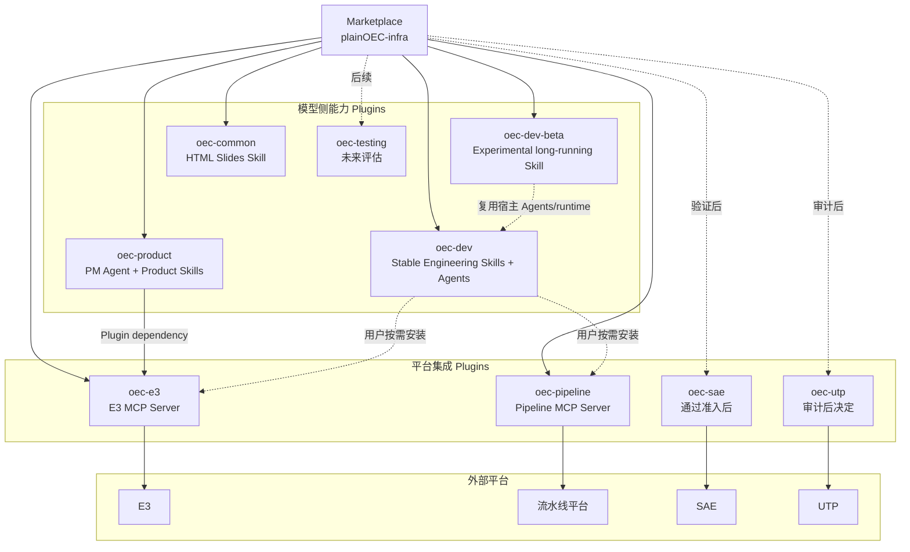
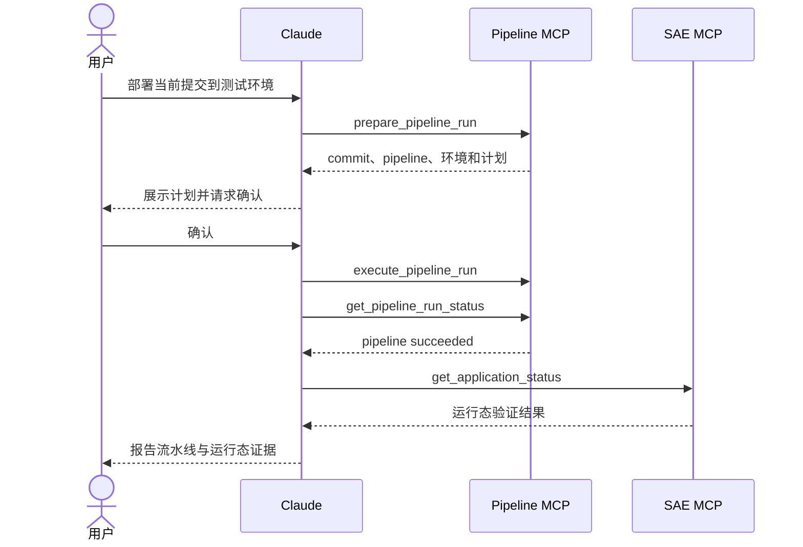

# 平台 Plugin 层级与 MCP 迁移设计

> 当前候选实现：Marketplace `3.1.0`、`oec-product@3.0.4`、`oec-dev@1.9.6`、`oec-dev-beta@0.1.0`、
> `oec-e3@1.0.3`、`oec-pipeline@1.0.2`、`oec-common@0.3.0`。本文区分“代码和自动验证已完成”与“真实外部平台已验收”；
> SAE、UTP 和 `oec-testing` 仍未进入 Marketplace。

## 1. 设计结论

删除 `oec-delivery` 这一场景包装层，按两条边界组织能力：

- 领域 Plugin 表达模型需要理解的产品和工程知识。
- 平台 Plugin 通过 MCP 表达外部系统的确定性原子能力。

```text
Marketplace 负责分发
→ 领域 Plugin 负责模型知识
→ 平台 Plugin 负责系统接入
→ MCP Server 负责认证和状态
→ MCP Tool 负责原子操作
→ 外部平台保存最终事实
```

平台 Plugin 不依赖领域 Plugin，避免平台执行能力反向绑定某一种 PM 或研发流程。

## 2. 完整逻辑层级



## 3. 当前组件

| Plugin | Agent | Skills | Hook | MCP | 责任 |
| --- | ---: | ---: | ---: | ---: | --- |
| `oec-product@3.0.4` | 1 | 3 | 0 | 0 | PRD 领域知识和发布语义 |
| `oec-dev@1.9.6` | 4 | 11 | 1 | 0 | 稳定 OEC Dev 任务执行、Specs、模块上下文和工程辅助；含一个 SessionStart bootstrap |
| `oec-dev-beta@0.1.0` | 0 | 1 | 0 | 0 | 实验性长时 Web/full-stack 编排；复用宿主 Engineering 能力 |
| `oec-e3@1.0.3` | 0 | 0 | 0 | 1 | E3 PRD 发布与研发任务执行 |
| `oec-pipeline@1.0.2` | 0 | 0 | 0 | 1 | 既有 dev/test 流水线受控执行 |
| `oec-common@0.3.0` | 0 | 1 | 0 | 0 | 零依赖 HTML-first 幻灯片 |

SAE、UTP 和 `oec-testing` 不创建空目录，也不进入 Marketplace，直到各自准入条件满足。

仓库保持根级 Plugin 目录，避免为了视觉分类移动已发布的 Product 和 Engineering 路径：

```text
plainOEC-infra/
├── .claude-plugin/marketplace.json
├── packages/prd-artifact-contract/       # 构建期共享确定性契约
├── oec-product/
│   ├── agents/prd-manager.md
│   ├── skills/prd-write/
│   ├── skills/prd-review/
│   └── skills/prd-publish/
├── oec-dev/
│   ├── skills/
│   ├── agents/
│   ├── bin/oec-spec
│   └── dist/oec-spec.mjs
├── oec-dev-beta/
│   ├── .claude-plugin/plugin.json
│   └── skills/web-develop/
├── oec-e3/
│   ├── .mcp.json
│   ├── servers/e3/
│   │   ├── publication/
│   │   └── development/
│   └── dist/e3-server.mjs
├── oec-pipeline/
    ├── .mcp.json
    ├── servers/pipeline/
│   └── dist/pipeline-server.mjs
└── oec-common/
    └── skills/create-slides/
```

共享 artifact contract 不是 Claude 组件、公共 references 层或运行时 npm 包。Product artifact checker 和
E3 Server 在构建时导入同一实现，再分别生成无外部依赖的 bundle，避免重复门禁逻辑或平台 Plugin
反向导入 Product Plugin。

## 4. 产品与工程边界

### Product

```text
prd-manager Agent
├── 预加载 prd-write
├── 预加载 prd-review
└── 不预加载 prd-publish

prd-publish
└── 显式调用 oec-e3 MCP
```

Publishing Skill 保留 HANDOFF、子 PRD、版本不可变和结果表达等产品语义。OAuth、API、publication record、
plan、幂等和远端校验全部属于 `oec-e3`。

### Engineering

`oec-dev` 不创建总控 Dev Agent，也不依赖 E3 或 Pipeline。普通编码继续由 Claude Code 主 Agent
完成；十个 Skills 补充任务级 `Spec`/`Design`、团队 Specs、模块上下文、任务执行、决策、TDD、诊断、
迁移、只读评审和收口方法。所有稳定 Skills 都可由精确自然语言目标发现；本地写入和 commit 仍有
独立确认门。版本化任务的 `spec.md`/`design.md` 位于 `ai-docs/versions/<version>/dev-task/<task-slug>/`，
统一身份由 `oec-spec task resolve` 处理。Claude SessionStart 只注入静态行为约束，不扫描项目或承担
Router；Spec reminder 只读且不创建项目状态。

`oec-dev-beta` 是独立的实验性 Plugin，只提供 `web-develop`。它要求宿主已经发现 `oec-dev`
的 `implementer`、`checker`、`evaluator` 和 `oec-spec`，不复制这些文件或 runtime；Skill 保持显式调用，
只面向本地或内部非生产 Web/full-stack 目标。

开发者按需组合：

```bash
claude plugin install oec-dev@plainOEC-infra
claude plugin install oec-dev-beta@plainOEC-infra
claude plugin install oec-e3@plainOEC-infra
claude plugin install oec-pipeline@plainOEC-infra
```

## 5. 实验性 Dev Beta 边界

`oec-dev-beta` 不拥有新的 Agent、MCP、Hook 或 runtime。`web-develop` 只在用户明确调用时启动，
先校验已有 taskRef、任务 Spec/Design、Playwright 和非生产目标，再复用宿主的 `implementer` 与
`evaluator`，通过 bounded cycles 完成运行态验证，最后可复用 `checker`。它不创建项目状态、提交、
部署或更新 E3/Pipeline。

稳定 `oec-dev` 的 `code-implement` 只负责 Main Session 的轻量任务执行；它不自动转入 Beta
长时循环。两者的职责和发布周期独立。

## 6. E3 平台边界

### PRD 发布主链

四个 PRD 发布工具名称保持不变：

```text
prepare_prd_publish
select_product_space
execute_prd_publish
get_prd_publish_status
```

roots、artifact gate、workspace/space/fingerprint 绑定、精确查询、partial checkpoint、远端漂移阻断
和 status 只读语义已经迁入 `oec-e3`。共享 artifact contract 在构建时分别进入 Product artifact checker 与
E3 bundle，不形成运行时跨 Plugin 文件依赖。

Product 安装后能够看到 E3 的全部 13 个工具，而不只看到四个 publication tools。这是当前有意接受
的工具面取舍：publication 与 development tools 属于同一平台、同一认证、同一远端状态生命周期和
同一 Owner，拆成两个 Plugin 会复制认证与状态边界，却不能形成独立可发布能力。Skill 仍只描述各自
允许的工具语义，MCP 继续对每次写入实施确定性门禁。只有权限模型、Owner 或发布周期实际分离时，才
以 ADR 重新评估 Plugin 拆分。

### 研发任务主链

```text
prepare_development_tasks
select_development_requirement
execute_development_tasks
prepare_task_progress
execute_task_progress
get_development_task_status
```

模型负责基于 PRD、设计和代码提出任务，MCP 负责需求选择、字段校验、远端创建/复用、工时/状态和
恢复。远端标题使用 `[localId] 标题`；mapped ID 优先验证；0 条创建、1 条复用、多条阻断。实现与
mock journey 已完成，真实 E3 验收必须单独记录。

首版明确不恢复：

- 缺陷生命周期。
- 提测版本管理。
- 任意任务字段编辑。
- 任务依赖可视化。
- 通用 E3 CRUD。

## 7. Pipeline 平台边界

首版已经实现四个工具：

```text
prepare_pipeline_run
select_pipeline_target
execute_pipeline_run
get_pipeline_run_status
```

计划绑定 canonical workspace、Git remote、repository、pipeline、ref、commit、环境、阶段和配置
fingerprint。只允许 dev/test，阻断 prod 和 unknown；候选不唯一时由用户选择；POST 结果未知时先按
远端运行标识查询，不盲目重试。

首版不迁移创建、复制、编辑、删除、取消、节点管理、Gitee 仓库管理或任意 `run-api` JSON。当前仅有
mock/integration 证据；在目标仓库、流水线和非生产授权明确前不宣称真实可用。

## 8. SAE 与 Pipeline

两者不能混成一个“部署工具”：

| 平台 | 所有权 |
| --- | --- |
| Pipeline | 构建、制品、流水线节点和运行状态 |
| SAE | 应用、环境、实例和运行健康 |
| Engineering Skill | 如何实现和验证代码变更 |
| 主 Agent | 根据用户目标组合工具 |



SAE 只有在真实 API、权限和非生产环境完成验证后才进入 Marketplace。任意 kubectl/helm、成员、
配额和 namespace CRUD 默认不迁移。

## 9. 状态归属

Plugin Data 保存用户私有运行时状态：

```text
${CLAUDE_PLUGIN_DATA}/
├── tokens/
├── workspaces/<canonical-root-sha256>/config.json
├── selections/
├── plans/
└── runtime/
```

业务仓库只保存需要团队审计和恢复的资产。Product Root 与 Dev Root 的目录边界如下：

```text
Product Root
├── ai-docs/prd/
├── ai-docs/versions/*/prd/
└── ai-docs/integrations/e3/publications/<version>.yaml

Dev Root
├── ai-docs/Spec/
├── ai-docs/Spec/integrations/e3/development-tasks/<changeId>.yaml
└── ai-docs/versions/*/dev-task/
```

Token、空间选择、plan 和 Pipeline 运行时状态不得进入 Git。旧 Product Plugin Data 中的凭证不自动
跨 Plugin 复制；升级后重新授权，已有项目 publication record 继续用于远端身份验证和幂等恢复。

## 10. 分发和版本

`oec-product@3.0.4` 声明同 Marketplace 依赖：

```json
{
  "name": "oec-product",
  "version": "3.0.4",
  "dependencies": [
    { "name": "oec-e3", "version": "~1.0.0" }
  ]
}
```

Plugin dependency 需要 Claude Code `2.1.110` 或更新版本；制定本文时本机已验证为 `2.1.237`。
PM 用户仍只安装 `oec-product`，Claude Code 自动解析 `oec-e3`。旧 Product 直接暴露的 MCP
plugin-scoped 身份会变化，因此 Product 使用主版本升级。

## 11. 迁移状态

| 阶段 | 状态 | 证据边界 |
| --- | --- | --- |
| 共享 PRD artifact contract | 已完成 | Product artifact checker 与 E3 gate 同源并分别 bundle |
| 四个 PRD 发布工具迁入 `oec-e3` | 已完成 | 既有回归保留；真实 PRD 证据继承自 2.2.0 |
| 六个研发任务工具 | 已验收 | 自动测试、mock journey 与“OBU-AI提效组”真实主链均完成 |
| 四个 Pipeline 工具 | 已实现 | 自动测试和 mock/integration 已完成；未执行真实 Pipeline |
| Product dependency cutover | 已完成 | Product 0 MCP；隔离安装自动解析 E3 dependency |
| Engineering 1.9.6 task execution | 已完成 | `code-implement`、十个稳定 Skills、四个 Agent 和静态 Hook |
| Dev Beta 0.1.0 | 已实现 | 单个显式长时 Skill；复用宿主 Agent/runtime，真实 Web outcome 待验收 |
| Common HTML Slides | 已完成 | 1 个零依赖 Skill；真实浏览器验证 overview、hash 与键盘导航 |
| SAE、UTP 准入 | 审计中 | 不创建空 Plugin，不进入 Marketplace |

Product cutover 一次性移除了内嵌 E3 Server，因此仓库和安装结果中都只有一套 E3 工具，不存在同名
Server 并存期。

真实 E3 对象、复用与状态证据见
[E3 平台 3.0.0 真实验收记录](../evidence/e3-platform-3.0.0-real-acceptance.md)。Pipeline 的实现状态不因
E3 验收而改变，仍需另行获得目标仓库、流水线和授权后才能形成真实证据。

当前 patch 只形成 release candidate：`oec-e3@1.0.3` 的账号归属、`oec-pipeline@1.0.2` 的单 POST
不变量和 `oec-dev-beta@0.1.0` 的宿主运行边界都有自动测试，但尚未完成明确授权的真实非生产复验。仓库 LICENSE/notice 的 Owner 决定也是
正式发布前置，因此本轮不创建或推送新 tag。
