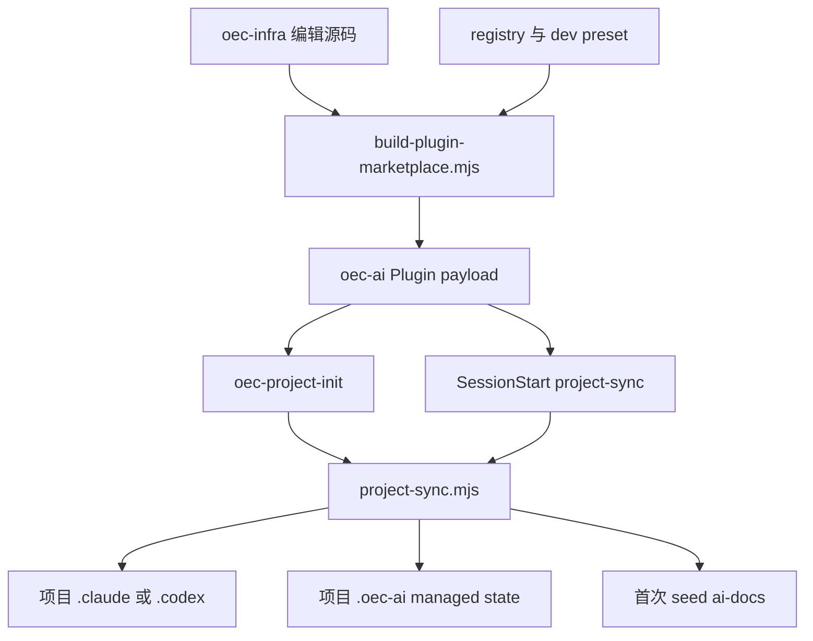
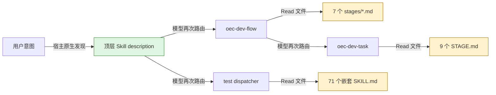
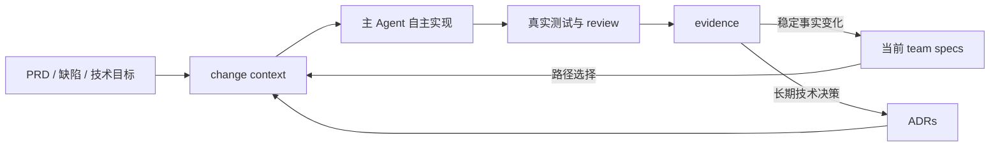

# OEC Dev 能力原生化迁移

> 本文基于旧仓库 `oec-ai-infra` 的 commit
> `79356008b9961c3e8a70c57e2fe5c9cf0c7ce424`，以及隔离临时目录中实际执行的
> `role=dev` 初始化结果。旧版本为 `oec-ai@0.2.2`。文中明确区分编辑源码、Plugin
> payload 和研发业务仓库的最终配置，不把构建前目录当作开发者真实加载的结构。

## 1. 结论

旧 Dev 方案包含有价值的业务知识、平台操作和测试资产，但它们被装入了错误的运行时边界：

- 通用研发方法、OEC 项目事实、外部平台操作和大型测试工具包由同一个角色 preset 一次下发。
- `oec-dev-flow`、`oec-dev-task`、内部阶段文件和测试调度器共同判断当前应该做什么。
- 大量内部 `SKILL.md` 和 `STAGE.md` 需要模型按路径 `Read`，却不是宿主原生发现的独立 Skill。
- E3、SAE、UTP、Git DevOps 和飞书操作依赖模型阅读说明后调用脚本或拼接请求，平台不变量没有
  类型化执行边界。
- 业务仓库保存 Plugin payload 的副本，Plugin cache 和项目副本构成两个状态源。

迁移不以缩写旧 Prompt 为目标。新的边界是：

1. Claude Code 主 Agent 继续承担普通编码、探索、拆解和验证，不再创建通用 Dev Agent。
2. 永久删除 `oec-dev-task`，不建立替代总控 Skill，也不复制 Superpowers 工作流。
3. 软件开发方法拆成少量、独立触发的 Skills。
4. 团队长期工程事实沉淀为项目 Git 资产，通过路径作用域按需选择。
5. 外部平台写操作由独立 MCP-only Plugin 承担；测试能力按独立生命周期另行评估。

## 2. 旧实现的真实分发结构

### 2.1 编辑源码不是最终配置

维护者在旧仓库中编辑以下资产：

```text
oec-infra/
├── skills/
│   ├── architecture/oec-architecture-design/
│   ├── dev/
│   │   ├── code-view-ali/
│   │   ├── oec-code-review/
│   │   ├── oec-detail-design/
│   │   ├── oec-dev-flow/
│   │   ├── oec-dev-task/
│   │   └── oec-release-closer/
│   ├── test/
│   └── tools/
└── agents/oec-tester/
```

旧仓库中的 `script/build-plugin-marketplace.mjs` 根据 registry 和 role preset 把
这些目录扁平化复制到 `plugins/oec-ai/payload`。因此，源码内的路径不是业务仓库中的稳定路径。

### 2.2 Marketplace 分发的是初始化器和 payload

旧 `oec-ai` Plugin 的原生 Claude 组件是：

```text
Skills:      1  oec-project-init
Agents:      0
Hooks:       1  SessionStart
MCP servers: 0
```

真正的研发资产位于 payload：

```text
plugins/oec-ai/
├── .claude-plugin/plugin.json
├── .codex-plugin/plugin.json
├── skills/oec-project-init/
├── hooks/hooks.json
├── runtime/project-sync.mjs
└── payload/
    ├── manifest.json
    ├── skills/
    ├── agents/claude/
    ├── agents/codex/
    ├── templates/dev/
    └── runtime/
```

Plugin 安装完成只会提供初始化入口和同步 Hook；开发者还必须在每个项目中执行一次角色初始化。
SessionStart 也只更新已经存在 `.oec-ai/installation.json` 的项目。

### 2.3 Claude Code 研发项目的最终物化结果

在隔离目录执行旧初始化器：

```bash
node plugins/oec-ai/skills/oec-project-init/scripts/init.mjs \
  --plugin-root plugins/oec-ai \
  --target <temporary-development-repository> \
  --role dev \
  --tool claude-code
```

得到的真实结构为：

```text
研发业务仓库/
├── .claude/
│   ├── agents/oec-tester/         # 19 个 Markdown Agent，另含支持文件
│   └── skills/                    # 12 个顶层 Skill 根
├── .oec-ai/
│   ├── installation.json
│   └── bin/
└── ai-docs/                       # 12 个首次 seed 的模板文件
```

实测数据：

| 指标 | Claude Code 初始化结果 |
|---|---:|
| 业务仓库文件总数 | 1418 |
| `installation.json` managed files | 1405 |
| 首次 seed 的 `ai-docs` 文件 | 12 |
| 顶层项目 Skills | 12 |
| 测试 Agent Markdown | 19 |
| 目录体积 | 约 28 MiB |

12 个顶层 Skills 是：

```text
oec-architecture-design
code-view
oec-code-review
oec-detail-design
oec-dev-flow
oec-dev-task
oec-release-closer
oec-test-dispatcher
oec-git-devops
oec-manage-task
iflytek-xfyj-sae-skill
iflytek-feishu-api
```

其中 `oec-test-dispatcher` 单独包含 71 个嵌套测试 `SKILL.md`；`oec-manage-task` 还包含一个
嵌套 Skill。它们是顶层 Skill 的 supporting files，不会被 Claude Code 注册成 72 个独立能力。

### 2.4 Codex 研发项目的最终物化结果

相同 role 使用 `tool=codex` 后得到：

```text
研发业务仓库/
├── .codex/
│   ├── agents/                    # 19 个 TOML Agent + Markdown 源和支持文件
│   ├── skills/                    # 旧路径
│   ├── config.toml
│   └── hooks.json
├── .oec-ai/
└── ai-docs/
```

实测为 1439 个文件、1426 个 managed files、约 28 MiB。当前 Codex 从 `.agents/skills`
发现项目 Skills，旧 `.codex/skills` 不再是应依赖的官方位置。旧 Agent 编译器只把 `name` 和
`description` 映射为原生字段，Claude 的 `tools`、`skills`、`agents` 等行为元数据被渲染成
`developer_instructions` 中的普通文字，不再具备等价的宿主语义。

### 2.5 分发和同步链



同步器具有 staging、backup、路径逃逸和 symlink 防护，也会通过 installation manifest 记录
managed files。这些是旧方案的合理部分。但它仍造成以下生命周期问题：

- Plugin cache 和项目副本是两个状态源。
- 同版本 payload 内容变化不会触发同步。
- 升级会覆盖 managed files 并删除 retired files，容易产生大规模工作区 diff。
- 卸载 Plugin 不会移除已经复制进项目的配置。
- 项目级配置和 `ai-docs` 业务内容混在同一初始化生命周期内。

## 3. 模型看到的索引与路由

### 3.1 三层研发路由

旧主链不是一次原生 Skill 选择，而是多层判断：

```text
用户请求
→ 12 个顶层 Skill description 竞争
→ oec-dev-flow 判断 7 个流程阶段
→ oec-dev-task 再判断 9 个内部阶段
→ Read STAGE.md / reference / nested SKILL.md
→ Bash / Python / HTTP 平台操作
```

`oec-dev-task` 根 Skill 明确规定执行动作前先读取对应内部 `STAGE.md`。这些文件自己也声明
“不是可注册 Skill”，说明所谓加载实际是普通文件索引。`oec-test-dispatcher` 采用相同方式，要求
调用方读取 `skills/<name>/SKILL.md`，以一个顶层 Skill 模拟 71 个能力注册。



绿色边是宿主 Skill 发现；黄色节点只是普通 Markdown 文件读取。两者不能用相同的“加载 Skill”
表述。

### 3.2 路由重叠

- `oec-dev-flow` 声明完整研发入口，但把实际开发委托给 `oec-dev-task`。
- `oec-dev-task` 同时覆盖设计、计划、实现、TDD、调试、验证和状态同步。
- `oec-detail-design`、`oec-code-review`、`code-view`、`oec-release-closer` 又与内部阶段重叠。
- 测试 Dispatcher 和 19 个测试 Agents 同时承担测试意图分发。

这不是单纯的上下文开销。相同请求落入多个 description 和内部路由规则时，会改变模型对任务
规模、确认次数、产物数量和合法下一步的判断。

### 3.3 已验证的路径漂移

旧源码中的命令：

```text
./oec-infra/skills/dev/oec-dev-task/scripts/verify-versioned-paths.sh
```

在业务仓库中不存在；实际安装路径是：

```text
.claude/skills/oec-dev-task/scripts/verify-versioned-paths.sh
```

测试调度说明还引用 `.claude/skills/test/SKILL.md`，实际顶层目录则是
`.claude/skills/oec-test-dispatcher/`。构建扁平化后继续依赖源码路径，是文件索引架构的固有风险。

### 3.4 Agent 并未解决原生加载问题

旧 Dev 没有通用研发 Agent；开发流程已经迁入 Skills。测试侧虽然有 19 个合法 Markdown Agent，
但存在两个问题：

1. Agent `skills:` 中声明的名称来自 Dispatcher 内部目录，不对应 12 个顶层项目 Skills，因此不能
   作为可解析的原生预加载依赖。
2. `oec-tester/AGENT.md` 要求先匹配 Agent，再用 `Read` 读取对应 Markdown 并执行。这是 Agent 文件
   路由器，不是宿主原生 subagent delegation。

Codex 编译产物虽然满足 TOML 基本结构，但同一批 Markdown 源又被复制到 `.codex/agents` 并供模型
读取，形成原生 TOML Agent 和文件路由两套执行方式。

## 4. 对旧方案的辩证判断

### 4.1 应保留的内容

- OEC 产品版本、HANDOFF、E3 requirement/story 对应关系。
- 已验证的项目构建、测试和部署命令。
- 领域词汇、架构不变量、接口兼容要求、数据语义和 ADR。
- 外部写操作的人类确认、权限边界和真实结果验证。
- 同步器曾实现的路径逃逸、symlink 和 staging 安全思想。
- 测试资产中具有确定性实现和真实平台契约的部分。

### 4.2 应交还模型判断的内容

- 普通编码任务是否需要详细设计文件。
- 小修复是否需要任务包和完整计划。
- 具体实现拆分、探索顺序、调试假设和测试层级。
- 是否需要并行 subagent，以及如何利用宿主内置探索和评审能力。
- 不涉及真实安全或外部副作用的阶段顺序。

### 4.3 应下沉为平台工具的内容

- OAuth、token 缓存和脱敏。
- E3/SAE/UTP HTTP API、payload、ID 归一化和成功码判断。
- 幂等查询、计划 token、重试、partial resume 和远端对象校验。
- 部署、任务状态和远端仓库写入的 prepare/confirm/execute/status。

## 5. 迁移后的当前结构

Marketplace 将领域知识与平台执行分开：

```text
Marketplace: plainOEC-infra
├── Plugin: oec-product
│   └── PM Agent / PRD Skills / oec-e3 dependency
├── Plugin: oec-engineering
│   ├── 9 focused Skills
│   ├── 3 explicit-use Agents
│   └── deterministic oec-spec runtime
├── Plugin: oec-e3
│   └── PRD publication + development task MCP
└── Plugin: oec-pipeline
    └── existing dev/test pipeline MCP
```

`oec-engineering` 第一版没有 Agent、MCP、Commands、Hooks 或 settings。主 Coding Agent 就是研发执行者；
新的 Skills 只在特定目标下改变它的判断。它不依赖 E3 或 Pipeline，开发者只在需要外部平台能力时
单独安装对应 Plugin。1.5.1 提供三个显式使用的可选 Agent、三个只允许用户触发的迁移、决策挑战与
工程收口 Skills、一个按明确原型请求发现的决策原型 Skill，并保持 0 Hook。

## 6. OEC 团队 Spec 闭环

Trellis 最值得采用的不是强制任务状态机，而是“项目长期事实”和“单次变更过程”分离。OEC 适配
继续使用既有 `ai-docs` 资产根：

```text
ai-docs/engineering/
├── README.md
├── specs/                         # 当前真实状态
├── decisions/                     # ADR
└── changes/<change-id>/           # 单次变更上下文和证据
```

每个 Spec 通过 `id` 和 `applies_to` 声明适用路径。确定性工具根据待改或已改文件选择相关 Spec，
避免模型每次读取完整知识树。



小修复不强制创建 change package；只有跨模块、接口、数据、兼容性或高风险变更才持久化完整
设计和计划。团队 Spec 记录事实和不变量，不记录“必须先做第几阶段”之类工作流。

## 7. 能力处置表

| 旧能力 | 处置 | 原因 |
|---|---|---|
| `oec-dev-task` | 删除 | 与现代 Coding Agent 和 Superpowers 类能力重叠 |
| `oec-dev-flow` | 删除编排 | E3 任务主链和既有流水线已迁入独立平台 MCP；SAE 尚未准入 |
| `oec-architecture-design` | 迁移 | 显式迁移 Skill 将有效事实导入 Specs、决策导入 ADR；变更方案进入 planning Skill |
| `oec-detail-design` | 合并 | 成为 planning Skill 的条件产物 |
| `code-view`、`oec-code-review` | 合并 | 单一只读代码评审 Skill |
| `oec-release-closer` | 缩减 | 只收口真实 evidence、Spec 和 ADR，不生成固定文档全集 |
| `oec-test-dispatcher`、测试 Agents | 暂缓 | 独立清点为 `oec-testing`，不迁移内部文件路由器 |
| `oec-manage-task` | 部分平台化 | E3 任务创建、进度和状态已迁移；缺陷、提测和任意字段编辑不迁移 |
| SAE | 准入审计 | 真实 API、权限和非生产环境未验证，不创建 Plugin |
| Git DevOps | 拆分 | 本地 Git 用宿主能力，远端写入按需接工具 |
| 飞书 API | 移出 | 办公集成不属于研发核心生命周期 |

## 8. 安装、项目配置和迁移边界

开发者通过 Marketplace 安装 `oec-engineering`，Plugin 安装本身不写项目 `.claude`、`.codex` 或
`ai-docs`。只有用户显式调用团队 Spec 管理 Skill，确认文件计划后才创建项目资产。

项目根 `CLAUDE.md` 和 `AGENTS.md` 只需要保存：

- 团队工程事实入口。
- 当前仓库真实构建、测试和验证命令。
- 必须遵守的业务或安全边界。

它们不复制 Skill 内容，也不成为第二个路由器。

旧项目迁移采用保守顺序：

```text
只读 legacy audit
→ 保留全部 ai-docs 业务和历史内容
→ 建立当前态 team specs
→ 导入有证据支持的有效事实
→ 单独提交新 specs
→ 用户确认后清理旧 managed 配置
```

新 Plugin 不自动删除 `.oec-ai` 或旧 managed files。清理属于单独的、可审阅的破坏性操作。

## 9. 验证边界

迁移成功必须证明：

- Claude Code 原生发现 9 个独立 Skills 和 3 个可选 Agent，不发现 Dev Agent、Commands 或 MCP。
- 普通实现和简单缺陷不会被强制进入 planning、TDD 或 closing。
- 技术方案、TDD、困难诊断、代码评审和 Spec 沉淀分别命中唯一能力。
- 路径作用域选择、Spec/ADR/变更引用和旧配置审计可确定性执行。
- Git 安装后的 runtime 不依赖 `node_modules`。
- Java/Spring Brownfield 能完成 PRD 到 team Spec 反哺的完整旅程。
- 前端小修复可以直接完成，不生成无意义任务包。
- 现有 `oec-product` 全部测试继续通过。

E3、Pipeline、SAE、UTP 和真实部署不属于 `oec-engineering@1.5.1` 验收范围。E3 与 Pipeline 即使由
同一 Marketplace 分发，也保持独立 Plugin 和独立证据；SAE/UTP 在类型化接口与非生产 E2E 完成前，
不以 Markdown、mock 或静态测试宣称旧平台能力已复现。

## 10. 当前实现状态

`oec-engineering@1.5.1` 已按上述边界实现：

- 9 个原生 Skills，其中旧 `ai-docs` 迁移、工程决策挑战与工程收口只允许用户触发；3 个可选 Agent，0 Hook，0 MCP，0 Command。
- `oec-spec` source、CLI、可执行入口和无依赖 bundle。
- Spec/ADR/change contract、路径选择、链接与引用校验、旧安装只读审计。
- Java/Spring 和前端路径 fixture、bundle 隔离执行及正负触发 cases。
- `oec-product` 回归测试与工程插件测试在同一根测试命令中执行。

工程 Plugin 本身没有实施外部写操作，也没有自动清理任何旧项目资产。Marketplace 另有：

- `oec-e3@1.0.1`：四个 PRD 发布工具和六个研发任务工具；研发任务真实 E3 验收单独记录，补丁版本的
  身份 fail-closed 行为尚待明确授权的真实写入复验。
- `oec-pipeline@1.0.1`：四个既有 dev/test 流水线工具；当前只有 mock/integration 证据，幂等补丁尚待
  明确授权的真实运行复验。
- SAE、UTP：仅形成准入审计，不存在 Plugin 组件或 Marketplace entry。
