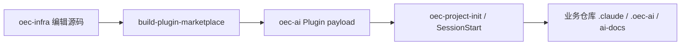
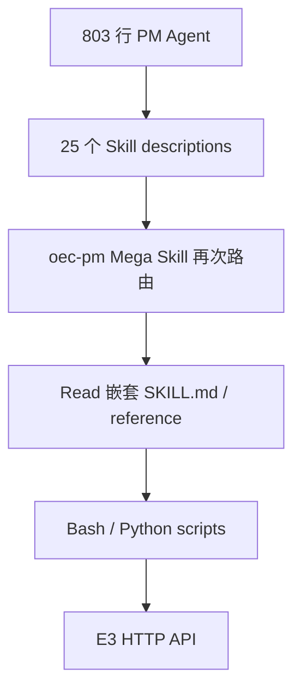
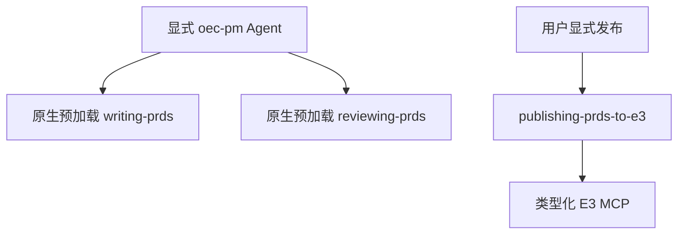

# PM 实现迁移 Review

> 事实基线：旧实现取自 `oec-ai-infra` commit
> `79356008b9961c3e8a70c57e2fe5c9cf0c7ce424`，当前实现取自 `plainOEC-infra`
> commit `fe81153`。旧分发结构的完整还原见 [PM 迁移分析](../../migration.md)。

## 1. 结论

PM 迁移的关键并不是缩短 Prompt，而是把不同性质的能力放回宿主原生边界：

- Agent 只表达 PM 身份、产物责任和事实边界。
- Skill 对应写作、评审和发布三个稳定用户目标。
- Supporting files 只服务于所属 Skill 的渐进披露。
- 确定性产物校验由脚本实现。
- E3 认证、接口、幂等、状态和恢复由 MCP 实现。
- Plugin 安装不再把配置和运行时复制进业务仓库。

这降低的不是单纯 token 数量，而是模型需要同时判断的路由、阶段和实现细节数量。

## 2. 真实分发结构对比

### 2.1 旧实现

旧实现不能只看编辑源码。它经过三层转换：



`role=designer + tool=claude-code` 的实际初始化结果是：

| 项目 | 旧实现 |
| --- | ---: |
| 业务仓库物化文件 | 622 |
| 同步器 managed files | 613 |
| 项目级 Skills | 25 |
| 项目级 PM Agent | 1 |
| PM Agent 正文 | 803 行 |
| `oec-pm` 内部 `SKILL.md` | 根入口 1 个 + 嵌套文件 6 个 |
| Plugin 原生组件 | 1 Skill、0 Agent、1 Hook、0 MCP |

因此，安装 Plugin 并不等于 PM 能力可用；还要在每个业务仓库执行初始化，将 payload 再复制为
项目配置。

### 2.2 当前实现

当前 `oec-product@2.2.1` 是一个原生 Claude Code Plugin：

```text
oec-product
├── Agent: oec-pm                         19 行
├── Skills
│   ├── writing-prds
│   ├── reviewing-prds
│   └── publishing-prds-to-e3             三个正文合计 105 行
└── MCP Server: e3                        四个公开工具
```

当前安装直接发现 1 Agent、3 Skills 和 1 MCP Server，不再生成项目级 `.claude/agents`、
`.claude/skills` 或同步运行时。2026-08-21 的自动回归基线为 65/65。

目标 3.0 架构会进一步把 E3 Server 从产品域 Plugin 抽离为 `oec-e3` MCP-only Plugin；
`oec-product` 通过原生 Plugin dependency 使用它。目标结构不应被描述为当前已完成状态。

## 3. 模型判断面的变化

旧调用链同时存在多层路由：



其中嵌套 `SKILL.md` 是普通文件索引，不是 Claude Code 独立加载的 Skill。旧 Agent 也没有通过
frontmatter `skills:` 预加载 PM 能力。模型必须自己完成意图路由、文件定位、流程解释、命令拼装和
远端结果判断。

当前调用链为：



Publishing Skill 的 `disable-model-invocation: true` 阻止模型自动触发发布；该字段属于 Skill，
不是 Agent 配置。

## 4. 文件和运行时边界

Python、`requirements.txt` 或脚本文件本身并不是 Claude Code 禁止的格式。旧实现的问题是：

- 这些文件作为 payload 被复制进业务仓库，而不是原生 Plugin 组件。
- Prompt 要求模型先按路径读取说明，再通过 Bash 选择脚本和参数。
- 认证、API payload、ID 归一化、重试和状态恢复部分依赖模型遵循文档。
- Plugin cache 和业务仓库副本形成两个状态源。
- SessionStart 同步会覆盖 managed files，并可能制造大规模工作区 diff。

当前实现使用 Node.js 自足 bundle，但“使用 Node”不是改进本身。真正的改进是 MCP 提供了固定
schema、服务端校验、不可变计划、workspace 绑定、远端身份验证和受控副作用边界。

## 5. 能力取舍

| 旧能力 | 当前决定 | 原因 |
| --- | --- | --- |
| PRD 编写、修订、拆分 | 合并为 `writing-prds` | 同一稳定产物目标 |
| PRD 红队评审 | `reviewing-prds` | 只读且判断边界独立 |
| PRD 发布 E3 | Skill + MCP | 产品语义与平台执行分离 |
| 原型设计 | 未迁移 | 不是当前 PRD 主链必需能力 |
| 通用产品/系统需求 CRUD | 未迁移 | 会扩大为平台管理 SDK |
| 文件写入策略 | 删除 | 主 Agent 已具备文件工具 |
| OAuth、API、重试、mapping | MCP | 平台不变量不应由 Prompt 模拟 |

删除某项旧能力不表示它没有价值。只有当能力属于稳定业务规则、明确用户目标或必须由平台保障的
确定性执行时，才应该进入核心 Plugin；分发附带工具和未来平台扩展需要单独审计。

## 6. 验证边界

- `oec-product@2.2.0` 已在授权的非生产 E3 空间完成一次真实 PRD 发布、状态验证和版本变更阻断。
- `2.2.1` 只做模型判断面文案清理和自动回归，没有重新执行真实 E3 写入。
- 当前四个 E3 工具是受控 PRD 发布器，不是完整 E3 管理 SDK。
- 目标 `oec-e3`、E3 研发任务和 Pipeline Plugin 在实现及验收前都属于计划，不应写成已交付能力。

## 7. 最终评价

迁移后的配置更接近 Claude Code 原生组件模型，也更有利于模型自主判断：稳定业务规则保留在
Agent/Skill，确定性检查进入脚本，外部写入进入 MCP，普通推理和代码工作留给主模型。它减少的是
冲突判断面和错误所有权，而不是为了追求最短 Prompt 删除必要约束。
