# OEC-infra 优化核心讲解思路

对应完整材料：[OEC-infra 下一步完整优化思路](./oec-infra-next-optimization.md)。

## 核心主线

整场汇报只围绕一条因果链展开：

> 旧 OEC-infra 的问题不是 Prompt 太长，而是角色、能力、分发单元和外部执行边界错位；当前迁移通过
> Claude Code 原生 Plugin、聚焦 Skill 和平台 MCP 重新划分责任；下一步不再扩建大 Agent，而是完成
> 测试能力审计、统一 Skill 治理和 UTP/SAE 平台准入。

讲解顺序固定为：

```text
旧配置实际如何到达用户项目
→ 为什么这种结构会影响模型判断
→ 旧 Skill 应该按什么原则拆分
→ 为什么外部交互脚本需要进入 MCP
→ 当前 3.1 候选已经实现什么
→ 哪些能力仍缺少证据
→ 下一阶段如何推进
→ 需要确认哪些决策
```

## 一、先讲旧系统实际上如何工作

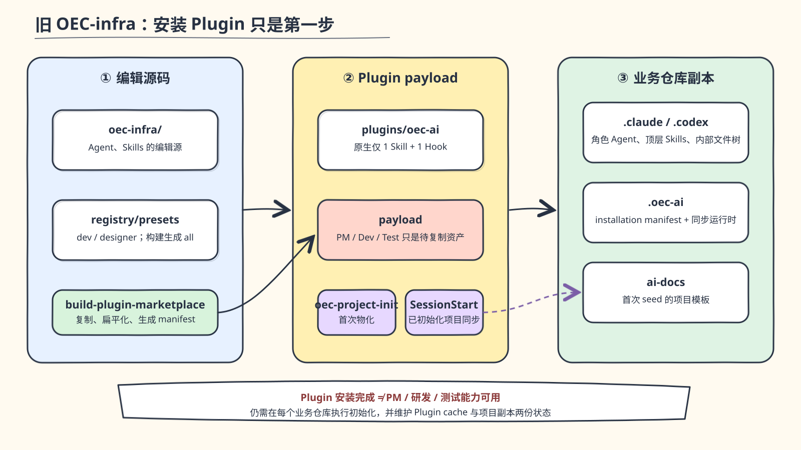

一句话结论：**旧 Marketplace 没有把 PM、研发和测试能力作为原生组件直接交付，而是由初始化器把
Plugin payload 再复制到业务仓库。**

展开时按真实运行链讲：

1. 组织先维护 Agent、Skills、scripts 和模板源码。
2. 构建脚本把这些内容打入 `oec-ai` Plugin payload。
3. 用户安装 Plugin 后，还要执行 `oec-project-init` 并选择 role/tool。
4. 初始化器才把配置复制到项目 `.claude` 或 `.codex`，同时生成 `.oec-ai` 和 `ai-docs`。
5. SessionStart 继续维护项目副本，最终模型从业务仓库内的复制文件工作。

需要强调：**Plugin 安装完成不等于角色能力可用**，Plugin cache 与业务仓库副本也因此形成两个状态源。

转场：这套机制不是只有“安装步骤多”，它还决定了 PM、研发和测试最终拿到什么配置。

## 二、再展示三类角色真实拿到的配置

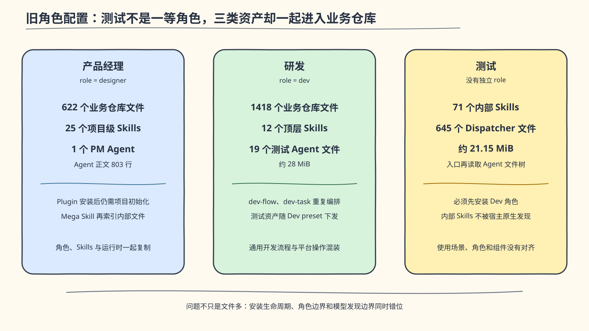

一句话结论：**旧系统按角色下发的不是少量原生能力，而是大规模项目级文件树；测试甚至没有独立
role，却成为 Dev preset 中最大的能力集合。**

核心事实：

- PM：622 个业务仓库文件、25 个项目级 Skills、1 个 803 行 PM Agent。
- 研发：1418 个文件、12 个顶层 Skills，并包含测试 Agent 与测试运行时。
- 测试：没有独立 role；Dispatcher 下面有 71 个内部 Skills，另有 19 个 Agent 文件。
- 旧 Plugin 原生清单实际只有 1 个初始化 Skill、0 Agent、1 Hook、0 MCP。

不要把旧方案全盘否定：staging、backup、rollback、路径逃逸防护、managed-file manifest 和首次 seed
保护都有工程价值。迁移要删除的是错误的运行边界，不是这些安全思想。

转场：文件数量只是表象，真正的问题是这些文件如何被宿主和模型理解。

## 三、说明嵌套文件为什么不是原生 Skill

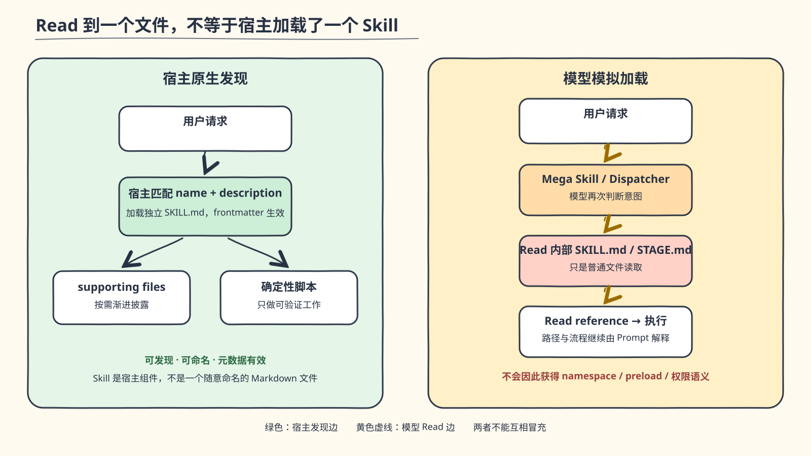

一句话结论：**模型能够 Read 一个 `SKILL.md`，不代表 Claude Code 已经发现、加载或预注册了一个
Skill。**

左侧原生关系：

- 宿主发现 Skill 的 name 和 description。
- 相关时加载 `SKILL.md`。
- references、assets、scripts 只是该 Skill 的渐进披露资源。
- namespace、触发和 frontmatter 仍由宿主管理。

右侧旧关系：

- PM Mega Skill 再索引 6 个内部 `SKILL.md`。
- `oec-dev-task` 再索引 9 个阶段文件。
- 测试 Dispatcher 再索引 71 个内部 Skills。
- 测试 Agent 总览再要求 Read 19 个 Agent 文件。

因此旧配置同时存在 Agent、顶层 Skill、Mega Skill、阶段文件和 Dispatcher 多层意图判断。路径一旦在
构建时被扁平化，Prompt 中保存的源码路径还可能直接失效。

转场：嵌套只是五类错位中的一类，最终都指向同一个结果——模型无法清楚判断什么是必要步骤。

## 四、把问题归结为“判断边界错位”

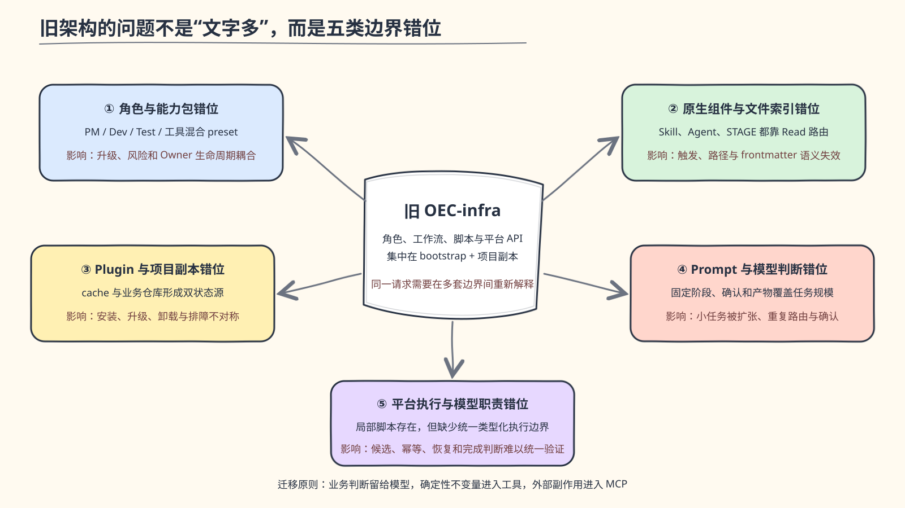

这里按五类问题快速收口：

1. **角色错位**：PM、研发、测试和相邻工具由 preset 混合下发。
2. **组件错位**：身份、知识、阶段、脚本和平台 API 都被称为 Skill。
3. **分发错位**：Plugin cache 与项目副本形成双状态源，安装、升级和卸载不对称。
4. **模型判断错位**：固定阶段、重复路由、固定确认和固定产物会把小任务扩大成完整流程。
5. **平台执行错位**：OAuth、候选选择、payload、重试、record 和最终状态由 Prompt、模型与多个脚本
   共同承担。

关键表述：**问题不以节省 token 为主要论据，而在于冗余或中性指令会改变模型对任务规模、下一步和
完成条件的判断。** 业务规则、权限边界和平台不变量仍然必须保留。

转场：因此迁移不能按旧目录一对一重写，而要先拆责任。

## 五、解释旧 Skill 的拆分方法

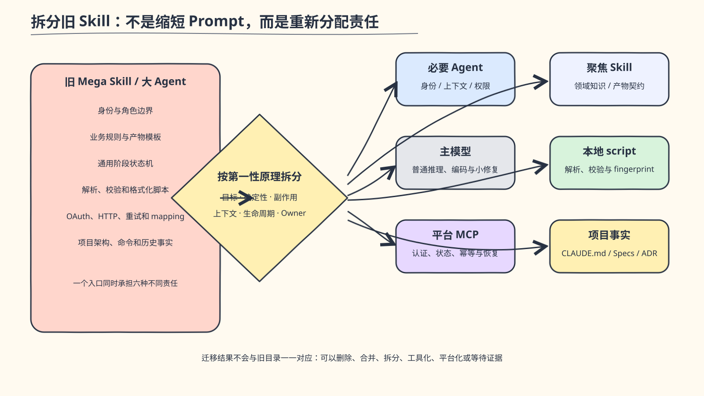

一句话结论：**拆分依据不是旧文件夹，而是能力的性质和生命周期。**

按照六类责任解释：

| 旧目录中的内容 | 新落点 | 原因 |
| --- | --- | --- |
| 稳定工作身份、上下文或权限边界 | Agent | 需要独立身份时才创建 |
| 领域知识、判断方法和产物契约 | Skill | 模型完成目标时按需加载 |
| 探索、普通计划、编码和常规验证 | 主模型 | 现代 Coding Agent 已具备，不再复制总控流程 |
| YAML、路径、glob、fingerprint 等确定性处理 | supporting script/runtime | 本地、可测试、无远端状态 |
| 认证、远端身份、外部写入、幂等和恢复 | MCP | 跨越外部系统信任边界 |
| 产品事实、工程 Specs、ADR 和构建命令 | 项目文档 | 属于项目 Git 资产，不属于组织 Plugin |

用两个例子帮助理解：

- `oec-dev-task` 的通用开发状态机直接删除；团队长期工程事实保留为 Specs，TDD、诊断、review 等只在
  目标明确时成为聚焦 Skills。
- PM 的写作、评审、发布不再由 Mega Skill 多次路由；身份归 Agent，三类用户目标归三个 Skills，E3
  执行归平台 MCP。

转场：其中最容易被问到的是——Skill 已经可以带 scripts，为什么还需要 MCP？

## 六、讲清 supporting script 与 MCP 的分界

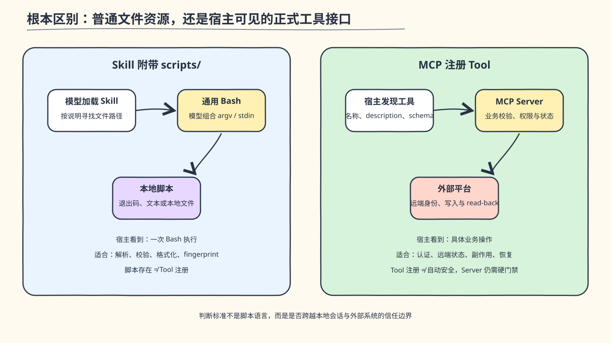

一句话结论：**分界不是实现语言或代码复杂度，而是是否跨越外部系统信任边界。**

关键补充：**当前不是把旧 Python/TypeScript 脚本注册成 `run_script`；新 MCP Server 不再启动旧脚本，
而是把经过验证的 API 契约迁入 Auth、Client 和 Service，并增加 prepare、plan、checkpoint 与 status。**

Skill supporting script 适合：

- 处理本地受控文件。
- 执行确定性解析、校验、选择或格式化。
- 不需要外部认证、远端持久状态和跨步骤恢复。
- 主要服务于一个 Skill，并随领域契约一起升级。

MCP Tool 适合：

- 需要认证和固定可信 origin。
- 操作远端对象并产生副作用。
- 需要精确候选选择、用户确认、幂等、checkpoint 和 partial resume。
- 需要 workspace/plan/token 隔离以及独立 status read-back。
- 需要由宿主识别具体工具，而不是只看到一条任意 Bash 命令。

需要同时说明两个边界：

1. 不是所有脚本都要包装成 MCP，本地 checker 和 `oec-spec` 留在 Skill runtime 更合理。
2. 注册成 MCP 不会自动安全，Server 仍必须落实 schema、权限、脱敏、身份、plan、幂等和状态验证。

转场：按这套原则拆分后，当前仓库已经形成了清楚的领域层与平台层。

## 七、展示当前 3.1 候选架构

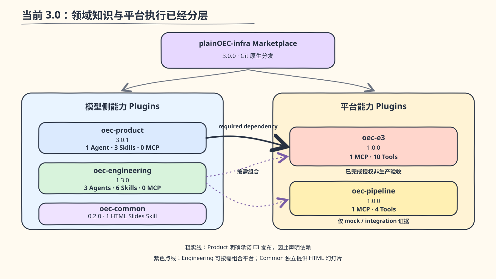

当前结构包含六个独立分发单元：

- `oec-product@3.0.3`：1 Agent、3 Skills、0 MCP；明确依赖 `oec-e3`。
- `oec-dev@1.9.5`：10 个可自动发现的稳定 Skills、4 个可选 Agent、1 个静态 SessionStart 行为 Hook、0 MCP；普通编码仍由主 Coding Agent 负责。
- `oec-dev-beta@0.1.0`：1 个显式实验性 Skill；复用宿主 Engineering 的 Agent 和 `oec-spec`，不复制文件或 runtime。
- `oec-e3@1.0.2`：1 MCP Server、10 Tools；负责 PRD 发布和研发任务主链。
- `oec-pipeline@1.0.2`：1 MCP Server、4 Tools；只运行既有 dev/test 流水线。
- `oec-common@0.3.0`：1 Skill、0 Agent、0 MCP；提供零依赖 HTML-first 幻灯片。

稳定 Engineering 新增 `code-implement` 作为已有 ready task 的轻量 Main Session 执行入口；固定 Agent
委派和长时编排不再进入稳定 Plugin。长时 Web 编排隔离到 `oec-dev-beta`，并保持显式调用。

强调两种关系：

- Product 向用户明确承诺 E3 发布，所以 Product → E3 是依赖关系。
- Engineering 与 E3/Pipeline 只是场景组合，不创建 `oec-delivery` 作为无状态的转发包装层。

分发也同步改变：Git Marketplace 直接安装版本化 Plugin，自足 bundle 不依赖用户 `npm login`、
`npm install` 或项目 `node_modules`，user scope 不再向业务仓库复制 `.claude` 和 `.oec-ai`。

转场：架构已经落地不代表所有能力都完成了相同级别的验证。

## 八、如实说明当前证据边界

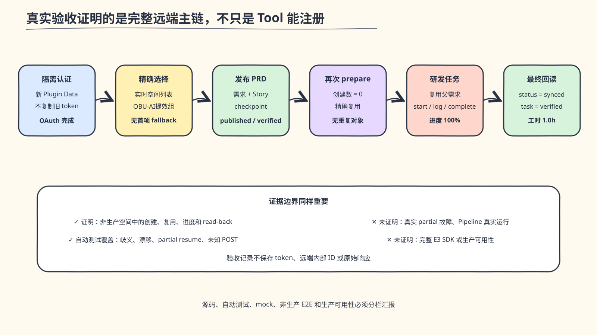

当前能够明确说明：

- 执行根目录 `npm test` 的 156/156 项自动测试全部通过。
- E3 PRD 发布和研发任务主链已在授权的“OBU-AI提效组”完成真实非生产验收。
- E3 验证了精确空间选择、发布、status、重复 prepare、任务创建、start/log/complete 和最终 verified。
- Pipeline 目前只有 mock/integration 和 bundle 证据，没有真实非生产流水线运行结论。
- Testing、UTP、SAE 仍处于审计、规划或未准入状态。

不要把 E3 的真实验收外推成 Pipeline、SAE、UTP 已可用，也不要把自动测试、工具注册或 mock 成功
表述成生产可用。

转场：证据缺口决定了下一步目标架构和实施顺序。

## 九、说明下一阶段不是继续扩建，而是审计后准入

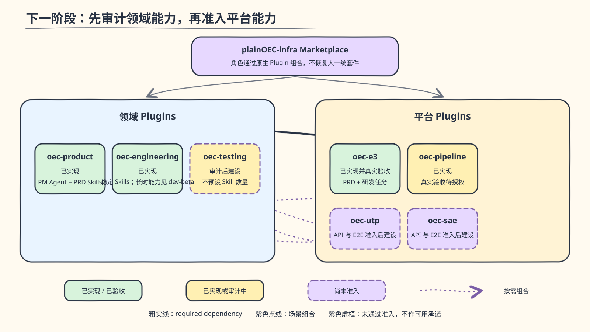

目标结构保持简单：

- Product、Engineering、E3、Pipeline 保持现有清晰边界。
- Testing 先审计再形成聚焦 `oec-testing`，不预先承诺 Skill/Agent 数量。
- UTP、SAE 只有通过真实 API、认证、权限、身份、幂等、status 和非生产验收后才进入 Marketplace。
- 不恢复 Dev Agent、测试 Dispatcher、角色套件、统一 delivery Plugin 或通用平台 CRUD。

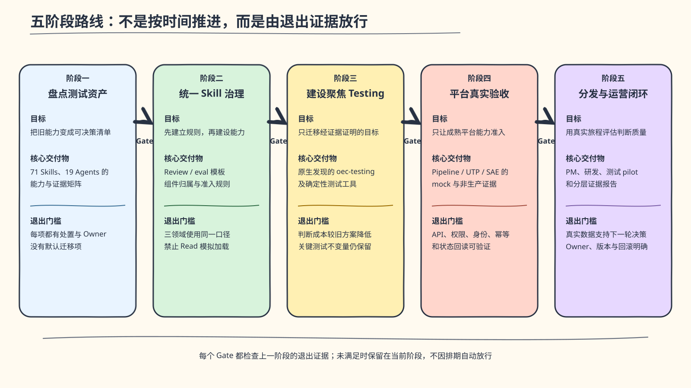

实施顺序只讲五步：

1. 盘点旧 71 个测试内部 Skills、19 个 Agents 和 supporting runtime。
2. 建立 Product、Engineering、Testing 共用的 Skill 评审与 eval 门禁。
3. 只迁移高频、独立、可维护的测试用户目标。
4. UTP/SAE 先完成平台准入和真实非生产验收。
5. 通过 PM、研发、测试真实 pilot 记录触发、确认、产物、失败恢复和完成路径。

转场：最后不讨论“又写了多少 Prompt”，而讨论组织是否接受这套责任和证据体系。

## 十、以组织责任和决策收尾

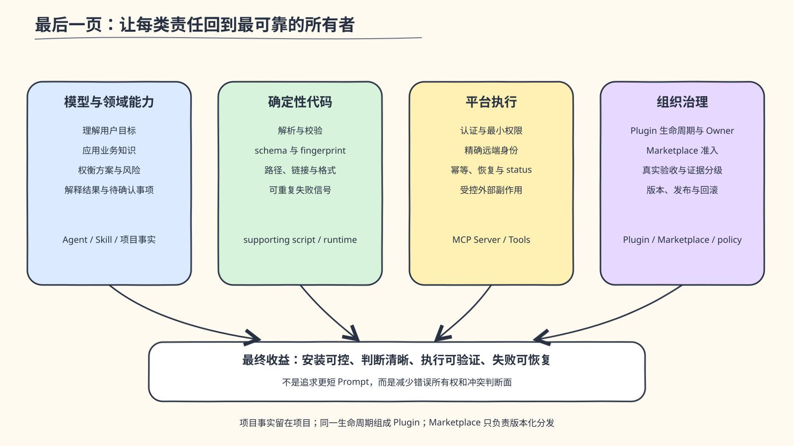

收尾时只保留三句话：

1. **旧问题的根因是边界错位，不是单个 Agent 或 Skill 写得不够好。**
2. **当前 3.1 候选已证明稳定领域 Skill、确定性工具、实验能力和平台 MCP 可以按原生层级协作。**
3. **下一阶段应该优先迁移测试能力并建立统一治理，而不是重新创造大 Agent、Dispatcher 或平台 CRUD。**

需要确认的决策：

- 认可“领域 Plugin 负责模型知识，平台 Plugin 负责系统接入”的长期分层。
- 确认测试迁移与 Skill 治理为第一优先级。
- 为 Product、Engineering、Testing、E3、Pipeline、UTP/SAE 明确 Owner。
- 未经真实非生产验收的平台写能力不得进入 Marketplace。
- 角色体验采用原生 Plugin 组合，不恢复 preset 同步和统一包装层。

## 10 分钟压缩讲法

时间不足时只讲六张图：

1. `01-legacy-distribution.svg`：旧能力如何真正到达业务仓库。
2. `02-native-vs-file-routing.svg`：Read 文件为什么不等于原生 Skill。
3. `12-legacy-skill-decomposition.svg`：旧能力按责任重新拆分。
4. `13-script-vs-mcp.svg`：本地确定性脚本与外部平台 MCP 的边界。
5. `05-current-architecture.svg`：当前 3.1 Marketplace 的六个 Plugin。
6. `08-evidence-gated-roadmap.svg`：下一阶段测试迁移与平台准入顺序。

压缩版仍必须讲清两条边界：E3 已完成真实非生产验收；Pipeline、Testing、UTP、SAE 尚不能借用该
证据宣称可用。

## 常见追问的回答路径

| 追问 | 核心回答 | 回到完整材料 |
| --- | --- | --- |
| 为什么不只把旧 Prompt 缩短？ | 问题是组件、分发和执行边界错位，缩短文字不会消除三重路由和双状态源 | 第 2、3 节 |
| Skill 已有 scripts，为什么还需要 MCP？ | 本地确定性处理留在 script；认证、远端状态、副作用和恢复进入 MCP | 第 5.3 节 |
| 为什么 E3 与 Pipeline 分开？ | 两个平台的事实、权限、身份、状态、Owner 和验收周期不同 | 第 5.4、6 节 |
| 为什么不再做 Dev Agent？ | 主 Coding Agent 已具备通用开发能力，只有独立身份、上下文或权限边界成立时才需要 Agent | 第 4、5、7 节 |
| 新架构是否已经完整替代旧能力？ | Product、Engineering、E3 主链已落地；Dev Beta 仍属实验能力，Pipeline 尚缺真实验收，Testing/UTP/SAE 尚待审计和准入 | 第 6.3、7 节 |
| 测试能力准备拆成多少 Skills？ | 不预设数量，先按用户目标、使用率、Owner、外部依赖和证据逐项处置 | 第 4.4、7.3、8 节 |
