# OEC-infra 下一步完整优化思路

## 1. 摘要

### 1.1 核心判断

旧 OEC-infra 的主要问题不是文字多，而是四组边界错位：

1. **角色边界错位**：PM、研发、测试、办公集成和平台操作通过 `designer/dev/all` preset 混合下发；
   测试甚至不是独立 role，而是 Dev 安装包的一部分。
2. **组件边界错位**：可复用知识、阶段工作流、Agent 文件、确定性脚本和远端 API 都被描述为
   “Skill”，模型需要再次解释它们之间的关系。
3. **分发边界错位**：Marketplace 安装的是 bootstrap Plugin，真正配置还要复制进每个业务仓库，
   Plugin cache 和项目副本成为两个真相源。
4. **执行边界错位**：旧脚本已经处理了部分 OAuth、401 重授权和响应规范化，但候选选择、调用参数、
   写操作恢复和跨步骤状态并未形成统一的宿主工具边界；模型仍需阅读文档后选择 Bash/Python 入口并
   解释多个脚本的结果。

这些错位会直接影响模型判断：同一请求同时命中多个路由、阶段和固定流程，模型可能扩大本应很小的
任务，重复确认，生成不需要的文件，或在外部系统执行中作出未经授权的猜测。

### 1.2 已完成的迁移

当前 release candidate `plainOEC-infra@3.0.1` 已经完成第一阶段原生化：

- Product：显式 PM Agent + 三个以用户目标划分并带跨域负向边界的 PRD Skills。
- Engineering：十个聚焦工程 Skills + 三个显式使用的可选 Agent；旧 `ai-docs` 迁移、工程决策挑战、
  Agent 委派与工程收口只允许用户触发，不创建默认接管主线程的通用 Dev Agent，也不注入 SessionStart
  上下文。
- E3：独立 MCP-only Plugin，提供十个受控工具。
- Pipeline：独立 MCP-only Plugin，提供四个既有流水线工具。
- Common：一个零运行时依赖的 HTML-first 幻灯片 Skill。
- 分发：Git Marketplace + 自足 bundle，不再通过 SessionStart 向业务仓库同步配置。

这里的迁移不是把旧 Skill 文案缩短后重新命名，而是先把一个旧 Skill 中混在一起的**用户目标、领域
知识、通用工作流、确定性代码、外部平台操作和项目事实**拆开，再分别交给 Skill、主模型、script、
MCP 和项目文档。对于原来“Skill 读取说明后执行 Python/TypeScript 调平台”的能力，业务语义仍留在
Skill，认证、远端选择、写入、幂等和状态验证则进入 MCP；完整拆分方法见第 5.3 节。

当前完整自动测试全部通过，精确数量以 `npm test` 输出为准。E3 的 PRD 发布与研发任务主链已在授权非生产空间完成真实验收；Pipeline
当前只有 mock/integration 证据；Testing、UTP、SAE 尚未进入 Marketplace。

### 1.3 下一阶段建议

下一阶段第一优先级应是**测试迁移与统一 Skill 治理**，而不是继续增加大 Agent、统一调度器或通用
平台 CRUD：

1. 逐项审计旧 71 个测试内部 Skills 和 19 个测试 Agents。
2. 建立适用于 Product、Engineering、Testing 的统一 Skill 评审与 eval 门禁。
3. 只把高频、目标独立、可维护的测试能力迁入 `oec-testing`。
4. 把确定性解析/执行变为工具，把 UTP 平台操作留给独立 MCP。
5. SAE、UTP 只有在 API、认证、权限、远端身份和非生产真实验收成立后才准入。

### 1.4 决策

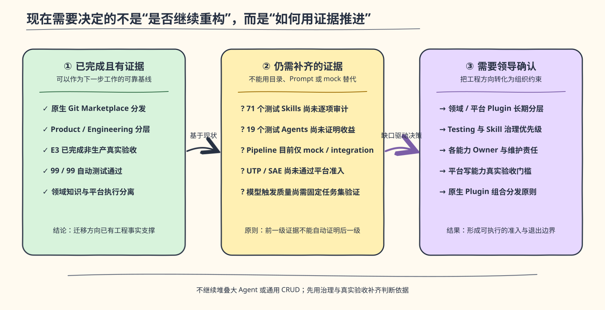

*图：已有工程事实证明迁移方向；下一步应以证据缺口驱动治理、Owner 和准入决策。*

- 确认“领域 Plugin 负责模型知识，平台 Plugin 负责系统接入”的长期分层。
- 确认测试迁移与 Skill 治理为下一阶段第一优先级。
- 为 Product、Engineering、Testing、E3、Pipeline、UTP/SAE 分别指定能力 Owner。
- 确认未经真实非生产验收的平台写能力不得进入 Marketplace。
- 确认角色安装采用原生 Plugin 组合清单，不恢复角色套件、项目同步 preset 或统一 delivery 包装层。

## 2. 旧 OEC-infra 的真实使用流程

### 2.1 需要区分的三种结构


*图：安装 bootstrap Plugin 后，仍需初始化和同步，角色配置才会进入业务仓库。*

旧实现不能只看 `oec-infra/` 编辑源码。真实运行经过三次形态变化。

实际用户步骤是：

1. 添加 Marketplace 并安装 `oec-ai` Plugin。
2. 在每个业务仓库运行 `oec-project-init`。
3. 选择运行时支持的 `role=designer`、`role=dev` 或 `role=all`，再选择 Claude Code/Codex。
4. 初始化器把 payload 复制到项目 `.claude` 或 `.codex`。
5. 项目保存 `.oec-ai/installation.json` 和同步运行时。
6. 后续 SessionStart 仅对已经初始化的项目执行版本同步。
7. 模型从项目级 descriptions 发现顶层能力，再按 Prompt 指定路径读取内部文件和执行脚本。

因此，“安装 Plugin”与“角色可用”是两个操作；“Plugin 中携带文件”与“Claude Code 原生发现组件”
也是两个概念。

### 2.2 三类使用者的实际配置


*图：文件体量只是表象，更关键的是测试场景没有独立角色和生命周期，却占据 Dev preset 的主要资产。*

| 使用者 | 旧 preset | 项目最终获得的核心配置 | 关键事实 |
| --- | --- | --- | --- |
| 产品经理 | `designer` | 25 个项目 Skills + 1 个 PM Agent | 622 个业务仓库文件，PM Agent 803 行 |
| 研发 | `dev` | 12 个顶层 Skills + 测试 Agent 树 | 1418 个文件，约 28 MiB |
| 测试 | 无独立 role | 作为 Dev preset 的 Dispatcher 与 Agents 下发 | 71 个内部 Skills 不被原生发现 |

这里需要区分源码与构建产物：`registry/presets.yaml` 只定义 `dev`、`designer` 两项；
`script/build-plugin-marketplace.mjs` 在构建时把两者合并生成 `roles.all`，最终
`plugins/oec-ai/payload/manifest.json` 才包含 `dev`、`designer`、`all` 三项。因此“测试角色”是
使用场景，不是 registry 或运行时 manifest 中的一等角色；测试资产的版本、安装和卸载生命周期被
绑定到研发工具包。

### 2.3 产品经理完整流程

`role=designer + tool=claude-code` 初始化后的结构为：

```text
产品业务仓库/
├── .claude/
│   ├── agents/oec-pm-agent.md
│   └── skills/                    # 25 个顶层项目 Skills
├── .oec-ai/
│   ├── installation.json
│   └── bin/
└── ai-docs/                       # 8 个首次 seed 文件
```

实测共 622 个业务仓库文件，其中 613 个由同步器管理。用户提出需求后，模型需要在以下多层入口间判断：

```text
803 行 PM Agent
→ 25 个 Skill descriptions
→ oec-pm Mega Skill 再路由
→ Read 6 个内部 SKILL.md
→ Read references
→ Bash/Python
→ E3 HTTP API
```

例如，PRD 生成、review、revise、finalize、split 分别存在顶层 Skill；`oec-pm` 又根据阶段和路径做
二次路由；Agent 还保存入口表和流程规则。相同的“补充并发布这个需求”会在 Agent、阶段 Skill 和
Mega Skill 三处被重新解释。

### 2.4 研发完整流程

`role=dev + tool=claude-code` 初始化后的结构为：

```text
研发业务仓库/
├── .claude/
│   ├── agents/oec-tester/         # 19 个 Agent Markdown，另有支持文件
│   └── skills/                    # 12 个顶层 Skill 根
├── .oec-ai/
│   ├── installation.json
│   └── bin/
└── ai-docs/                       # 12 个首次 seed 文件
```

实测共 1418 个业务仓库文件、1405 个 managed files、约 28 MiB。12 个顶层 Skills 同时包含：

- 架构设计、详细设计、代码查看和代码评审。
- `oec-dev-flow`、`oec-dev-task` 和 release closer。
- 测试 Dispatcher。
- Git DevOps、E3 任务、SAE 和飞书。

研发请求的模型链路可能是：

```text
12 个顶层 descriptions 竞争
→ oec-dev-flow 判断约 7 个流程阶段
→ oec-dev-task 再判断 9 个内部阶段
→ Read STAGE.md / references / nested SKILL.md
→ Bash / Python / HTTP
```

`oec-dev-task` 重新实现了设计、计划、执行、TDD、调试、验证和同步等通用研发流程，与现代 Coding
Agent 及 Superpowers 类能力重复。普通修复也可能被固定阶段扩张为完整任务包。

### 2.5 测试完整流程

测试人员必须先按 Dev 角色初始化项目，才能获得测试配置：

```text
role=dev
→ .claude/skills/oec-test-dispatcher/
→ .claude/agents/oec-tester/
→ AGENT.md 选择 Agent 文件
→ Dispatcher 选择内部 Skill 文件
→ 脚本 / 平台 / 报告
```

测试资产的实际体量：

| 资产 | 文件数 | 体积/行数 | 运行关系 |
| --- | ---: | ---: | --- |
| `oec-test-dispatcher` 整棵树 | 645 | 约 21.15 MiB | 一个顶层 Skill 携带全部资产 |
| Dispatcher 根 `SKILL.md` | 1 | 286 行 | 路由 71 个内部 Skills |
| 内部测试 `SKILL.md` | 71 | 分布于 `skills/` | Claude Code 不独立发现 |
| `oec-tester` Agent 树 | 23 | 约 0.49 MiB | 含 19 个 Markdown Agent |
| `oec-tester/AGENT.md` | 1 | 96 行 | 再次按路径路由 Agent |

Dispatcher 明确要求调用方读取 `skills/<name>/SKILL.md`；Agent 总览又要求先匹配 Agent，再通过 Read
读取 `<agent-root>/oec-tester/<name>.md`。这导致测试意图至少经过 descriptions、Agent 路由和 Skill
路由三层判断。

71 项能力还混合了不同所有权：

- 测试方法：需求审查、测试方案、用例设计、代码影响和质量分析。
- 确定性工具：文档解析、源码扫描、用例生成、报告构建和覆盖率计算。
- 自动化运行时：API、Playwright、PC UI、Mobile Midscene。
- 平台能力：OAuth、UTP 计划/报告、需求/缺陷、设备和任务状态。
- 过程编排：完整链路、检查点、循环、固定产物根和确认规则。

它们不应共享一个版本、上下文和安装生命周期。

### 2.6 旧方案中应保留的工程价值

迁移不应把旧方案描述成“完全错误”。它解决了当时的现实问题：

- 用 registry 和 preset 同时管理 Claude Code/Codex 资产。
- 按 designer/dev 下发不同集合，并在构建产物中提供两者合并的 all，避免永远安装全集。
- 同步器使用 staging、backup 和 rollback，避免半安装。
- 拒绝路径逃逸、payload symlink 和目标 symlink traversal。
- 通过 `installation.json` 记录 managed 和 retired files。
- `ai-docs` 模板只在缺失时 seed，避免升级覆盖产品内容。

新架构应保留这些安全思想，但不再以“复制组织配置到每个项目”作为默认运行模型。

## 3. 旧配置的结构性问题

### 3.1 嵌套文件索引冒充 Skill 加载


*图：宿主加载 Skill 与模型读取 Markdown 是两种不同的运行关系。*

Claude Code 原生 Skill 的关键关系是：宿主发现 `<name>/SKILL.md` 的 name/description，相关时加载
正文，supporting files 再按需读取。旧实现则用一个顶层 Skill 模拟几十个内部 Skill。

绿色节点是宿主原生发现；黄色节点只是普通文件读取。Read 能取得文本，不代表 Claude Code 已把它
注册为独立 Skill，更不意味着触发、namespace、预加载或权限元数据生效。

具体例子：

- PM：`oec-pm` 根入口把 6 个内部 `SKILL.md` 声明为执行规范。
- Dev：`oec-dev-task` 要求动作前读取内部 `STAGE.md`，这些文件自身声明不是可注册 Skill。
- Test：Dispatcher 明确说明 71 个子 Skill 不被平台发现，只能由根入口按路径 Read。
- Test Agent：`AGENT.md` 要求 Read 目标 Agent Markdown 后“按文件指令执行”，不是原生 Agent 调用。

直接影响不是只有上下文占用，还包括：路径漂移、触发不可观测、元数据失效、重复路由和模型判断冲突。

### 3.2 Plugin 安装结果不符合原生组件语义

旧 `oec-ai` Plugin 的实际原生清单是：

```text
Skills:      1  oec-project-init
Agents:      0
Hooks:       1  SessionStart
MCP servers: 0
```

PM Agent、25 个 designer Skills、12 个 Dev Skills、19 个测试 Agents 和 71 个测试内部 Skills 都只是
payload。安装 Plugin 后，Claude Code 不会直接显示这些 namespaced 组件；必须先复制到项目目录。

另有两个具体问题：

- `oec-tester/AGENT.md` 把 `.claude/agents` 当成普通文件库进行路由，绕开宿主 Agent tool 的上下文
  隔离和调用语义。
- 旧 Codex 产物写入 `.codex/skills`，而当前 Codex 项目 Skill 使用 `.agents/skills`；Claude Agent
  的 tools/skills 等行为元数据还会在 TOML 转换后降级成普通 instruction 文本。

因此“同时生成 Claude/Codex 文件”不等于真正的跨宿主兼容。兼容必须分别验证发现路径、frontmatter、
工具权限、上下文和调用语义。

### 3.3 分发产生双状态源和不对称生命周期

| 问题 | 机制 | 影响 |
| --- | --- | --- |
| 二次安装 | Plugin 安装后还要执行项目初始化 | 开箱即用链路不完整 |
| 双状态源 | Plugin cache 与业务仓库各有一份配置 | 排障和版本判断需要检查两处 |
| 同版本漂移 | SessionStart 只按版本号升级 | payload 内容变化可能不传播 |
| 工作区污染 | 每个项目复制数百至上千文件 | 组织运行时与业务代码混在同一 Git 生命周期 |
| 更新覆盖 | managed files 被覆盖，retired files 被删除 | 产生大规模 diff，可能覆盖项目修改 |
| 卸载不对称 | 卸载 Plugin 不删除项目副本 | 用户以为能力已卸载，实际 Prompt/脚本仍残留 |
| 生命周期耦合 | PM、Dev、Test、SAE、飞书等同包升级 | 不同 Owner 与风险能力无法独立发布 |

旧源码路径在构建中还会被扁平化。例如源码命令引用：

```text
./oec-infra/skills/dev/oec-dev-task/scripts/verify-versioned-paths.sh
```

业务仓库的真实路径却是：

```text
.claude/skills/oec-dev-task/scripts/verify-versioned-paths.sh
```

测试说明引用 `.claude/skills/test/SKILL.md`，实际顶层目录则是
`.claude/skills/oec-test-dispatcher/`。当 Prompt 保存构建前路径时，分发扁平化会自然制造失效索引。

### 3.4 冗余或中性 Prompt 会改变模型判断

随着模型能力提升，应删除的是模型已经能可靠完成的通用过程控制，而不是业务规则、安全边界或平台
不变量。

旧方案存在以下判断冲突：

- 803 行 PM Agent、25 个 descriptions 和 Mega Skill 对同一意图重复路由。
- ideate/generate/review/revise/finalize/split 被固化成阶段，而不是模型可选择的工作动作。
- Dev 的 7+9 个阶段与详细设计、代码评审、release closer 等独立 Skill 重叠。
- 测试 Dispatcher、Agent 总览、专用 Agents 和 71 个内部 Skills 同时决定测试链路。
- 测试方案评审内含固定 14 步流程，API、PC、Mobile 等又分别规定完整链路；这些规则没有先区分
  小任务、复杂任务和平台脆弱步骤。
- 固定确认、固定产物目录、固定完成话术和完整链路会把简单任务扩大成复杂任务。

例如用户只想修复一个明确的编译错误，模型本可以直接定位、修改并验证；如果 Prompt 要求先建立任务、
详细设计、执行 TDD 阶段、同步状态和生成 evidence，模型会把这些文字理解为合法性约束，而不是可选
建议。问题并非多消耗了多少 token，而是模型对“什么是必要步骤”的判断被改写。

这里有一个容易被忽略的行为学前提：**不能指望模型自己判断"哪些 Prompt 指令应该跳过"。**
放在上下文里的固定阶段、强制确认和完整链路，不是可选建议——模型会将其理解为合法性约束。
即使模型足够聪明到可以跳过，它在压力下也会给自己找合理化借口（"这次太简单""时间紧"），
而绕过的条件不受外部控制。因此，清理冗余 Prompt 不是"信任模型"，而是承认**纪律的强制力
必须来自外部——来自"这一段指令根本不在上下文里"，而不是来自"模型决定不遵守它"。**

在这个前提下，判断哪些能力可以交还模型、哪些必须保留，可以落到一个更具体的标准上：
**模型自己能产出什么 spec，不能产出什么 spec。**

模型变强后，自己已经能产出相当质量的 spec——它会做计划、拆任务、写设计文档，甚至会在
动手前主动追问模糊点。这些通用方法论及其产出的 spec，会被宿主和模型原生能力逐步吸收，
不再需要在 Skill 层重复建设。

但模型自己产出的 spec 缺少三样东西：

1. **外部视角的逼问**：模型倾向于顺着用户的假设走，不会像 office-hours 那样"直接到让人
   不舒服"。它不会追问"这周就有人愿意付钱吗""你亲眼看过别人用吗"——而这些追问决定的
   范围取舍，最终会落在 spec 里。
2. **团队品味的取舍**：YAGNI 无情砍需求，还是 completeness is cheap 往大了做——两个方向
   直接冲突，模型没法替你选。选哪一个，取决于团队规模、资金跑道和产品阶段，这些上下文
   不在模型权重里。
3. **决策历史的追溯**：三个月前为什么否决了微服务方案、这个 ADR 是在什么约束下做出的——
   这类组织记忆属于团队，不属于模型权重，也不该属于某个厂商的云端。

这三样东西不会因为模型变强而消失，因为它们要求的是**外部视角、团队判断和跨会话延续性**——
没有一个能靠更大的上下文窗口或更强的推理能力解决。

正确区分如下：

| 应保留 | 应交还模型 | 应代码化/MCP 化 |
| --- | --- | --- |
| 业务术语、产物契约、安全与权限边界 | 探索顺序、实现拆分、是否需要详细设计、普通调试策略 | schema、路径、认证、API、幂等、状态、恢复 |
| 已确认架构不变量和 ADR | 小修复是否需要任务包、采用何种测试层级 | 外部写操作、远端身份和结果验证 |
| 真实平台前置条件和禁止事项 | 是否并行委派、如何组织当前上下文 | 不可变 plan、checkpoint、脱敏和审计 |

### 3.5 平台不变量由 Prompt 和脚本调用者承担

旧 E3、SAE、UTP 等能力并非完全没有确定性代码。`oec-manage-task/scripts/client.py` 已封装 token
获取、401 后重新授权一次和成功响应判断；`oec-git-devops/devops/scripts/client.ts` 已封装 OAuth、
401 处理和响应解包；测试侧 `platform-gateway` 也已经实现认证、环境选择和部分重试。真实链路更准确
地表示为：

```text
Skill/Agent 文档
→ Read API reference
→ 模型选择 Bash/Python/Node 入口和调用参数
→ 脚本处理局部确定性职责（OAuth、401、部分响应规范化）
→ HTTP API
→ 模型或上层文档继续负责候选、跨步骤状态、写后恢复和最终完成判断
```

| 旧实现已经代码化的部分 | 仍然留给模型/调用者的缺口 |
| --- | --- |
| OAuth/PKCE、token 缓存和部分 401 重授权 | 选择哪个子文档、脚本和参数组合 |
| 部分 HTTP 超时、错误包装和响应解包 | 多候选业务身份的精确选择及确认 |
| 个别 UTP 操作的归一化与幂等测试 | 跨脚本 plan、checkpoint、mapping 和 status read-back |
| Pipeline Client 的请求包装 | `run_pipeline` 等写操作失败后的通用重试缺少“结果未知先精确查询”的语义 |

已发现的风险包括：

- 列表第一项曾被当成默认业务候选。
- OAuth、token、endpoint 和 payload 分散在 Markdown 与 Python。
- POST 结果不确定时容易盲目重试并重复创建对象。
- 缺失远端 ID 可能只降级为 warning，完成状态不严格。
- 模型可以构造超出稳定用户目标的通用 CRUD 参数。

因此问题不是“旧实现没有脚本”，而是确定性职责分散在多个 Skill payload 中，且没有成为宿主可发现、
可授权、可审计的统一类型化边界。这些缺口不应通过增加更多“必须”“不要忘记”来修复。正确做法是
MCP input schema、服务端验证、workspace 绑定、精确选择、不可变 plan、原子 checkpoint 和独立
status read-back。

### 3.6 问题归因总结


*图：问题来自职责和生命周期错位，而不是单纯的 Prompt 长度。*

## 4. Skill 研发与评审框架

### 4.1 第一性原则

Skill 的价值不是替模型复述常识，而是在正确触发时提供模型原本不知道、但完成目标确实需要的知识、
约束、产物契约和轻量编排。

《浅谈 SKILL 研发的最佳实践——以百补详情助手为例》提供了三个有价值的视角：渐进披露、自由度与
任务脆弱性匹配、真实运行现场闭环。在此基础上还需要平台安全、跨宿主语义和正式 eval：

- 模型需要判断的内容，提供目标、证据和边界，不固定唯一过程。
- 输出必须确定一致的内容，用脚本或校验器实现。
- 涉及外部数据和动作的内容，用类型化 MCP 实现。
- description 决定发现质量，必须同时覆盖正向、近邻负向和歧义输入。
- `SKILL.md` 内用标题隔离路径只能改善可读性；真正的渐进披露需要物理 supporting files 按需加载。
- 真实日志、错误堆栈和案例有价值，但必须先满足脱敏、授权和最小披露。

### 4.2 Skill 评审矩阵

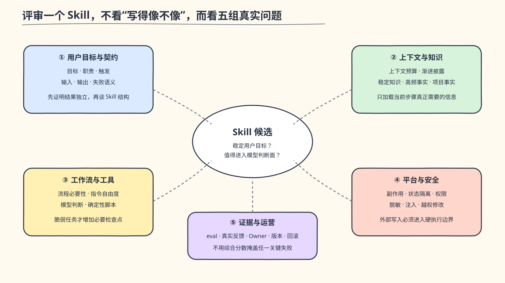

*图：十六项检查被归并为五组问题，便于汇报时先讲判断框架，再按表格复核细节。*

| 维度 | 必须回答的问题 | 常见失败信号 | 主要证据 |
| --- | --- | --- | --- |
| 用户目标 | 是否对应一个稳定、可独立描述的用户结果？ | 以内部阶段或文件目录命名 | 真实任务样本 |
| 职责边界 | 明确做什么和不做什么了吗？ | PRD、代码、部署、平台 CRUD 混为一个 Skill | 正负场景 |
| 触发 | description 是否覆盖正向、近邻负向和歧义输入？ | “任何相关任务均使用”或与多个 Skill 重叠 | 触发 eval |
| 输入 | 最小必需输入是什么，何时澄清、何时可推断？ | 猜默认业务值或机械逐项追问 | 缺失/歧义用例 |
| 输出 | 成功、失败、空结果和文件生命周期是否清楚？ | 固定话术替代结果验证 | 输出 contract |
| 上下文 | 当前步骤是否只加载必要信息？ | Agent 常驻模板、API 和全部知识库 | 加载追踪 |
| 渐进披露 | 大型知识是否物理拆分并按需导航？ | 单文件标题隔离被称为按需加载 | 文件结构与 debug |
| 知识归属 | 稳定领域知识、高频数据和项目事实分别放在哪里？ | 高频变化规则写死在 Prompt | Owner/更新频率 |
| 工作流必要性 | 流程是否来自真实脆弱性，而非对模型不信任？ | 所有任务都进入完整状态机 | 小任务对照实验 |
| 自由度 | 指令自由度是否与失败代价匹配？ | 开放式 Prompt 执行高风险写操作，或固定简单推理 | 风险分类 |
| 确定性工具 | 哪些解析、校验和格式化必须由代码保证？ | 模型模拟 YAML parser、ID 提取或固定报告 | 单元测试 |
| 平台副作用 | 外部操作是否有 schema、确认、幂等和 status？ | Prompt 拼 HTTP/JSON、盲重试 | MCP integration/E2E |
| 状态隔离 | workspace、session、token、plan 如何绑定和过期？ | 全局配置覆盖多个项目 | 双 workspace 测试 |
| 安全 | 权限、脱敏、提示注入和越权修改是否验证？ | 原始日志/凭证进入模型或输出 | 安全测试与审计 |
| 评测 | 是否覆盖触发、路径、长尾、弱模型和目标宿主？ | 只验证 Markdown 格式或 happy path | 固定 eval corpus |
| 维护 | Owner、版本、gotcha 过期、回滚和真实反馈是否清楚？ | 正文无限增长、远程版本不可追溯 | Changelog/运行证据 |

### 4.3 评审处置，而非伪精确评分

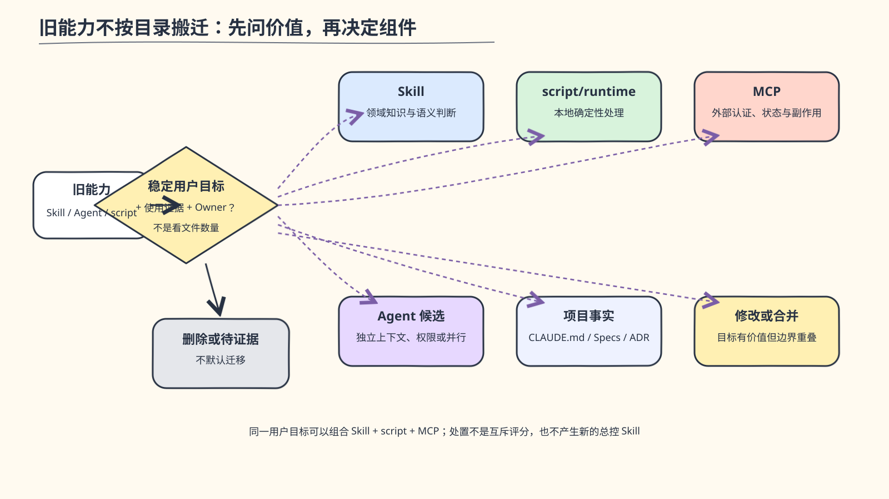

*图：处置是责任分流，不是互斥评分；同一目标可以组合 Skill、script 和 MCP。*

每项能力评审后只做以下处置：

| 处置 | 含义 |
| --- | --- |
| 保留 | 稳定用户目标、触发边界和证据都成立 |
| 修改 | 目标有价值，但 description、上下文或输出契约需要收敛 |
| 工具化 | 主要价值是确定性解析、计算、执行或格式化 |
| 平台化 | 涉及远端认证、数据、状态或副作用，应进入 MCP |
| 删除 | 与主模型、宿主内置能力或其他 Skill 重复，且没有额外领域价值 |
| 待证据 | 使用率、API、Owner、非生产环境或真实验收不足，暂不分发 |

不采用 A/B/C/D 或综合分数，因为不同维度不能互相抵消：一个格式良好的 Skill 如果会误触发生产写
操作，不能靠“文档清晰”提高总分而获得准入。

### 4.4 对旧测试资产的初步应用

| 旧能力类型 | 初步处置方向 | 原因 |
| --- | --- | --- |
| 通用测试常识和固定大 checklist | 删除或极度收敛 | 现代模型已具备，容易束缚判断 |
| 需求测试、测试设计、用例评审 | 候选聚焦 Skills | 目标相对独立，需要真实触发 eval |
| 文档解析、源码扫描、覆盖率计算、报告构建 | 工具化 | 输出可确定验证，不应消耗模型推理 |
| API/UI/Mobile 自动化运行 | 按运行时和 Owner 拆分评估 | 依赖、权限和生命周期不同 |
| UTP 计划、报告、用例和缺陷操作 | 平台化或待证据 | 需要认证、远端身份、幂等和真实 E2E |
| Dispatcher 和 Agent 文件路由器 | 删除 | 重复宿主能力，制造嵌套判断 |
| 只有在独立上下文中有明确收益的任务 | Agent 候选 | 必须用 eval 证明隔离/并行价值 |

## 5. Agent、Skill、MCP、Plugin 的职责

Claude Code 官方将这些能力放在不同扩展位置：[扩展模型](https://code.claude.com/docs/en/features-overview)、
[Plugin 规范](https://code.claude.com/docs/en/plugins-reference)、
[Subagent 规范](https://code.claude.com/docs/en/sub-agents)、[MCP 规范](https://code.claude.com/docs/en/mcp)。

### 5.1 责任矩阵

| 组件 | 主要职责 | 适合内容 | 不应承担 |
| --- | --- | --- | --- |
| Agent | 独立身份、上下文、工具或并行边界 | PM 身份、只读审计、需要隔离的大范围研究 | 完整阶段状态机、文件索引器、通用 API 文档 |
| Skill | 按需领域知识、判断方法、产物契约和轻量编排 | PRD 写作、红队评审、TDD、困难诊断 | 认证、任意 HTTP payload、重试和持久状态 |
| MCP | 外部数据与动作的类型化工具 | E3、Pipeline、未来 UTP/SAE | 产品判断、测试方法、通用角色 Prompt |
| Plugin | 独立安装、升级和卸载的能力包 | 同一领域或平台生命周期的组件 | 业务项目内容和跨领域全集 |
| Marketplace | 组织级发现、版本和分发 | Product、Engineering、E3 等 Plugins | 业务 Prompt 和运行时状态 |
| Supporting files | 某个 Skill 的渐进披露资源 | reference、template、example、script | 冒充独立 Skill 或公共文件路由树 |
| CLAUDE.md / AGENTS.md | 项目长期事实和始终适用约定 | 构建命令、业务边界、资料入口 | 复制 Plugin 工作流和 API 文档 |
| Script/runtime | 确定性本地实现 | schema、解析、选择、报告、bundle | 自身宣称为 Agent/Skill/MCP |

### 5.2 组合关系

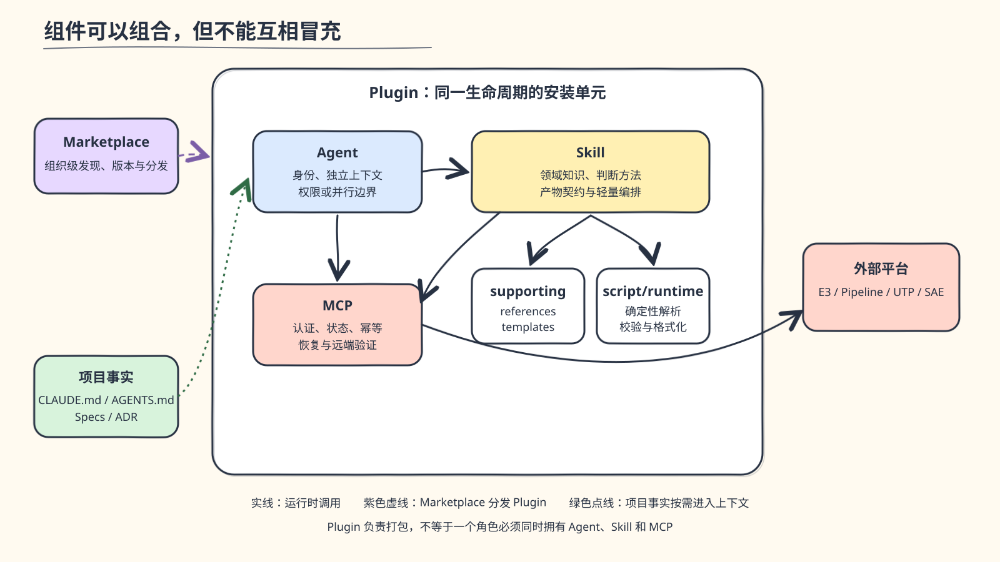

*图：Plugin 负责分发组合，Agent、Skill 与 MCP 分别承担身份、知识和平台执行。*

组件可以组合，但不能互相冒充：

- Skill 可以说明何时调用 MCP，但不复制 MCP 的 OAuth 和 payload。
- Agent 可以通过 `skills:` 原生预加载 Skill，但不写“Read 某路径即加载 Skill”。
- MCP description 可以帮助模型发现工具，但不定义 PM 或测试角色工作流。
- Plugin 是分发层，不等于一个角色必须拥有 Agent、Skill、MCP 全部类型。

### 5.3 旧 Skill 如何拆成原生组件


*图：迁移不是压缩旧 Prompt，而是让身份、知识、模型能力、确定性代码、平台执行和项目事实各归其位。*

旧 Skill 不能按目录一对一搬迁。一个目录中可能同时存在用户入口、领域规则、阶段状态机、脚本、平台
凭证和项目模板；如果只是把它改短，职责冲突仍然存在。实际拆分按以下顺序进行：

1. **先识别稳定用户结果**：用户究竟要完成 PRD、评审代码、同步研发任务，还是运行既有流水线；不把
   “阶段一/阶段二”或旧目录名当成能力。
2. **从目标中剥离通用模型能力**：探索代码、普通计划、实现、小修复和常规验证交还主 Coding Agent；
   不再为这些能力建设第二套总控状态机。
3. **保留模型不知道的稳定知识**：产品语言、artifact contract、团队 Spec 规则、评审方法等进入聚焦
   Skill 及其 supporting files。
4. **把可确定验证的本地工作代码化**：YAML 解析、路径检查、fingerprint、Spec glob 选择等保留为
   Skill supporting script 或自足 runtime；它们不需要 MCP。
5. **把外部平台不变量收进 MCP**：对于需要接入公司内部平台的能力，只要涉及认证、远端状态、外部
   副作用、跨步骤恢复或持久化运行状态，就由类型化工具承担执行边界。
6. **最后决定是否需要 Agent**：只有身份、上下文、权限或并行隔离确有价值时才创建；不会因为存在
   一组 Skills 就自动创建一个角色 Agent。

| 旧能力集合 | 拆分判断 | 当前或目标落点 |
| --- | --- | --- |
| PM Agent + `oec-pm` Mega Skill + PRD 阶段 Skills | PM 身份、写作、评审和发布是不同职责；内部 `SKILL.md` 路由没有独立价值 | `oec-pm` Agent；writing/reviewing/publishing 三个 Skills；模板和契约归属各自 Skill |
| 产品原型设计 | 不属于当前 PRD 写作、评审和发布主链 | 不随 Product 核心能力迁移；Engineering 仅提供用于回答一个交互或状态问题的 throwaway 决策原型，不生成产品原型资产 |
| 通用产品/系统需求 CRUD | 会把受控发布扩张为平台管理 SDK，权限与失败面明显增大 | 不迁移；只保留 PRD 发布所需的受限 E3 原子操作 |
| 文件写入策略 | Claude Code 已有原生文件工具，旧 Prompt 规则不提供额外领域价值 | 交还主 Agent；Skill 只保留产物契约和精确提交边界 |
| `oec-dev-task` + `oec-dev-flow` | 大部分是现代 Coding Agent 已具备的通用研发流程；团队长期事实仍有独立价值 | 删除总控流程；保留十个聚焦 Engineering Skills 和项目侧团队 Specs；新增的显式 Agent 委派只处理已有 change 或当前 diff，不保存阶段、恢复或重试状态 |
| `oec-manage-task` 及 E3 scripts | “何时同步哪些任务”需要业务语义；认证、候选、远端写入和恢复必须确定执行 | 研发规划留在主 Agent/Engineering Skills；平台动作进入 `oec-e3` 六个研发任务工具 |
| PRD 发布说明 + E3 scripts | 子 PRD、Story 和发布确认属于产品语义；HTTP、mapping 和幂等属于平台执行 | publishing Skill 编排 `oec-e3` 四个 PRD 发布工具 |
| `oec-dev-flow` 中的流水线步骤及平台 Client | 普通开发流程不应强制绑定流水线；运行既有流水线是独立高副作用能力 | 删除固定开发阶段；`oec-pipeline` 提供四个受控运行工具 |
| `oec-test-dispatcher` + 71 内部 Skills + Agent 文件树 | 不能把嵌套路由器整体搬入新 Plugin | 先逐项审计，再决定 Skill、script、UTP MCP、Agent 候选或删除 |

这意味着迁移结果不会与旧目录数量对齐：有的旧 Skill 被删除，有的拆成多个原生组件，有的多个旧
Skill 合并为一个稳定用户目标，还有的平台能力在真实契约不足时保持“待证据”，而不是用 Prompt
代偿。

#### 5.3.1 Skill supporting script 与 MCP Tool 的根本区别


*图：左侧宿主只看到通用 Bash；右侧宿主能够识别、授权并约束具体平台操作。*

根本区别不是实现语言，也不是代码复杂度，而是这项能力是否成为**宿主可发现、可授权、可约束的正式
工具接口**。Skill 的 `scripts/` 只是该 Skill 的 supporting files；文件存在不等于宿主注册了一个工具，
模型通常仍需先加载 Skill，再通过 Bash 组合脚本路径和参数。MCP Tool 则在 Server 启动后直接进入
Claude Code 工具列表，以名称、description 和 input schema 暴露稳定能力。

| 维度 | Skill 附带 `scripts/` | MCP 注册 Tool |
| --- | --- | --- |
| 宿主认知 | Skill 的 supporting file，不是独立组件 | 工具列表中的正式能力 |
| 发现方式 | 模型加载 Skill 后，按文档导航到脚本 | MCP Server 启动后注册工具名和 description |
| 调用方式 | Bash + 路径 + argv/stdin，结果通常是退出码和文本 | 结构化 tool call，输入由 JSON schema 和服务端共同校验 |
| 权限与确认 | 宿主通常看到的是一次通用 Bash 执行 | 可以围绕具体业务工具声明交互要求并应用宿主权限策略 |
| 实现暴露 | Prompt 往往需要知道脚本路径、参数和部分运行细节 | 调用者不需要知道 HTTP endpoint、token、payload 或实现路径 |
| 状态与恢复 | 通常由脚本临时文件和调用者串联，跨步骤契约不统一 | Server 可统一绑定 workspace、selection、plan、checkpoint 和过期时间 |
| 复用与生命周期 | 通常服务于一个 Skill，随该 Skill 内容演进 | 可被多个 Agent/Skill 共用，并按平台 Plugin 独立升级 |
| 测试边界 | 适合单元测试和 CLI 输入输出测试 | 还可验证协议注册、schema、权限元数据、transport 和远端集成 |

例如，`check-artifacts` 与 `oec-spec` 只读取本地受控文件，负责 YAML、路径、链接、glob 和 fingerprint
等确定性处理。它们不需要认证、远端状态或跨步骤副作用，因此作为 Skill runtime 更直接，也更容易随
领域契约共同维护。

相反，E3 发布、研发任务同步和 Pipeline 运行需要认证、远端身份、用户确认、写后恢复和状态回读，
这些能力必须由宿主看到具体的业务工具，而不是只看到一条包含任意参数的 Bash 命令。因此它们注册为
MCP Tool，并按平台生命周期独立分发。

#### 5.3.2 为什么外部交互脚本要进入 MCP

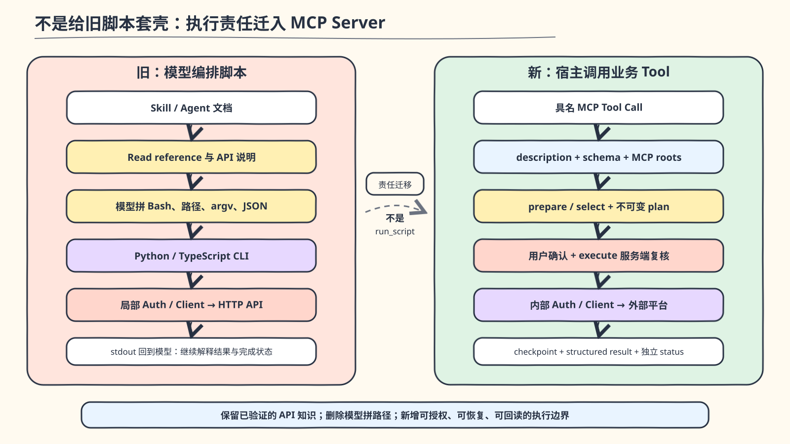

*图：当前实现不是注册一个通用 `run_script`，而是把平台执行责任迁入具名 Tool 和 Server 硬门禁。*

当前 MCP 不会启动旧 Python/TypeScript 脚本。迁移保留了已经验证的认证、API 和字段转换知识，但将
它们重写为 MCP Server 内部模块，并重新划分调用入口、运行状态和完成判断：

| 旧实现 | 当前落点 |
| --- | --- |
| Skill 意图路由、reference 和 API 索引 | `registerTool` 的名称、description 和 input schema |
| `client.py` 与 TypeScript Client | MCP 内部 `auth.mjs` 与 `client.mjs` |
| 一个个 CLI 入口脚本 | Publisher、Development 与 Pipeline Service |
| 全局或 Skill 目录下的 `preferences.json` | 与 canonical workspace 绑定的 Plugin Data |
| stdout、退出码和模型解释 | MCP `structuredContent` 与明确的 blocked/partial/verified 状态 |
| Prompt 中的确认、重试和完成判断 | selection/plan token、宿主确认、checkpoint 与独立 status |

迁移同时保留三条边界：

1. 这不是给旧脚本增加 MCP 壳；新 Server 不再依靠模型选择脚本路径、参数或任意 payload。
2. 不是所有脚本都进入 MCP；`check-artifacts`、`oec-spec` 等本地确定性校验仍属于 Skill runtime。
3. 不是旧平台能力全部恢复；缺陷、提测、通用 CRUD、流水线编辑和 Gitee 管理被有意排除。

判断标准不是“它是不是脚本”，而是它是否跨越本地模型会话与外部系统的信任边界。外部平台执行从
Skill script 抽出时，主要解决以下问题：

| 执行问题 | 放在 Skill + Bash/Python 中的局限 | MCP 提供的硬边界 |
| --- | --- | --- |
| 输入 | 模型从 Markdown 组合命令、路径和 JSON，允许范围依赖其正确理解 | tool schema 只接收被允许的字段、枚举和标识 |
| 认证 | token 路径、刷新策略和 header 容易暴露给 Prompt、日志或子进程 | Server 独立持有凭证、固定 origin、统一刷新与脱敏 |
| 远端身份 | 模型可能取第一项、模糊匹配或在歧义时继续 | 精确匹配；0/1/多候选分别创建、复用或阻断 |
| 用户授权 | “请先确认”只是 Prompt 约定，后续步骤仍可能绕过 | prepare 生成不可变 plan，execute 具有宿主交互元数据并校验 token |
| 幂等与恢复 | POST 超时后直接重跑可能产生重复对象 | 结果未知先按精确身份查询；每项成功立即 checkpoint，支持 partial resume |
| 状态隔离 | 项目、空间、选择和计划容易共享全局文件 | workspace、selection、plan 和 Plugin Data 有明确绑定与过期规则 |
| 完成判断 | 脚本返回成功不一定证明远端对象和父子关系正确 | 独立 status 重新读取并验证 ID、标题、关联和漂移 |
| 复用与测试 | 每个 Skill 各自复制 API 文档、重试和错误解释 | Agent/Skill 共享同一组工具；协议、失败分支和 bundle 可独立测试 |

MCP 因此不是把一段 Python 改写成 Node 的技术重构，而是把原来散落在 Prompt、脚本和模型判断中的
平台契约提升为宿主可发现、可授权、可验证的执行接口。模型仍决定用户意图和业务取舍，但不能自定义
任意平台 payload、跳过 plan 或把 warning 解释成发布成功。

这套硬边界不会因为模型变强而失效，因为它的价值不是"模型做不到"，而是**不交给模型做**。
模型决定用户意图和业务取舍，但不能自定义任意平台 payload、跳过 plan 或把 warning 解释成
发布成功。更强的模型只是更擅长在规则内找到路径，但规则本身仍然需要来自外部——这和一个
优秀的工程师仍然需要 CI 门禁、code review 和 deploy approval 是同一个道理。

放在更大的图景里看，MCP 硬边界守护的是上一节提到的三样东西的第二类和第三类：**团队品味的
取舍**（哪些平台操作是允许的、哪些是默认排除的，由团队而非模型决定）和**决策历史的追溯**
（workspace、selection、plan、checkpoint 的绑定与过期，使每次平台操作可审计、可恢复）。
模型的职责是理解用户意图并选择正确的工具组合，但工具本身的边界——schema、权限、幂等、
status——不由模型协商。

注册为 MCP 也不会自动获得安全性。Server 仍必须实现 schema 业务校验、固定可信 origin、凭证脱敏、
workspace 绑定、不可变 plan、幂等恢复和独立 status；否则只是把一个不安全脚本换成了一个不安全
Tool。

#### 5.3.3 Skill 与 MCP 如何协作，而不是互相替代

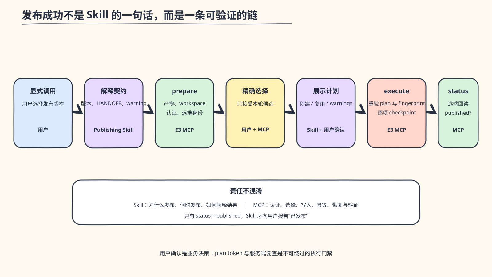

*图：Skill 保留产品语义，MCP 保障平台执行；用户确认和服务端硬门禁共同组成发布边界。*

以 PRD 发布为例，新的调用链如下。

其中 Skill 保留“一个子 PRD 对应一个系统需求”“何时应该发布”“如何向用户解释 warning”等领域
语义；MCP 保证 OAuth、空间绑定、POMP 选择、mapping、远端身份、幂等和恢复。研发任务同步采用同样
原则，但不额外创建“Dev 总控 Skill”：技术规划仍由主 Agent 和 Engineering Skills 完成，E3 只提供
受限的任务创建、进度和状态原子工具。Pipeline 也只负责把一个已经明确的 dev/test 运行计划安全
执行，不规定研发必须经过哪些阶段。

最终形成的不是二选一，而是三层协作：Skill 说明为什么做、何时做和如何解释结果；supporting script
保证本地确定性处理；MCP 承担外部认证、状态和副作用。既不能把平台写操作藏回 Bash，也不应为了
形式统一把本地检查器包装成 MCP。

### 5.4 为什么平台能力不合并为统一 delivery Plugin

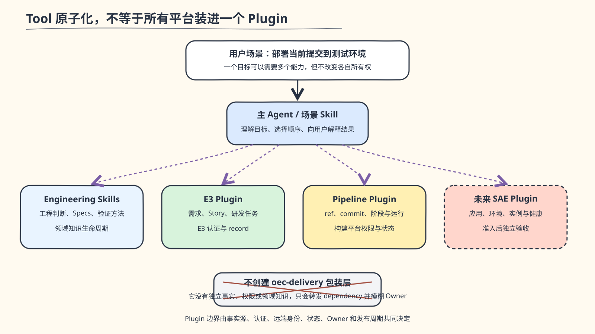

*图：场景可以跨平台，Plugin 的事实、权限、状态、Owner 和验收生命周期仍然独立。*

MCP Tool 应当原子化，不代表所有平台工具应该装进同一个 Plugin。Tool 的粒度由一次可验证操作决定，
Plugin 的粒度则由生命周期决定：当外部事实来源、认证权限、远端身份、状态恢复、平台 Owner 或发布
验收周期不同，就应分开安装和升级。

| 能力所有者 | 管理的事实与状态 | 组合边界 |
| --- | --- | --- |
| E3 Plugin | 需求、Story、研发任务、空间与 E3 mapping | 只负责 E3 认证、远端身份和任务/发布状态 |
| Pipeline Plugin | Git remote、ref、commit、流水线、阶段与运行状态 | 只运行既有 dev/test 流水线，不管理应用运行态 |
| 未来 SAE Plugin | 应用、环境、实例、版本和运行健康 | 通过准入后独立建设，不借用 Pipeline 的权限或验收结果 |
| Engineering Skills | 工程判断、团队 Specs、计划、诊断和评审方法 | 不持有任何平台 token、selection、plan 或远端状态 |
| 主 Agent / 场景 Skill | 根据用户目标决定何时组合领域知识和平台工具 | 不复制各平台认证、payload、幂等或恢复实现 |

因此，“部署当前提交到测试环境”可以在会话中依次组合 Pipeline 运行和未来 SAE 状态验证，但这种场景
组合不需要一个新的 `oec-delivery` Plugin。后者没有独立事实、权限或领域知识，只会增加 dependency
转发层并重新模糊 Owner。详细平台边界保留在
[平台 Plugin 层级与 MCP 迁移设计](../architecture/platform-plugin-hierarchy.md)中。

## 6. 当前 3.0 已实现架构

### 6.1 组件层级


*图：Product 明确依赖 E3；Engineering 与 E3、Pipeline 仅按使用场景组合；Common 独立提供通用 HTML 幻灯片。*

| Plugin | Agent | Skills | MCP | 作用与边界 |
| --- | ---: | ---: | ---: | --- |
| `oec-product@3.0.2` | 1 | 3 | 0 | PRD 写作、只读评审和发布语义；依赖 E3 |
| `oec-engineering@1.6.0` | 3 | 10 | 0 | 团队 Specs、显式迁移、规划、决策挑战、决策原型、TDD、诊断、Agent 委派、review、close |
| `oec-e3@1.0.1` | 0 | 0 | 1 | 4 个 PRD 发布工具 + 6 个研发任务工具 |
| `oec-pipeline@1.0.1` | 0 | 0 | 1 | 既有 dev/test 流水线的受控 prepare/execute/status |
| `oec-common@0.2.1` | 0 | 1 | 0 | 零依赖 HTML-first 幻灯片 |

Product 明确向用户承诺 E3 发布，所以声明 `oec-e3@~1.0.0` dependency。Engineering 的十个 Skills
不以 E3 或 Pipeline 为完成前提，因此与平台 Plugin 是按场景组合关系，不作强依赖。

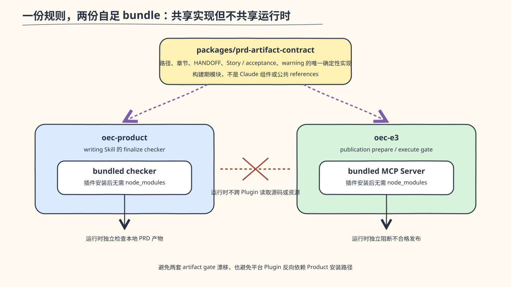

*图：共享的是构建期确定性实现，不是公共 Skill 资源或运行时跨 Plugin 文件依赖。*

Product 与 E3 都需要验证同一份 PRD 产物，但不复制两套规则：根级构建模块
`packages/prd-artifact-contract` 维护唯一确定性实现，Product checker 与 E3 publication gate 在构建
时分别导入，再生成各自的自足 bundle。它不是 Claude 组件、公共 Skill references 或运行时 npm 包，
Product 和 E3 运行时也不跨 Plugin 读取文件。这样既避免 artifact gate 漂移，也不让平台 Plugin
反向依赖 Product 的安装路径。

### 6.2 当前分发方式

```bash
claude plugin marketplace add \
  quanxinwang18-a11y/plainOEC-infra \
  --scope user

claude plugin install oec-product@plainOEC-infra --scope user
claude plugin install oec-engineering@plainOEC-infra --scope user
claude plugin install oec-pipeline@plainOEC-infra --scope user
claude plugin install oec-common@plainOEC-infra --scope user
```

- Git Marketplace 直接分发版本化 Plugin。
- Product 安装时由 Claude Code 自动解析 E3 dependency。
- user scope 不向业务仓库创建 `.claude` 或 `.oec-ai`。
- project scope 由 CLI 生成插件启用声明，不需要手工复制组件。
- 自足 bundle 随 Git 提交，用户不需要 npm login、npm install 或 Plugin 内 `node_modules`。
- Plugin Data 保存 token、workspace config、selection、plan 和 runtime state；业务仓库只保存需要团队
  审计和恢复的产物与 mapping。

### 6.3 当前证据边界

| 能力 | 实现 | 自动验证 | 真实外部验收 |
| --- | --- | --- | --- |
| Product Agent/Skills | 已完成 | 组件、触发、artifact、bundle 回归 | PM 使用旅程已有 fixture 证据 |
| Engineering Skills/Specs/Agents | 已完成 | 结构、Agent parity、路径选择、bundle、Java/前端 fixture | 不涉及外部平台写入 |
| Common HTML Slides | 已完成 | 组件、零依赖 shell、真实浏览器 smoke | 不涉及外部平台写入 |
| E3 PRD 发布 | 已完成 | OAuth、幂等、漂移、partial 等 | “OBU-AI提效组”真实通过 |
| E3 研发任务 | 已完成 | 创建/复用、进度、status 等 | “OBU-AI提效组”真实通过 |
| Pipeline | 已完成 | mock/integration 与 bundle | 未执行真实非生产流水线 |
| Testing/UTP/SAE | 未准入 | 仅审计或规划 | 无 |


*图：真实旅程证明创建、复用、进度和 read-back 主链；图中同时标明不能由此推出的结论。*

当前完整自动测试全部通过，精确数量以 `npm test` 输出为准。E3 的真实验收不是“工具能够注册”或“mock 返回成功”，而是完成了图中的远端
旅程。

[脱敏验收记录](../evidence/e3-platform-3.0.0-real-acceptance.md)没有保存 token、远端内部 ID 或原始
响应，也没有在真实环境人为制造 partial；partial resume 仍由自动测试证明。因此该记录证明的是上述
授权空间中的创建、复用、进度和 read-back 主链，不是完整 E3 管理能力或生产可用性。Pipeline、SAE、
UTP 也不得借用 E3 证据宣称已验证。

## 7. 下一阶段目标架构与角色分发

### 7.1 目标层级


*图：Testing 先审计再建设；UTP 与 SAE 只有通过平台准入后才进入 Marketplace。*

明确不新增：

- `oec-delivery` 场景包装 Plugin。
- 通用 Dev Agent。
- 测试 Dispatcher 或 71 项文件索引树。
- 角色套件 Plugin。
- SessionStart 项目同步、默认 Agent settings 或通用平台 CRUD。

### 7.2 角色安装体验

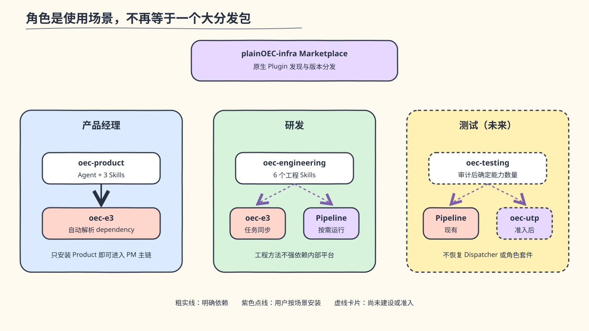

*图：PM 具有明确 Product→E3 dependency；研发和测试按场景组合平台能力。*

角色是使用场景，不再强制等于一个大分发包：

| 角色 | 基础安装 | 按需平台组合 | 说明 |
| --- | --- | --- | --- |
| PM | `oec-product` | 自动获得 `oec-e3` | publishing 明确依赖 E3 |
| 研发 | `oec-engineering` | `oec-e3`、`oec-pipeline` | 工程方法不与内部平台强绑定 |
| 测试 | 未来 `oec-testing` | 未来 `oec-utp`、现有 Pipeline | UTP 未准入前不提供安装承诺 |

公司内部完整研发场景可在 onboarding 文档中给出三条原生安装命令，但不为“一条命令”重新制造一个
无领域知识、只转发 dependency 的角色套件。

### 7.3 `oec-testing` 的形成方式

第一版不预先承诺 Skill 或 Agent 数量。先审计每项旧能力：

| 审计字段 | 目的 |
| --- | --- |
| 稳定用户目标与真实使用率 | 判断是否值得独立分发 |
| 输入、输出、失败语义 | 判断能否形成清晰 contract |
| 与其他能力的重叠 | 合并重复链路 |
| 方法、工具或平台属性 | 决定 Skill、script/runtime 或 MCP |
| 外部依赖和权限 | 判断安全边界与安装成本 |
| 远端 identity 和幂等 | 判断平台能力能否准入 |
| Owner 和变化频率 | 决定 Plugin 生命周期 |
| 自动、mock、真实证据 | 防止仅凭文档宣称可用 |

审计完成后：

- 主模型能稳定完成的测试常识不迁移。
- 高频、目标独立、领域知识明确的能力成为顶层 Skills。
- 确定性解析、扫描、执行和报告成为可测试工具。
- UTP 认证、数据、任务和状态进入独立 MCP。
- 只有独立上下文、并行或权限隔离通过 eval 证明收益时才创建 Agent。

### 7.4 UTP 与 SAE 准入门槛

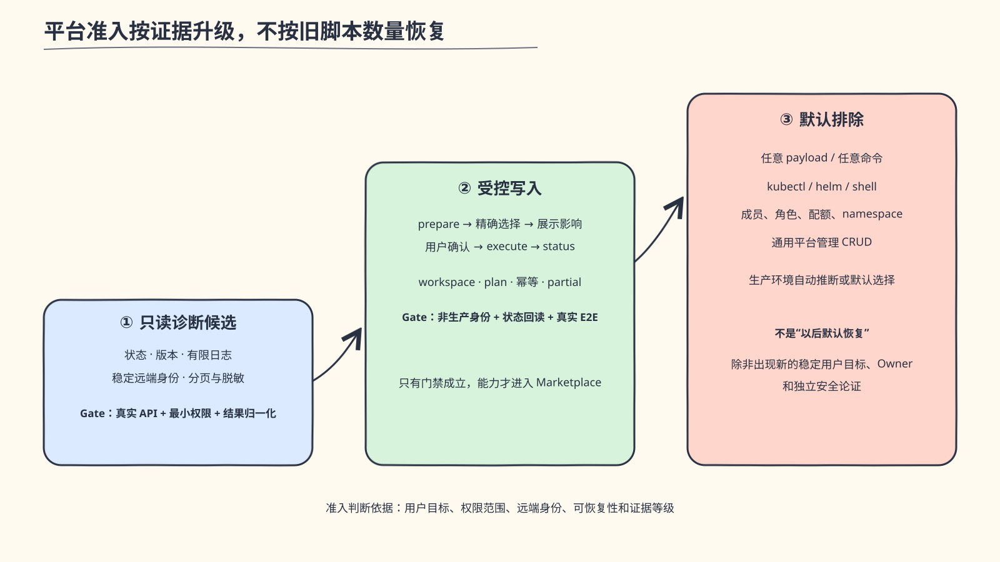

*图：只有证据通过门禁才能升级能力范围；排除项不会因为旧 payload 已有脚本而自动恢复。*

平台迁移采用渐进准入，不因旧 payload 已有脚本就一次性恢复全部操作：

| 准入层级 | 处理原则 |
| --- | --- |
| 只读诊断 | 优先验证状态、版本、受限时间窗日志和稳定远端身份；仍需真实 API、权限和结果归一化证据 |
| 受控写入 | API、非生产身份、影响范围和状态回读成立后，再采用 prepare、用户确认、execute、status |
| 默认排除 | 任意 payload、kubectl/helm、成员/角色/配额/namespace 和通用平台管理 CRUD |

这不是按模型“能不能调用”划分，而是按稳定用户目标、最小权限和可恢复性划分。例如 SAE 可以先评估
应用状态、版本和有限日志，只有真实部署入口和非生产身份都可验证后才考虑写入；UTP 也必须先把测试
方法、本地确定性工具与远端平台 API 分开审计。

任何平台 Plugin 进入 Marketplace 前必须满足：

1. 固定可信 origin、真实 API schema、成功码和错误语义。
2. 明确认证方式、最小权限和凭证脱敏。
3. 可用于验收的非生产环境和精确远端身份。
4. workspace 绑定、候选选择、不可变 plan 和过期时间。
5. POST 结果未知时按精确标识查询，不盲重试。
6. partial checkpoint、read-back status 和漂移阻断。
7. 不接受任意 payload、任意状态码、任意 kubectl/helm 或通用 CRUD。
8. 自足 bundle、自动失败场景和一次明确授权的真实旅程。

详细审计见 [SAE 与 UTP 准入审计](../audits/sae-utp-admission-audit.md)。

## 8. 下一步实施路线


*图：阶段之间由退出证据放行，不按排期自动前进，也不以目录或 mock 代替真实能力证明。*

### 阶段一：测试资产盘点与基线

目标：把 71 个内部 Skills、19 个 Agents 和 supporting runtime 变成可决策清单，而不是直接搬目录。

交付物：

- 每项能力的目标、使用率、Owner、输入输出、依赖、副作用和证据矩阵。
- 重复能力、失效路径、通用模型能力和平台耦合清单。
- 代表 API、Web UI、PC、Mobile、需求测试、覆盖率、UTP 的固定任务集。
- 旧 Dispatcher 在这些任务上的触发、阶段、确认、文件和成功/失败基线。

退出条件：每项旧能力都有“保留/修改/工具化/平台化/删除/待证据”处置，不存在无 Owner 的默认迁移。

### 阶段二：统一 Skill 治理

目标：先建立规则，再建设新 Testing Plugin，避免复制旧问题。

交付物：

- 通用 Skill review 模板和准入 checklist。
- 正向、近邻负向、歧义、长尾和越权 eval 格式。
- frontmatter、目录、链接、路径和 supporting-file 自动检查。
- 模型判断、确定性工具、平台 MCP 和项目事实的归属规则。
- gotcha 的归并、过期和回归测试替代制度。

退出条件：Product、Engineering 和 Testing 候选能力使用同一评审口径；禁止出现新的内部
`Read */SKILL.md` 加载约定。

### 阶段三：建设聚焦 `oec-testing`

目标：只迁移经证据证明的测试用户目标。

原则：

- 一个 Skill 对应一个稳定结果，不按 API 测试内部阶段逐项拆 Skill。
- 普通、小范围测试保留主 Agent 快速路径。
- 复杂链路用必要的检查点，不复制统一 14 步或完整状态机。
- 确定性脚本有独立测试、schema 和输出 contract。
- 不在核心 Plugin 中携带 UTP OAuth、远端 API 或设备平台 CRUD。

退出条件：原生发现无 Dispatcher；固定任务集证明误触发、无关上下文、无意义产物和越权操作均较旧
方案减少，并且没有牺牲关键业务/测试不变量。

### 阶段四：平台准入与真实验收

目标：只在契约成熟后建设 UTP/SAE。

- 先实现只读发现和 status，再评估受控写操作。
- 写操作统一 prepare、用户确认、execute、status。
- Pipeline 先获得明确目标仓库、流水线和授权，完成一次 dev/test 真实运行。
- UTP/SAE 分别形成 mock 与真实非生产证据，不借用其他平台结果。

退出条件：真实 API、权限、远端 identity、幂等、partial 和状态回读全部可验证；否则保持未准入。

### 阶段五：分发推广与运营

目标：让组织看到真实效率与判断质量变化，而不是只看 Prompt 行数。

- PM：需求写作、评审、E3 发布真实旅程。
- 研发：Java/Spring 复杂变更与前端小修复两条旅程。
- 测试：API、UI、需求测试各至少一个代表场景。
- 分别记录安装步骤、首次可用时间、触发、确认、产物、失败恢复和用户反馈。
- 每次发布同时给出组件清单、自动测试、mock 和真实 E2E 状态。

## 9. 成功标准与领导可见指标

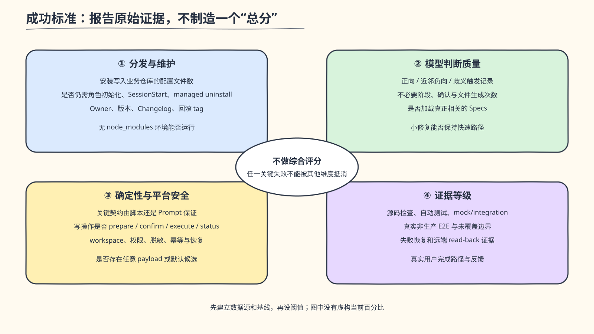

*图：指标必须报告原始数据和证据来源，不用综合分数或没有基线的百分比包装结果。*

不把多个维度压成一个综合分数，直接报告原始证据：

### 9.1 分发与维护

- user-scope Plugin 安装向业务仓库写入的配置文件数：目标为 0。
- 是否仍需角色初始化、SessionStart 同步和 managed-file uninstall：目标为否。
- 每个 Plugin 是否有独立 Owner、版本、Changelog 和回滚 tag。
- bundle 是否在无 `node_modules` 的 Git archive 中运行。

### 9.2 模型判断质量

- 固定任务集的 Skill 命中、漏触发、误触发和歧义记录。
- 任务实际经过的阶段、确认轮次和生成文件数量。
- 是否读取了真正相关的 reference/Spec，是否加载无关知识。
- 小修复能否走快速路径，复杂任务能否保留必要不变量。
- 是否出现失效路径或“Read 文件即完成 Skill/Agent 加载”的伪调用。

### 9.3 确定性与平台安全

- 所有外部写操作是否经过类型化 schema、计划确认和独立 status。
- 是否存在默认取第一候选、任意 payload、盲重试或缺 ID 仍报告完成。
- workspace、token、plan、mapping 和远端对象是否正确隔离与绑定。
- 权限、脱敏、提示注入、路径逃逸和越权修改是否有失败测试。

### 9.4 证据等级

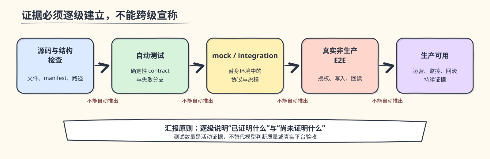

*图：证据必须逐级建立；每一级都需要说明已证明与尚未证明的边界。*

- 自动测试总数和失败项。
- mock/integration 覆盖的失败、歧义、partial 和漂移分支。
- 真实非生产旅程的目标、授权、创建对象、read-back 和清理边界。
- 明确列出未测试和不能宣称生产可用的能力。

触发准确率等指标先建立旧/新固定任务基线，再设发布阈值；不在没有样本时预先编造百分比。

## 10. 风险、边界与最终建议

### 10.1 主要风险

| 风险 | 控制方式 |
| --- | --- |
| 为追求原生化误删业务规则 | 先分类为业务事实、模型常识、确定性不变量和平台能力 |
| Testing 审计变成又一次大迁移 | 先形成处置矩阵，不承诺固定组件数量 |
| 新 Plugin 继续依赖 Prompt 调 API | 平台写操作必须先通过 MCP 准入 |
| 只优化强模型、弱模型不可用 | 固定任务集覆盖目标模型与弱模型 |
| 真实数据提升调试但泄露敏感信息 | 脱敏、最小披露、授权和保留周期 |
| 远程平台升级导致结果不可复现 | 记录 Server/接口版本、plan 和结果 provenance |
| 角色安装命令较多 | 用明确 onboarding 组合清单，不以包装 Plugin 换取表面一条命令 |

### 10.2 最终建议


*图：项目事实、领域知识、确定性不变量、平台执行和分发治理各自拥有清晰边界。*

OEC-infra 后续不应继续做“更多 Prompt、更多角色路由、更多统一入口”，而应完成三件事：

1. **把剩余测试资产从文件路由树变成有证据的原生能力。**
2. **建立贯穿 Product、Engineering、Testing 的 Skill 研发和评审治理。**
3. **让 UTP、SAE 等平台能力在真实契约成立后以独立 MCP 准入。**

这套架构的收益不是“少写了多少字”，而是模型、代码、平台和组织 Owner 各自只承担自己能够可靠
负责的部分；安装、升级、判断和外部执行都变得可观察、可验证和可回滚。

## 附录 A：事实来源

- 旧 OEC PM 分发与运行分析：[Product 能力迁移分析](../migrations/product-capability-migration.md)。
- 旧 Dev/Test 分发与运行分析：[Engineering 能力迁移分析](../migrations/engineering-capability-migration.md)。
- 当前平台层级：[platform-plugin-hierarchy.md](../architecture/platform-plugin-hierarchy.md)。
- E3 真实验收：[e3-platform-3.0.0-real-acceptance.md](../evidence/e3-platform-3.0.0-real-acceptance.md)。
- SAE/UTP 准入：[sae-utp-admission-audit.md](../audits/sae-utp-admission-audit.md)。
- Skill 实践参考：《浅谈 SKILL 研发的最佳实践——以百补详情助手为例》。
- Claude Code 官方：[扩展模型](https://code.claude.com/docs/en/features-overview)、
  [Skills](https://code.claude.com/docs/en/slash-commands)、
  [Plugins](https://code.claude.com/docs/en/plugins-reference)、
  [Subagents](https://code.claude.com/docs/en/sub-agents)、[MCP](https://code.claude.com/docs/en/mcp)。

## 附录 B：当前版本与发布状态

| 项目 | 版本/状态 |
| --- | --- |
| Marketplace | `3.0.1` release candidate |
| Product | `3.0.2` release candidate，未创建新 tag |
| Engineering | `1.6.0` release candidate，未创建新 tag |
| E3 | `1.0.1` release candidate，未创建新 tag |
| Pipeline | `1.0.1` release candidate，未创建新 tag |
| Common | `0.2.1` release candidate，未创建新 tag |
| 当前自动测试 | 全部通过；精确数量以 `npm test` 输出为准 |
| Skill 行为 eval | 14 个 Skill 的正负场景已可执行；真实运行受 early-access 账号能力限制 |
| 远端发布 | LICENSE/notice Owner 决定及外部写入证据完成前阻塞；不创建或推送新 tag |

## 附录 C：可复核证据索引

以下索引用于把关键事实落到固定 commit 或当前仓库文件。旧仓库命令均在
`/Users/qxwang6/project/oec-ai-infra` 执行，不依赖当前工作树内容。

| 事实 | 可复核证据 | 证据能证明什么 |
| --- | --- | --- |
| 旧源码 preset 只有 dev/designer | `git show 7935600:registry/presets.yaml` | registry 的原始角色定义 |
| all 是构建时合并项 | `git show 7935600:script/build-plugin-marketplace.mjs`，查看 `buildPayloadManifest` | `roles.all` 由 dev/designer 合并生成 |
| 旧运行时有三个可选 role | `git show 7935600:plugins/oec-ai/payload/manifest.json` | 分发 payload 的 dev/designer/all 清单 |
| 旧 Plugin 是 bootstrap | `plugins/oec-ai/.claude-plugin/plugin.json`、`plugins/oec-ai/skills/oec-project-init/`、`plugins/oec-ai/hooks/hooks.json` | 原生入口是初始化 Skill 与 SessionStart Hook；角色资产位于 payload |
| 旧平台并非没有代码封装 | `oec-infra/skills/tools/oec-manage-task/scripts/client.py`、`oec-infra/skills/tools/oec-git-devops/devops/scripts/client.ts`、`oec-infra/skills/test/skills/platform-gateway/scripts/gateway_client.py` | OAuth、401、响应处理和部分重试已有确定性实现 |
| 旧平台边界仍不完整 | `oec-infra/skills/tools/oec-manage-task/SKILL.md` 与上述 clients | 模型仍负责文件路由、入口/参数组合和跨步骤流程；Pipeline Client 对写操作使用通用失败重试 |
| 当前组件层级与 dependency | [Marketplace manifest](../../.claude-plugin/marketplace.json)、[Product manifest](../../oec-product/.claude-plugin/plugin.json)、[Engineering manifest](../../oec-engineering/.claude-plugin/plugin.json)、[E3 manifest](../../oec-e3/.claude-plugin/plugin.json)、[Pipeline manifest](../../oec-pipeline/.claude-plugin/plugin.json)、[Common manifest](../../oec-common/.claude-plugin/plugin.json) | 当前版本、分发单元和 Product→E3 依赖 |
| Product/Engineering/Common 的结构与 fixture | [Product 组件测试](../../oec-product/tests/components.test.mjs)、[Engineering 组件测试](../../oec-engineering/tests/components.test.mjs)、[Engineering 分发测试](../../oec-engineering/tests/distribution.test.mjs)、[Common 组件测试](../../oec-common/tests/components.test.mjs) | 原生组件、负向触发文本、Agent parity、Spec 工具、HTML deck shell 和无依赖 bundle 等确定性契约 |
| E3/Pipeline 的 mock 与 bundle | [E3 mock journey](../../oec-e3/servers/e3/tests/journey.test.mjs)、[E3 bundle 测试](../../oec-e3/servers/e3/tests/distribution.test.mjs)、[Pipeline planner 测试](../../oec-pipeline/servers/pipeline/tests/planner.test.mjs)、[Pipeline bundle 测试](../../oec-pipeline/servers/pipeline/tests/distribution.test.mjs) | 测试替身下的计划/恢复分支和 MCP stdio 分发，不证明真实远端运行 |
| E3 真实非生产旅程 | [脱敏验收记录](../evidence/e3-platform-3.0.0-real-acceptance.md) | 授权空间、唯一标识、execute/status/read-back 和明确未覆盖边界 |
| 当前宿主版本 | 2026-08-21 执行 `claude --version` 返回 `2.1.237 (Claude Code)` | 当时验证使用的 Claude Code 版本，不代表未来版本行为 |

旧 PM/Dev/Test 的文件数、行数和物化结构还可以分别通过
[Product 能力迁移分析](../migrations/product-capability-migration.md) 与
[Engineering 能力迁移分析](../migrations/engineering-capability-migration.md) 中记录的固定基线和临时初始化方法复算。这些结果仍以原始
初始化和固定 commit 为证据，不把文档二次转述当成新的独立证据。

## 附录 D：术语表

| 术语 | 含义 |
| --- | --- |
| E3 | OEC 使用的需求、Story 和研发任务协作平台；当前通过 `oec-e3` MCP 接入 |
| UTP | 旧测试资产连接的测试管理/执行平台；尚未通过新架构准入 |
| SAE | 旧配置包含的应用与环境管理平台能力；尚未通过新架构准入 |
| POMP | E3 产品空间下用于关联需求/任务的项目元数据 |
| HANDOFF | PRD 版本向子 PRD 和 Story 映射的结构化交接文件，当前 contract 为 schema v4 |
| Plugin Data | Claude Code 为单个 Plugin 提供的本地数据目录，用于 token、workspace config、selection 和 plan 等非 Git 状态 |
| mapping | Git 仓库内记录本地产物与 E3 远端对象身份及同步状态的 YAML 文件 |
| selection token | 把候选集合、workspace 和选择阶段绑定起来的短期不透明凭据 |
| plan token | 把已确认计划、workspace、fingerprint 和目标平台状态绑定起来的短期不透明凭据 |
