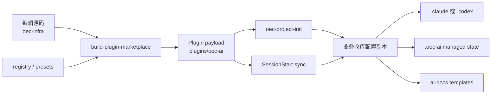
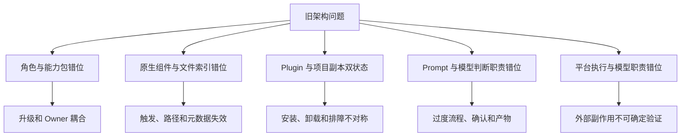
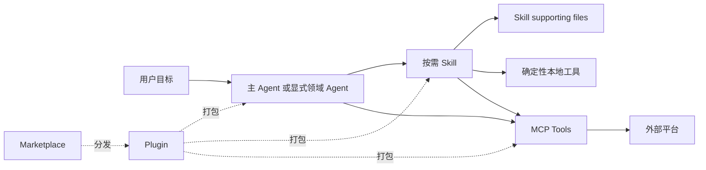
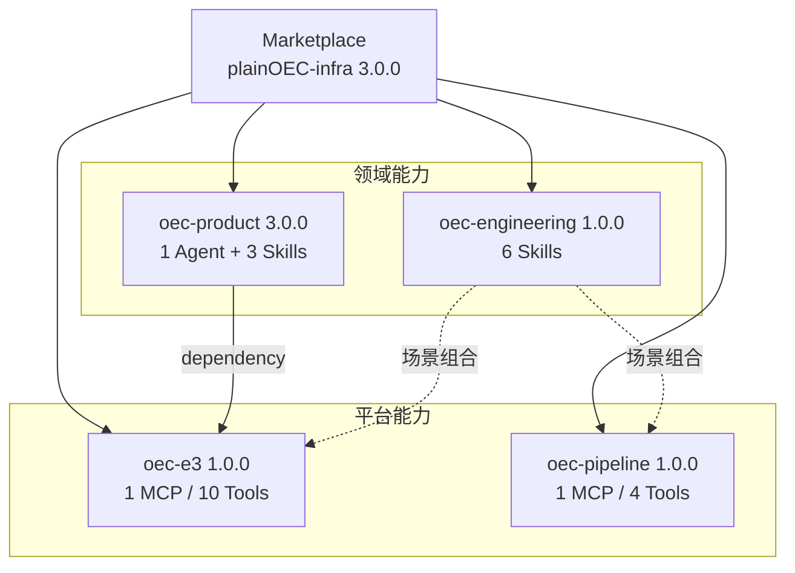
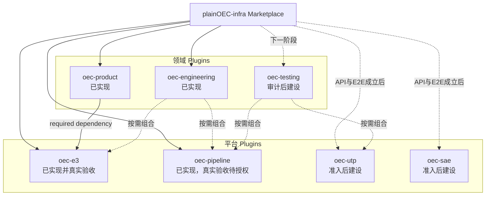

# OEC-infra 下一步完整优化思路

> 面向对象：技术与管理混合决策者  
> 旧实现基线：`oec-ai-infra@7935600`（`oec-ai@0.2.2`）  
> 当前实现基线：`plainOEC-infra@9f70ae8`（Marketplace `3.0.0`）  
> 文档日期：2026-08-21

## 0. 阅读口径

本文把结论分成四类，避免将设计、代码和真实可用性混为一谈：

- **事实**：由固定 commit、实际初始化结果、Plugin manifest 或测试输出直接证明。
- **判断**：基于事实对职责、模型判断面和维护成本的分析。
- **已实现**：当前仓库已经存在并通过自动验证的能力。
- **下一步规划**：尚未完成，不以目录、Prompt、mock 或静态检查宣称可用。

外部系统能力再单独区分：

```text
源码与结构检查 ≠ 自动测试 ≠ mock/integration ≠ 真实非生产 E2E ≠ 生产可用
```

本文不是以“Prompt 越短越好”为目标。真正的目标是：让模型只承担需要语义理解和权衡的工作，让
确定性代码保障不变量，让平台 MCP 承担外部系统执行，并让每种能力以正确的 Claude Code 原生组件
进行分发。

## 1. 管理摘要

### 1.1 核心判断

旧 OEC-infra 的主要问题不是文字多，而是四组边界错位：

1. **角色边界错位**：PM、研发、测试、办公集成和平台操作通过 `designer/dev/all` preset 混合下发；
   测试甚至不是独立 role，而是 Dev 安装包的一部分。
2. **组件边界错位**：可复用知识、阶段工作流、Agent 文件、确定性脚本和远端 API 都被描述为
   “Skill”，模型需要再次解释它们之间的关系。
3. **分发边界错位**：Marketplace 安装的是 bootstrap Plugin，真正配置还要复制进每个业务仓库，
   Plugin cache 和项目副本成为两个真相源。
4. **执行边界错位**：OAuth、HTTP payload、候选选择、重试、ID 提取、幂等和恢复依赖模型阅读文档
   后驱动 Bash/Python，而不是平台提供的类型化工具。

这些错位会直接影响模型判断：同一请求同时命中多个路由、阶段和固定流程，模型可能扩大本应很小的
任务，重复确认，生成不需要的文件，或在外部系统执行中作出未经授权的猜测。

### 1.2 已完成的迁移

当前 `plainOEC-infra@3.0.0` 已经完成第一阶段原生化：

- Product：显式 PM Agent + 三个以用户目标划分的 PRD Skills。
- Engineering：六个聚焦工程 Skills，不创建通用 Dev Agent。
- E3：独立 MCP-only Plugin，提供十个受控工具。
- Pipeline：独立 MCP-only Plugin，提供四个既有流水线工具。
- 分发：Git Marketplace + 自足 bundle，不再通过 SessionStart 向业务仓库同步配置。

当前自动测试为 99/99。E3 的 PRD 发布与研发任务主链已在授权非生产空间完成真实验收；Pipeline
当前只有 mock/integration 证据；Testing、UTP、SAE 尚未进入 Marketplace。

### 1.3 下一阶段建议

下一阶段第一优先级应是**测试迁移与统一 Skill 治理**，而不是继续增加大 Agent、统一调度器或通用
平台 CRUD：

1. 逐项审计旧 71 个测试内部 Skills 和 19 个测试 Agents。
2. 建立适用于 Product、Engineering、Testing 的统一 Skill 评审与 eval 门禁。
3. 只把高频、目标独立、可维护的测试能力迁入 `oec-testing`。
4. 把确定性解析/执行变为工具，把 UTP 平台操作留给独立 MCP。
5. SAE、UTP 只有在 API、认证、权限、远端身份和非生产真实验收成立后才准入。

### 1.4 需要领导确认的决策

- 确认“领域 Plugin 负责模型知识，平台 Plugin 负责系统接入”的长期分层。
- 确认测试迁移与 Skill 治理为下一阶段第一优先级。
- 为 Product、Engineering、Testing、E3、Pipeline、UTP/SAE 分别指定能力 Owner。
- 确认未经真实非生产验收的平台写能力不得进入 Marketplace。
- 确认角色安装采用原生 Plugin 组合清单，不恢复角色套件、项目同步 preset 或统一 delivery 包装层。

## 2. 旧 OEC-infra 的真实使用流程

### 2.1 需要区分的三种结构

旧实现不能只看 `oec-infra/` 编辑源码。真实运行经过三次形态变化：



实际用户步骤是：

1. 添加 Marketplace 并安装 `oec-ai` Plugin。
2. 在每个业务仓库运行 `oec-project-init`。
3. 选择 `role=designer`、`role=dev` 或 `role=all`，再选择 Claude Code/Codex。
4. 初始化器把 payload 复制到项目 `.claude` 或 `.codex`。
5. 项目保存 `.oec-ai/installation.json` 和同步运行时。
6. 后续 SessionStart 仅对已经初始化的项目执行版本同步。
7. 模型从项目级 descriptions 发现顶层能力，再按 Prompt 指定路径读取内部文件和执行脚本。

因此，“安装 Plugin”与“角色可用”是两个操作；“Plugin 中携带文件”与“Claude Code 原生发现组件”
也是两个概念。

### 2.2 三类使用者的实际配置

| 使用者 | 旧 preset | 项目最终获得的核心配置 | 关键事实 |
| --- | --- | --- | --- |
| 产品经理 | `designer` | 25 个项目 Skills + 1 个 PM Agent | 622 个业务仓库文件，PM Agent 803 行 |
| 研发 | `dev` | 12 个顶层 Skills + 测试 Agent 树 | 1418 个文件，约 28 MiB |
| 测试 | 无独立 role | 作为 Dev preset 的 Dispatcher 与 Agents 下发 | 71 个内部 Skills 不被原生发现 |

旧 registry 实际只有 `dev`、`designer`、`all`。因此“测试角色”是使用场景，不是分发模型中的一等
角色；测试资产的版本、安装和卸载生命周期被绑定到研发工具包。

### 2.3 产品经理完整流程

`role=designer + tool=claude-code` 初始化后的结构为：

```text
产品业务仓库/
├── .claude/
│   ├── agents/oec-pm-agent.md
│   └── skills/                    # 25 个顶层项目 Skills
├── .oec-ai/
│   ├── installation.json
│   └── bin/
└── ai-docs/                       # 8 个首次 seed 文件
```

实测共 622 个业务仓库文件，其中 613 个由同步器管理。用户提出需求后，模型需要在以下多层入口间判断：

```text
803 行 PM Agent
→ 25 个 Skill descriptions
→ oec-pm Mega Skill 再路由
→ Read 6 个内部 SKILL.md
→ Read references
→ Bash/Python
→ E3 HTTP API
```

例如，PRD 生成、review、revise、finalize、split 分别存在顶层 Skill；`oec-pm` 又根据阶段和路径做
二次路由；Agent 还保存入口表和流程规则。相同的“补充并发布这个需求”会在 Agent、阶段 Skill 和
Mega Skill 三处被重新解释。

### 2.4 研发完整流程

`role=dev + tool=claude-code` 初始化后的结构为：

```text
研发业务仓库/
├── .claude/
│   ├── agents/oec-tester/         # 19 个 Agent Markdown，另有支持文件
│   └── skills/                    # 12 个顶层 Skill 根
├── .oec-ai/
│   ├── installation.json
│   └── bin/
└── ai-docs/                       # 12 个首次 seed 文件
```

实测共 1418 个业务仓库文件、1405 个 managed files、约 28 MiB。12 个顶层 Skills 同时包含：

- 架构设计、详细设计、代码查看和代码评审。
- `oec-dev-flow`、`oec-dev-task` 和 release closer。
- 测试 Dispatcher。
- Git DevOps、E3 任务、SAE 和飞书。

研发请求的模型链路可能是：

```text
12 个顶层 descriptions 竞争
→ oec-dev-flow 判断约 7 个流程阶段
→ oec-dev-task 再判断 9 个内部阶段
→ Read STAGE.md / references / nested SKILL.md
→ Bash / Python / HTTP
```

`oec-dev-task` 重新实现了设计、计划、执行、TDD、调试、验证和同步等通用研发流程，与现代 Coding
Agent 及 Superpowers 类能力重复。普通修复也可能被固定阶段扩张为完整任务包。

### 2.5 测试完整流程

测试人员必须先按 Dev 角色初始化项目，才能获得测试配置：

```text
role=dev
→ .claude/skills/oec-test-dispatcher/
→ .claude/agents/oec-tester/
→ AGENT.md 选择 Agent 文件
→ Dispatcher 选择内部 Skill 文件
→ 脚本 / 平台 / 报告
```

测试资产的实际体量：

| 资产 | 文件数 | 体积/行数 | 运行关系 |
| --- | ---: | ---: | --- |
| `oec-test-dispatcher` 整棵树 | 645 | 约 21.15 MiB | 一个顶层 Skill 携带全部资产 |
| Dispatcher 根 `SKILL.md` | 1 | 286 行 | 路由 71 个内部 Skills |
| 内部测试 `SKILL.md` | 71 | 分布于 `skills/` | Claude Code 不独立发现 |
| `oec-tester` Agent 树 | 23 | 约 0.49 MiB | 含 19 个 Markdown Agent |
| `oec-tester/AGENT.md` | 1 | 96 行 | 再次按路径路由 Agent |

Dispatcher 明确要求调用方读取 `skills/<name>/SKILL.md`；Agent 总览又要求先匹配 Agent，再通过 Read
读取 `<agent-root>/oec-tester/<name>.md`。这导致测试意图至少经过 descriptions、Agent 路由和 Skill
路由三层判断。

71 项能力还混合了不同所有权：

- 测试方法：需求审查、测试方案、用例设计、代码影响和质量分析。
- 确定性工具：文档解析、源码扫描、用例生成、报告构建和覆盖率计算。
- 自动化运行时：API、Playwright、PC UI、Mobile Midscene。
- 平台能力：OAuth、UTP 计划/报告、需求/缺陷、设备和任务状态。
- 过程编排：完整链路、检查点、循环、固定产物根和确认规则。

它们不应共享一个版本、上下文和安装生命周期。

### 2.6 旧方案中应保留的工程价值

迁移不应把旧方案描述成“完全错误”。它解决了当时的现实问题：

- 用 registry 和 preset 同时管理 Claude Code/Codex 资产。
- 按 designer/dev/all 下发不同集合，避免永远安装全集。
- 同步器使用 staging、backup 和 rollback，避免半安装。
- 拒绝路径逃逸、payload symlink 和目标 symlink traversal。
- 通过 `installation.json` 记录 managed 和 retired files。
- `ai-docs` 模板只在缺失时 seed，避免升级覆盖产品内容。

新架构应保留这些安全思想，但不再以“复制组织配置到每个项目”作为默认运行模型。

## 3. 旧配置的结构性问题

### 3.1 嵌套文件索引冒充 Skill 加载

Claude Code 原生 Skill 的关键关系是：宿主发现 `<name>/SKILL.md` 的 name/description，相关时加载
正文，supporting files 再按需读取。旧实现则用一个顶层 Skill 模拟几十个内部 Skill：


绿色节点是宿主原生发现；黄色节点只是普通文件读取。Read 能取得文本，不代表 Claude Code 已把它
注册为独立 Skill，更不意味着触发、namespace、预加载或权限元数据生效。

具体例子：

- PM：`oec-pm` 根入口把 6 个内部 `SKILL.md` 声明为执行规范。
- Dev：`oec-dev-task` 要求动作前读取内部 `STAGE.md`，这些文件自身声明不是可注册 Skill。
- Test：Dispatcher 明确说明 71 个子 Skill 不被平台发现，只能由根入口按路径 Read。
- Test Agent：`AGENT.md` 要求 Read 目标 Agent Markdown 后“按文件指令执行”，不是原生 Agent 调用。

直接影响不是只有上下文占用，还包括：路径漂移、触发不可观测、元数据失效、重复路由和模型判断冲突。

### 3.2 Plugin 安装结果不符合原生组件语义

旧 `oec-ai` Plugin 的实际原生清单是：

```text
Skills:      1  oec-project-init
Agents:      0
Hooks:       1  SessionStart
MCP servers: 0
```

PM Agent、25 个 designer Skills、12 个 Dev Skills、19 个测试 Agents 和 71 个测试内部 Skills 都只是
payload。安装 Plugin 后，Claude Code 不会直接显示这些 namespaced 组件；必须先复制到项目目录。

另有两个具体问题：

- `oec-tester/AGENT.md` 把 `.claude/agents` 当成普通文件库进行路由，绕开宿主 Agent tool 的上下文
  隔离和调用语义。
- 旧 Codex 产物写入 `.codex/skills`，而当前 Codex 项目 Skill 使用 `.agents/skills`；Claude Agent
  的 tools/skills 等行为元数据还会在 TOML 转换后降级成普通 instruction 文本。

因此“同时生成 Claude/Codex 文件”不等于真正的跨宿主兼容。兼容必须分别验证发现路径、frontmatter、
工具权限、上下文和调用语义。

### 3.3 分发产生双状态源和不对称生命周期

| 问题 | 机制 | 影响 |
| --- | --- | --- |
| 二次安装 | Plugin 安装后还要执行项目初始化 | 开箱即用链路不完整 |
| 双状态源 | Plugin cache 与业务仓库各有一份配置 | 排障和版本判断需要检查两处 |
| 同版本漂移 | SessionStart 只按版本号升级 | payload 内容变化可能不传播 |
| 工作区污染 | 每个项目复制数百至上千文件 | 组织运行时与业务代码混在同一 Git 生命周期 |
| 更新覆盖 | managed files 被覆盖，retired files 被删除 | 产生大规模 diff，可能覆盖项目修改 |
| 卸载不对称 | 卸载 Plugin 不删除项目副本 | 用户以为能力已卸载，实际 Prompt/脚本仍残留 |
| 生命周期耦合 | PM、Dev、Test、SAE、飞书等同包升级 | 不同 Owner 与风险能力无法独立发布 |

旧源码路径在构建中还会被扁平化。例如源码命令引用：

```text
./oec-infra/skills/dev/oec-dev-task/scripts/verify-versioned-paths.sh
```

业务仓库的真实路径却是：

```text
.claude/skills/oec-dev-task/scripts/verify-versioned-paths.sh
```

测试说明引用 `.claude/skills/test/SKILL.md`，实际顶层目录则是
`.claude/skills/oec-test-dispatcher/`。当 Prompt 保存构建前路径时，分发扁平化会自然制造失效索引。

### 3.4 冗余或中性 Prompt 会改变模型判断

随着模型能力提升，应删除的是模型已经能可靠完成的通用过程控制，而不是业务规则、安全边界或平台
不变量。

旧方案存在以下判断冲突：

- 803 行 PM Agent、25 个 descriptions 和 Mega Skill 对同一意图重复路由。
- ideate/generate/review/revise/finalize/split 被固化成阶段，而不是模型可选择的工作动作。
- Dev 的 7+9 个阶段与详细设计、代码评审、release closer 等独立 Skill 重叠。
- 测试 Dispatcher、Agent 总览、专用 Agents 和 71 个内部 Skills 同时决定测试链路。
- 测试方案评审内含固定 14 步流程，API、PC、Mobile 等又分别规定完整链路；这些规则没有先区分
  小任务、复杂任务和平台脆弱步骤。
- 固定确认、固定产物目录、固定完成话术和完整链路会把简单任务扩大成复杂任务。

例如用户只想修复一个明确的编译错误，模型本可以直接定位、修改并验证；如果 Prompt 要求先建立任务、
详细设计、执行 TDD 阶段、同步状态和生成 evidence，模型会把这些文字理解为合法性约束，而不是可选
建议。问题并非多消耗了多少 token，而是模型对“什么是必要步骤”的判断被改写。

正确区分如下：

| 应保留 | 应交还模型 | 应代码化/MCP 化 |
| --- | --- | --- |
| 业务术语、产物契约、安全与权限边界 | 探索顺序、实现拆分、是否需要详细设计、普通调试策略 | schema、路径、认证、API、幂等、状态、恢复 |
| 已确认架构不变量和 ADR | 小修复是否需要任务包、采用何种测试层级 | 外部写操作、远端身份和结果验证 |
| 真实平台前置条件和禁止事项 | 是否并行委派、如何组织当前上下文 | 不可变 plan、checkpoint、脱敏和审计 |

### 3.5 平台不变量由 Prompt 和脚本调用者承担

旧 E3、SAE、UTP 等能力通常采用：

```text
Skill/Agent 文档
→ Read API reference
→ 模型选择 Bash/Python 脚本
→ 模型拼参数或 JSON
→ requests/HTTP
→ 模型解释成功码与 ID
→ 模型决定重试或写 mapping
```

已发现的风险包括：

- 列表第一项曾被当成默认业务候选。
- OAuth、token、endpoint 和 payload 分散在 Markdown 与 Python。
- POST 结果不确定时容易盲目重试并重复创建对象。
- 缺失远端 ID 可能只降级为 warning，完成状态不严格。
- 模型可以构造超出稳定用户目标的通用 CRUD 参数。

这些行为不应通过增加更多“必须”“不要忘记”来修复。正确做法是 MCP input schema、服务端验证、
workspace 绑定、精确选择、不可变 plan、原子 checkpoint 和独立 status read-back。

### 3.6 问题归因总结



## 4. Skill 研发与评审框架

### 4.1 第一性原则

Skill 的价值不是替模型复述常识，而是在正确触发时提供模型原本不知道、但完成目标确实需要的知识、
约束、产物契约和轻量编排。

《浅谈 SKILL 研发的最佳实践——以百补详情助手为例》提供了三个有价值的视角：渐进披露、自由度与
任务脆弱性匹配、真实运行现场闭环。本文进一步补上平台安全、跨宿主语义和正式 eval：

- 模型需要判断的内容，提供目标、证据和边界，不固定唯一过程。
- 输出必须确定一致的内容，用脚本或校验器实现。
- 涉及外部数据和动作的内容，用类型化 MCP 实现。
- description 决定发现质量，必须同时覆盖正向、近邻负向和歧义输入。
- `SKILL.md` 内用标题隔离路径只能改善可读性；真正的渐进披露需要物理 supporting files 按需加载。
- 真实日志、错误堆栈和案例有价值，但必须先满足脱敏、授权和最小披露。

### 4.2 Skill 评审矩阵

| 维度 | 必须回答的问题 | 常见失败信号 | 主要证据 |
| --- | --- | --- | --- |
| 用户目标 | 是否对应一个稳定、可独立描述的用户结果？ | 以内部阶段或文件目录命名 | 真实任务样本 |
| 职责边界 | 明确做什么和不做什么了吗？ | PRD、代码、部署、平台 CRUD 混为一个 Skill | 正负场景 |
| 触发 | description 是否覆盖正向、近邻负向和歧义输入？ | “任何相关任务均使用”或与多个 Skill 重叠 | 触发 eval |
| 输入 | 最小必需输入是什么，何时澄清、何时可推断？ | 猜默认业务值或机械逐项追问 | 缺失/歧义用例 |
| 输出 | 成功、失败、空结果和文件生命周期是否清楚？ | 固定话术替代结果验证 | 输出 contract |
| 上下文 | 当前步骤是否只加载必要信息？ | Agent 常驻模板、API 和全部知识库 | 加载追踪 |
| 渐进披露 | 大型知识是否物理拆分并按需导航？ | 单文件标题隔离被称为按需加载 | 文件结构与 debug |
| 知识归属 | 稳定领域知识、高频数据和项目事实分别放在哪里？ | 高频变化规则写死在 Prompt | Owner/更新频率 |
| 工作流必要性 | 流程是否来自真实脆弱性，而非对模型不信任？ | 所有任务都进入完整状态机 | 小任务对照实验 |
| 自由度 | 指令自由度是否与失败代价匹配？ | 开放式 Prompt 执行高风险写操作，或固定简单推理 | 风险分类 |
| 确定性工具 | 哪些解析、校验和格式化必须由代码保证？ | 模型模拟 YAML parser、ID 提取或固定报告 | 单元测试 |
| 平台副作用 | 外部操作是否有 schema、确认、幂等和 status？ | Prompt 拼 HTTP/JSON、盲重试 | MCP integration/E2E |
| 状态隔离 | workspace、session、token、plan 如何绑定和过期？ | 全局配置覆盖多个项目 | 双 workspace 测试 |
| 安全 | 权限、脱敏、提示注入和越权修改是否验证？ | 原始日志/凭证进入模型或输出 | 安全测试与审计 |
| 评测 | 是否覆盖触发、路径、长尾、弱模型和目标宿主？ | 只验证 Markdown 格式或 happy path | 固定 eval corpus |
| 维护 | Owner、版本、gotcha 过期、回滚和真实反馈是否清楚？ | 正文无限增长、远程版本不可追溯 | Changelog/运行证据 |

### 4.3 评审处置，而非伪精确评分

每项能力评审后只做以下处置：

| 处置 | 含义 |
| --- | --- |
| 保留 | 稳定用户目标、触发边界和证据都成立 |
| 修改 | 目标有价值，但 description、上下文或输出契约需要收敛 |
| 工具化 | 主要价值是确定性解析、计算、执行或格式化 |
| 平台化 | 涉及远端认证、数据、状态或副作用，应进入 MCP |
| 删除 | 与主模型、宿主内置能力或其他 Skill 重复，且没有额外领域价值 |
| 待证据 | 使用率、API、Owner、非生产环境或真实验收不足，暂不分发 |

不采用 A/B/C/D 或综合分数，因为不同维度不能互相抵消：一个格式良好的 Skill 如果会误触发生产写
操作，不能靠“文档清晰”提高总分而获得准入。

### 4.4 对旧测试资产的初步应用

| 旧能力类型 | 初步处置方向 | 原因 |
| --- | --- | --- |
| 通用测试常识和固定大 checklist | 删除或极度收敛 | 现代模型已具备，容易束缚判断 |
| 需求测试、测试设计、用例评审 | 候选聚焦 Skills | 目标相对独立，需要真实触发 eval |
| 文档解析、源码扫描、覆盖率计算、报告构建 | 工具化 | 输出可确定验证，不应消耗模型推理 |
| API/UI/Mobile 自动化运行 | 按运行时和 Owner 拆分评估 | 依赖、权限和生命周期不同 |
| UTP 计划、报告、用例和缺陷操作 | 平台化或待证据 | 需要认证、远端身份、幂等和真实 E2E |
| Dispatcher 和 Agent 文件路由器 | 删除 | 重复宿主能力，制造嵌套判断 |
| 只有在独立上下文中有明确收益的任务 | Agent 候选 | 必须用 eval 证明隔离/并行价值 |

## 5. Agent、Skill、MCP、Plugin 的职责

Claude Code 官方将这些能力放在不同扩展位置：[扩展模型](https://code.claude.com/docs/en/features-overview)、
[Plugin 规范](https://code.claude.com/docs/en/plugins-reference)、
[Subagent 规范](https://code.claude.com/docs/en/sub-agents)、[MCP 规范](https://code.claude.com/docs/en/mcp)。

### 5.1 责任矩阵

| 组件 | 主要职责 | 适合内容 | 不应承担 |
| --- | --- | --- | --- |
| Agent | 独立身份、上下文、工具或并行边界 | PM 身份、只读审计、需要隔离的大范围研究 | 完整阶段状态机、文件索引器、通用 API 文档 |
| Skill | 按需领域知识、判断方法、产物契约和轻量编排 | PRD 写作、红队评审、TDD、困难诊断 | 认证、任意 HTTP payload、重试和持久状态 |
| MCP | 外部数据与动作的类型化工具 | E3、Pipeline、未来 UTP/SAE | 产品判断、测试方法、通用角色 Prompt |
| Plugin | 独立安装、升级和卸载的能力包 | 同一领域或平台生命周期的组件 | 业务项目内容和跨领域全集 |
| Marketplace | 组织级发现、版本和分发 | Product、Engineering、E3 等 Plugins | 业务 Prompt 和运行时状态 |
| Supporting files | 某个 Skill 的渐进披露资源 | reference、template、example、script | 冒充独立 Skill 或公共文件路由树 |
| CLAUDE.md / AGENTS.md | 项目长期事实和始终适用约定 | 构建命令、业务边界、资料入口 | 复制 Plugin 工作流和 API 文档 |
| Script/runtime | 确定性本地实现 | schema、解析、选择、报告、bundle | 自身宣称为 Agent/Skill/MCP |

### 5.2 组合关系



组件可以组合，但不能互相冒充：

- Skill 可以说明何时调用 MCP，但不复制 MCP 的 OAuth 和 payload。
- Agent 可以通过 `skills:` 原生预加载 Skill，但不写“Read 某路径即加载 Skill”。
- MCP description 可以帮助模型发现工具，但不定义 PM 或测试角色工作流。
- Plugin 是分发层，不等于一个角色必须拥有 Agent、Skill、MCP 全部类型。

## 6. 当前 3.0 已实现架构

### 6.1 组件层级



| Plugin | Agent | Skills | MCP | 作用与边界 |
| --- | ---: | ---: | ---: | --- |
| `oec-product@3.0.0` | 1 | 3 | 0 | PRD 写作、只读评审和发布语义；依赖 E3 |
| `oec-engineering@1.0.0` | 0 | 6 | 0 | 团队 Specs、规划、显式 TDD、诊断、review、close |
| `oec-e3@1.0.0` | 0 | 0 | 1 | 4 个 PRD 发布工具 + 6 个研发任务工具 |
| `oec-pipeline@1.0.0` | 0 | 0 | 1 | 既有 dev/test 流水线的受控 prepare/execute/status |

Product 明确向用户承诺 E3 发布，所以声明 `oec-e3@~1.0.0` dependency。Engineering 的六个 Skills
不以 E3 或 Pipeline 为完成前提，因此与平台 Plugin 是按场景组合关系，不作强依赖。

### 6.2 当前分发方式

```bash
claude plugin marketplace add \
  quanxinwang18-a11y/plainOEC-infra \
  --scope user

claude plugin install oec-product@plainOEC-infra --scope user
claude plugin install oec-engineering@plainOEC-infra --scope user
claude plugin install oec-pipeline@plainOEC-infra --scope user
```

- Git Marketplace 直接分发版本化 Plugin。
- Product 安装时由 Claude Code 自动解析 E3 dependency。
- user scope 不向业务仓库创建 `.claude` 或 `.oec-ai`。
- project scope 由 CLI 生成插件启用声明，不需要手工复制组件。
- 自足 bundle 随 Git 提交，用户不需要 npm login、npm install 或 Plugin 内 `node_modules`。
- Plugin Data 保存 token、workspace config、selection、plan 和 runtime state；业务仓库只保存需要团队
  审计和恢复的产物与 mapping。

### 6.3 当前证据边界

| 能力 | 实现 | 自动验证 | 真实外部验收 |
| --- | --- | --- | --- |
| Product Agent/Skills | 已完成 | 组件、触发、artifact、bundle 回归 | PM 使用旅程已有 fixture 证据 |
| Engineering Skills/Specs | 已完成 | 结构、路径选择、bundle、Java/前端 fixture | 不涉及外部平台写入 |
| E3 PRD 发布 | 已完成 | OAuth、幂等、漂移、partial 等 | “OBU-AI提效组”真实通过 |
| E3 研发任务 | 已完成 | 创建/复用、进度、status 等 | “OBU-AI提效组”真实通过 |
| Pipeline | 已完成 | mock/integration 与 bundle | 未执行真实非生产流水线 |
| Testing/UTP/SAE | 未准入 | 仅审计或规划 | 无 |

当前完整测试为 99/99。真实 E3 证据见
[验收记录](../evidence/e3-platform-3.0.0-real-acceptance.md)；Pipeline、SAE、UTP 不得借用 E3 证据
宣称已验证。

## 7. 下一阶段目标架构与角色分发

### 7.1 目标层级



明确不新增：

- `oec-delivery` 场景包装 Plugin。
- 通用 Dev Agent。
- 测试 Dispatcher 或 71 项文件索引树。
- 角色套件 Plugin。
- SessionStart 项目同步、默认 Agent settings 或通用平台 CRUD。

### 7.2 角色安装体验

角色是使用场景，不再强制等于一个大分发包：

| 角色 | 基础安装 | 按需平台组合 | 说明 |
| --- | --- | --- | --- |
| PM | `oec-product` | 自动获得 `oec-e3` | publishing 明确依赖 E3 |
| 研发 | `oec-engineering` | `oec-e3`、`oec-pipeline` | 工程方法不与内部平台强绑定 |
| 测试 | 未来 `oec-testing` | 未来 `oec-utp`、现有 Pipeline | UTP 未准入前不提供安装承诺 |

公司内部完整研发场景可在 onboarding 文档中给出三条原生安装命令，但不为“一条命令”重新制造一个
无领域知识、只转发 dependency 的角色套件。

### 7.3 `oec-testing` 的形成方式

第一版不预先承诺 Skill 或 Agent 数量。先审计每项旧能力：

| 审计字段 | 目的 |
| --- | --- |
| 稳定用户目标与真实使用率 | 判断是否值得独立分发 |
| 输入、输出、失败语义 | 判断能否形成清晰 contract |
| 与其他能力的重叠 | 合并重复链路 |
| 方法、工具或平台属性 | 决定 Skill、script/runtime 或 MCP |
| 外部依赖和权限 | 判断安全边界与安装成本 |
| 远端 identity 和幂等 | 判断平台能力能否准入 |
| Owner 和变化频率 | 决定 Plugin 生命周期 |
| 自动、mock、真实证据 | 防止仅凭文档宣称可用 |

审计完成后：

- 主模型能稳定完成的测试常识不迁移。
- 高频、目标独立、领域知识明确的能力成为顶层 Skills。
- 确定性解析、扫描、执行和报告成为可测试工具。
- UTP 认证、数据、任务和状态进入独立 MCP。
- 只有独立上下文、并行或权限隔离通过 eval 证明收益时才创建 Agent。

### 7.4 UTP 与 SAE 准入门槛

任何平台 Plugin 进入 Marketplace 前必须满足：

1. 固定可信 origin、真实 API schema、成功码和错误语义。
2. 明确认证方式、最小权限和凭证脱敏。
3. 可用于验收的非生产环境和精确远端身份。
4. workspace 绑定、候选选择、不可变 plan 和过期时间。
5. POST 结果未知时按精确标识查询，不盲重试。
6. partial checkpoint、read-back status 和漂移阻断。
7. 不接受任意 payload、任意状态码、任意 kubectl/helm 或通用 CRUD。
8. 自足 bundle、自动失败场景和一次明确授权的真实旅程。

详细审计见 [SAE 与 UTP 准入审计](../audits/sae-utp-admission-audit.md)。

## 8. 下一步实施路线

### 阶段一：测试资产盘点与基线

目标：把 71 个内部 Skills、19 个 Agents 和 supporting runtime 变成可决策清单，而不是直接搬目录。

交付物：

- 每项能力的目标、使用率、Owner、输入输出、依赖、副作用和证据矩阵。
- 重复能力、失效路径、通用模型能力和平台耦合清单。
- 代表 API、Web UI、PC、Mobile、需求测试、覆盖率、UTP 的固定任务集。
- 旧 Dispatcher 在这些任务上的触发、阶段、确认、文件和成功/失败基线。

退出条件：每项旧能力都有“保留/修改/工具化/平台化/删除/待证据”处置，不存在无 Owner 的默认迁移。

### 阶段二：统一 Skill 治理

目标：先建立规则，再建设新 Testing Plugin，避免复制旧问题。

交付物：

- 通用 Skill review 模板和准入 checklist。
- 正向、近邻负向、歧义、长尾和越权 eval 格式。
- frontmatter、目录、链接、路径和 supporting-file 自动检查。
- 模型判断、确定性工具、平台 MCP 和项目事实的归属规则。
- gotcha 的归并、过期和回归测试替代制度。

退出条件：Product、Engineering 和 Testing 候选能力使用同一评审口径；禁止出现新的内部
`Read */SKILL.md` 加载约定。

### 阶段三：建设聚焦 `oec-testing`

目标：只迁移经证据证明的测试用户目标。

原则：

- 一个 Skill 对应一个稳定结果，不按 API 测试内部阶段逐项拆 Skill。
- 普通、小范围测试保留主 Agent 快速路径。
- 复杂链路用必要的检查点，不复制统一 14 步或完整状态机。
- 确定性脚本有独立测试、schema 和输出 contract。
- 不在核心 Plugin 中携带 UTP OAuth、远端 API 或设备平台 CRUD。

退出条件：原生发现无 Dispatcher；固定任务集证明误触发、无关上下文、无意义产物和越权操作均较旧
方案减少，并且没有牺牲关键业务/测试不变量。

### 阶段四：平台准入与真实验收

目标：只在契约成熟后建设 UTP/SAE。

- 先实现只读发现和 status，再评估受控写操作。
- 写操作统一 prepare、用户确认、execute、status。
- Pipeline 先获得明确目标仓库、流水线和授权，完成一次 dev/test 真实运行。
- UTP/SAE 分别形成 mock 与真实非生产证据，不借用其他平台结果。

退出条件：真实 API、权限、远端 identity、幂等、partial 和状态回读全部可验证；否则保持未准入。

### 阶段五：分发推广与运营

目标：让组织看到真实效率与判断质量变化，而不是只看 Prompt 行数。

- PM：需求写作、评审、E3 发布真实旅程。
- 研发：Java/Spring 复杂变更与前端小修复两条旅程。
- 测试：API、UI、需求测试各至少一个代表场景。
- 分别记录安装步骤、首次可用时间、触发、确认、产物、失败恢复和用户反馈。
- 每次发布同时给出组件清单、自动测试、mock 和真实 E2E 状态。

## 9. 成功标准与领导可见指标

不把多个维度压成一个综合分数，直接报告原始证据：

### 9.1 分发与维护

- user-scope Plugin 安装向业务仓库写入的配置文件数：目标为 0。
- 是否仍需角色初始化、SessionStart 同步和 managed-file uninstall：目标为否。
- 每个 Plugin 是否有独立 Owner、版本、Changelog 和回滚 tag。
- bundle 是否在无 `node_modules` 的 Git archive 中运行。

### 9.2 模型判断质量

- 固定任务集的 Skill 命中、漏触发、误触发和歧义记录。
- 任务实际经过的阶段、确认轮次和生成文件数量。
- 是否读取了真正相关的 reference/Spec，是否加载无关知识。
- 小修复能否走快速路径，复杂任务能否保留必要不变量。
- 是否出现失效路径或“Read 文件即完成 Skill/Agent 加载”的伪调用。

### 9.3 确定性与平台安全

- 所有外部写操作是否经过类型化 schema、计划确认和独立 status。
- 是否存在默认取第一候选、任意 payload、盲重试或缺 ID 仍报告完成。
- workspace、token、plan、mapping 和远端对象是否正确隔离与绑定。
- 权限、脱敏、提示注入、路径逃逸和越权修改是否有失败测试。

### 9.4 证据等级

- 自动测试总数和失败项。
- mock/integration 覆盖的失败、歧义、partial 和漂移分支。
- 真实非生产旅程的目标、授权、创建对象、read-back 和清理边界。
- 明确列出未测试和不能宣称生产可用的能力。

触发准确率等指标先建立旧/新固定任务基线，再设发布阈值；不在没有样本时预先编造百分比。

## 10. 风险、边界与最终建议

### 10.1 主要风险

| 风险 | 控制方式 |
| --- | --- |
| 为追求原生化误删业务规则 | 先分类为业务事实、模型常识、确定性不变量和平台能力 |
| Testing 审计变成又一次大迁移 | 先形成处置矩阵，不承诺固定组件数量 |
| 新 Plugin 继续依赖 Prompt 调 API | 平台写操作必须先通过 MCP 准入 |
| 只优化强模型、弱模型不可用 | 固定任务集覆盖目标模型与弱模型 |
| 真实数据提升调试但泄露敏感信息 | 脱敏、最小披露、授权和保留周期 |
| 远程平台升级导致结果不可复现 | 记录 Server/接口版本、plan 和结果 provenance |
| 角色安装命令较多 | 用明确 onboarding 组合清单，不以包装 Plugin 换取表面一条命令 |

### 10.2 最终建议

OEC-infra 后续不应继续做“更多 Prompt、更多角色路由、更多统一入口”，而应完成三件事：

1. **把剩余测试资产从文件路由树变成有证据的原生能力。**
2. **建立贯穿 Product、Engineering、Testing 的 Skill 研发和评审治理。**
3. **让 UTP、SAE 等平台能力在真实契约成立后以独立 MCP 准入。**

最终组织模型应稳定为：

```text
项目事实留在项目
领域知识进入 Skills/必要 Agent
确定性逻辑进入工具
外部系统进入 MCP
同一生命周期能力组成 Plugin
Marketplace 只负责版本化分发
```

这套架构的收益不是“少写了多少字”，而是模型、代码、平台和组织 Owner 各自只承担自己能够可靠
负责的部分；安装、升级、判断和外部执行都变得可观察、可验证和可回滚。

## 附录 A：事实来源

- 旧 OEC PM 分发与运行分析：[migration.md](../../migration.md)。
- 旧 Dev/Test 分发与运行分析：[dev-migration.md](../../dev-migration.md)。
- 当前平台层级：[platform-plugin-hierarchy.md](../architecture/platform-plugin-hierarchy.md)。
- E3 真实验收：[e3-platform-3.0.0-real-acceptance.md](../evidence/e3-platform-3.0.0-real-acceptance.md)。
- SAE/UTP 准入：[sae-utp-admission-audit.md](../audits/sae-utp-admission-audit.md)。
- Skill 实践参考：《浅谈 SKILL 研发的最佳实践——以百补详情助手为例》（仅提炼方法，不复制案例
  正文）。
- Claude Code 官方：[扩展模型](https://code.claude.com/docs/en/features-overview)、
  [Skills](https://code.claude.com/docs/en/slash-commands)、
  [Plugins](https://code.claude.com/docs/en/plugins-reference)、
  [Subagents](https://code.claude.com/docs/en/sub-agents)、[MCP](https://code.claude.com/docs/en/mcp)。

## 附录 B：当前版本与发布状态

| 项目 | 版本/状态 |
| --- | --- |
| Marketplace | `3.0.0` |
| Product | `3.0.0`，本地 tag `oec-product--v3.0.0` |
| Engineering | `1.0.0`，tag `oec-engineering--v1.0.0` |
| E3 | `1.0.0`，本地 tag `oec-e3--v1.0.0` |
| Pipeline | `1.0.0`，本地 tag `oec-pipeline--v1.0.0` |
| 当前自动测试 | 99/99 |
| 远端发布 | 本文基线的 3.0 tags 尚未在本次报告工作中执行 push |
