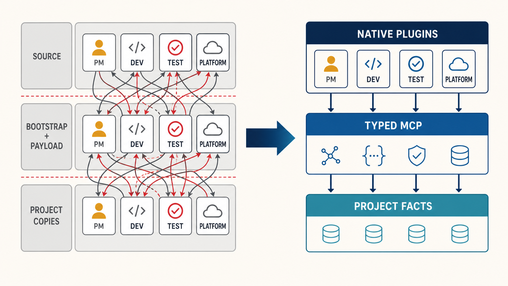
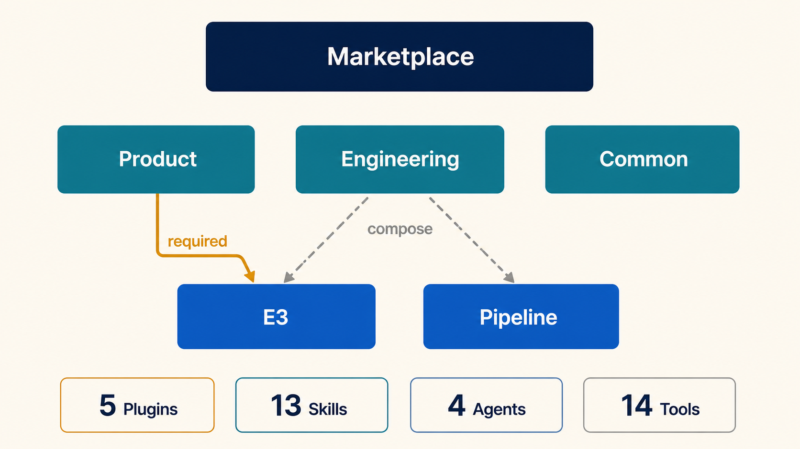
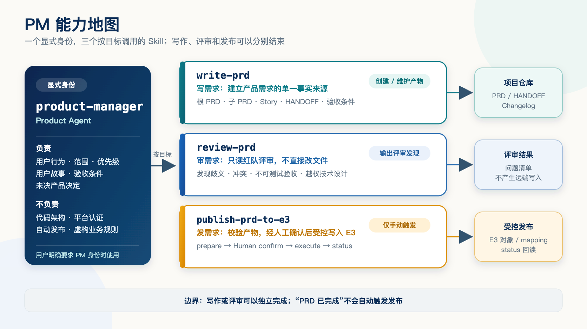
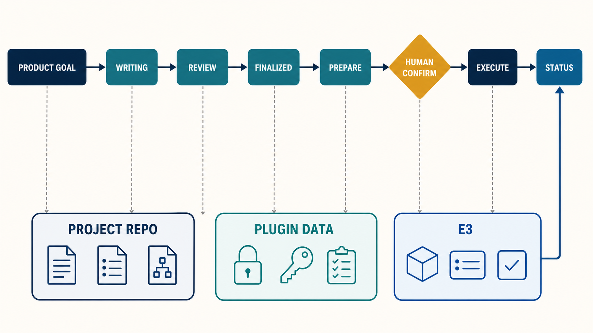
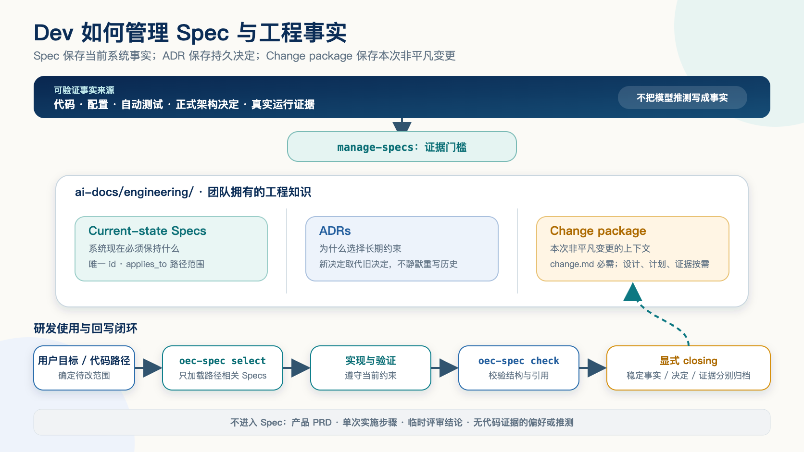
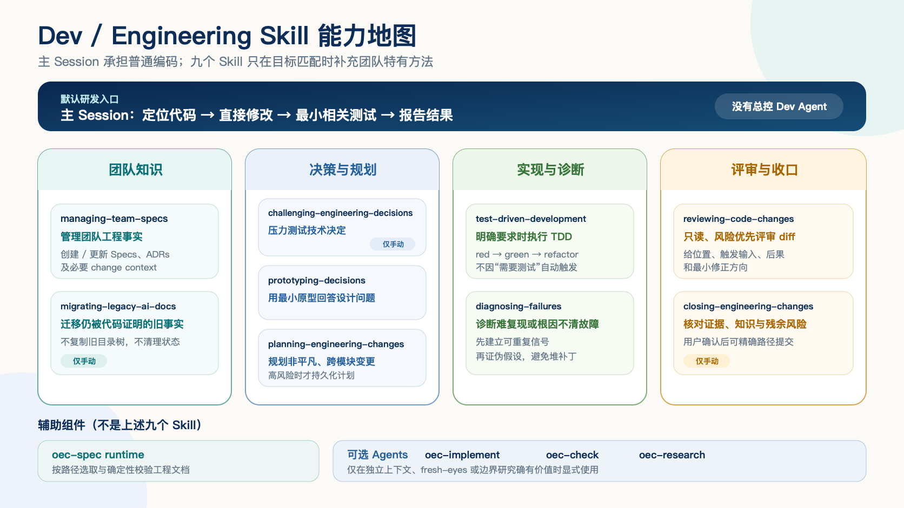
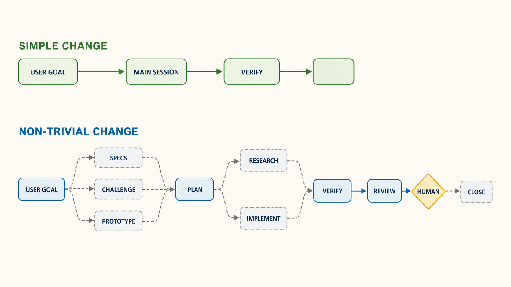
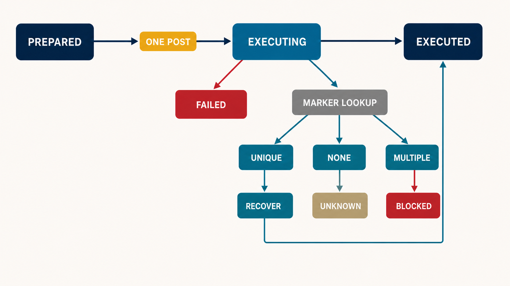
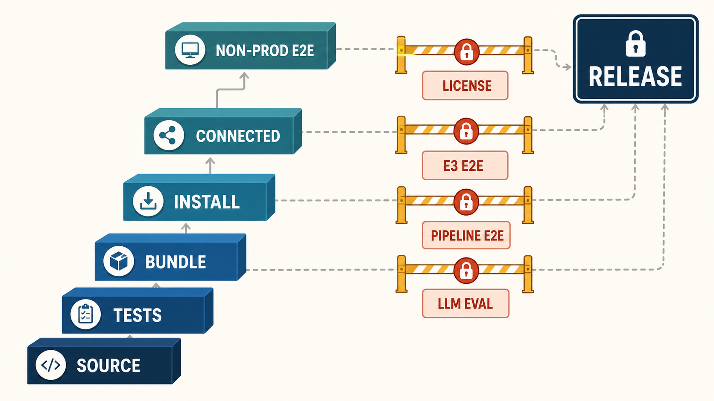

# PlainOEC-infra 完整架构与能力管理报告

> 报告日期：2026-09-02
>
> 报告对象：OEC 项目管理者
>
> 当前状态：release candidate，尚未正式发布

## 1. 执行摘要

PlainOEC-infra 不是将旧 OEC-infra 的 Prompt 缩短后重新打包，而是将旧系统中混合的角色身份、领域
知识、通用模型能力、确定性校验、外部平台操作和项目事实重新分配到宿主原生组件。迁移的主要收益不
是减少文本行数，而是让每一类能力拥有清楚的 Owner、状态、失败语义、安装边界和验证证据。

当前候选方案由六个可独立分发的 Plugin 组成：

| 项目 | 当前定位 |
| --- | --- |
| Marketplace | 组织级发现、依赖、发布和升级管理 |
| Product | PRD 编写、评审和发布语义 |
| Engineering | 稳定任务执行、团队工程知识与聚焦工程方法 |
| Dev Beta | 实验性长时 Web/全栈编排 |
| E3 | PRD 和研发任务的受控平台操作 |
| Pipeline | 既有 dev/test 流水线的受控运行 |
| Common | HTML-first 公共内容交付能力 |

当前组件规模：

| 类型 | 数量 |
| --- | ---: |
| Plugin | 6 |
| Agent | 5 |
| Skill | 15 |
| MCP Server | 2 |
| MCP Tool | 14 |
| Hook | 1 |
| Command | 0 |

### 1.1 核心术语速查

| 英文术语 | 中文解释 |
| --- | --- |
| Plugin（插件） | 可被宿主独立安装、升级和卸载的能力包，是本报告的分发单元 |
| Skill（技能） | 模型按用户目标加载的领域方法、判断边界和产物约定，不是后台常驻流程 |
| Agent（智能体） | 拥有独立身份或上下文的模型执行单元，只在隔离价值明确时使用 |
| Main Session（主会话） | 用户当前直接交互的编码会话，负责普通编码、通用推理和能力组合 |
| MCP（模型上下文协议） | Model Context Protocol，将外部系统能力注册为有类型约束的工具 |
| Runtime（确定性运行程序） | 用代码完成路径选择、结构校验等可重复检查，不依赖模型临场判断 |
| PRD（产品需求文档） | Product Requirements Document，说明做什么、为什么以及如何验收 |
| SSOT（单一事实来源） | Single Source of Truth，同类事实只由一个权威位置维护 |
| HANDOFF（结构化交接） | 保存根 PRD、子 PRD 与 Story 对应关系的交接文件 |
| Spec（当前系统规约） | 描述系统现在必须保持的责任、接口、不变量和失败方式 |
| ADR（架构决策记录） | Architecture Decision Record，保存会约束后续工作的持久技术决定 |
| Change package（变更包） | 非平凡变更的边界、设计、计划、研究和证据集合，按风险创建 |
| Plugin Data（插件数据） | 宿主为单个 Plugin 隔离的本地运行状态目录，不属于业务仓库 |
| Artifact / contract（产物 / 契约） | Artifact 是交付文件；contract 是其结构、字段和引用必须满足的规则 |
| prepare / execute / status | 分别表示执行前准备、经确认写入、独立查询结果，三者不能合并为一次盲写 |
| Idempotency（幂等） | 同一请求被重放时不产生第二份远端对象或重复副作用 |
| Checkpoint / read-back（检查点 / 回读） | 保存执行进度，并从远端重新读取结果验证真实状态 |
| Mock / E2E / eval | 分别是模拟测试、端到端真实旅程、模型行为评测，证据强度和覆盖范围不同 |
| Release candidate（候选发布状态） | 已具备发布候选质量，但仍有门禁未关闭，不能称为正式发布 |

Product、Engineering、Dev Beta 和 Common 是模型侧领域能力；E3 和 Pipeline 是平台侧受控执行能力。Product
通过原生依赖使用完整 E3 Plugin。Engineering 不强依赖任何平台，主 Session 根据具体目标按需组合
E3 或 Pipeline；Dev Beta 只在明确的 Web/full-stack 场景中复用 Engineering 的宿主能力。普通编码始终
由主 Session 负责，稳定 Engineering 不安装一个默认接管研发过程的总控 Agent。Claude 的一个静态
SessionStart（会话启动）Hook 只注入行为边界，不注入能力清单、项目状态或任务路由。

当前可以确认的事实包括：154 项自动测试全部通过；Marketplace 与六个 Plugin 通过固定 Claude Code
环境的严格结构校验；Git 归档包和隔离安装验证了六个 Plugin、十五个 Skills、五个 Agents 以及两个
MCP Server；Engineering 的 `oec-spec` bundle 还通过了 taskRef、任务 Spec/Design、双空间来源和
reminder 隔离 fixture；E3 和 Pipeline MCP 均能独立启动并显示 Connected（已连接）。

当前仍不能称为正式发布。LICENSE/notice 的 Owner（责任人）决策、E3 账号 owner 真实复验、Pipeline
单 POST（一次提交）真实复验，以及受 early access（早期开放）限制的 LLM eval（大模型行为评测）
证据仍是明确缺口。本报告将“源码存在”“自动测试通过”“隔离安装成功”“MCP Connected”和“真实
非生产验收”作为不同证据等级，不互相替代。

## 2. 原 OEC-infra 的真实结构与问题

### 2.1 原系统实际如何交付

旧系统事实以 `oec-ai-infra` commit `79356008b9961c3e8a70c57e2fe5c9cf0c7ce424` 及其实际构建
payload 和隔离初始化结果为固定基线，不能只按维护源码目录推断用户行为。实际交付经历三次形态变化：

```text
oec-infra 维护源码
→ bootstrap Plugin 与 payload
→ 初始化器复制角色配置
→ 业务仓库中的项目级 Agent / Skill / ai-docs / scripts
```

第一层是维护者编辑的 Agent、Skill、脚本和模板。第二层是 Marketplace 真正分发的 bootstrap Plugin
及其 payload。第三层才是产品或研发人员实际使用的项目级 `.claude`、`.codex`、`ai-docs` 和 managed
files。模型实际加载的是第三层，而不是第一层的源码目录。

因此，旧系统的安装不是“安装一个原生 PM 或 Dev Plugin”，而是先安装初始化器，再选择
`designer`、`dev` 或 `all`，最后把一整套角色文件树复制到业务仓库。Plugin cache 与项目副本随后
拥有不同生命周期，形成两个真相源。



*图：左侧的复杂度来自相同角色资产在源码、payload 和项目副本之间重复，并由交叉路由连接；问题不是
文件数量本身，而是责任和生命周期混合。右侧将领域知识、平台执行和项目事实分开，使安装状态、外部
状态和项目所有权不再互相复制。*

### 2.2 原系统解决过的问题

旧设计并非没有价值。它曾经解决以下现实问题：

- 统一下发组织级产品、研发和测试知识。
- 使用 `designer`、`dev`、`all` 表达角色组合。
- 对 managed files 提供路径检查、事务式写入和升级清单。
- 保存 PRD、工程设计、测试和平台接入领域知识。
- 在脚本中实现部分 OAuth、401 重授权、字段转换和响应规范化。
- 在部分流程中考虑远端对象复用、状态恢复和结果校验。
- 允许团队事实与单次任务上下文跨会话留存。

PlainOEC 保留这些业务知识与安全思想，但不再以“向每个项目复制完整组织配置”作为默认运行模型。
迁移否定的是职责和生命周期混合，而不是旧实现中的全部业务规则。

### 2.3 四类结构性问题

| 问题 | 旧机制 | 管理影响 |
| --- | --- | --- |
| 角色边界错位 | PM、研发、测试、办公和平台能力按 preset 混合 | Owner、权限和发布责任不清 |
| 组件边界错位 | 知识、流程、Agent、脚本和 API 都叫 Skill | 模型必须再次解释内部架构 |
| 分发边界错位 | Plugin cache 与项目副本并存 | 安装、升级、卸载不对称 |
| 执行边界错位 | 模型选择脚本、拼参数并判断重试 | 外部副作用缺少硬门禁 |

角色边界错位意味着测试不是独立能力，而是 Dev 安装包的一部分；平台操作、办公集成和通用工程方法
也随角色一起进入上下文。组件边界错位意味着宿主只发现少数顶层入口，模型还要阅读内部索引才能知道
几十个文件的关系。

分发边界错位造成 Plugin 已升级但项目副本未同步，或 Plugin 已卸载但项目中仍残留旧配置。执行边界
错位则让模型承担候选选择、参数组合、未知结果重试和跨步骤状态恢复。即使底层已有脚本，这些平台
不变量仍没有成为宿主可识别的类型化硬边界。

### 2.4 对模型和组织的具体影响

这些问题的主要损失不是单纯的 token 数量，而是模型和组织判断被改变：

- 小型修复可能被扩大为设计、计划、TDD、评审和收口的完整流程。
- 同一请求可能同时命中角色 Agent、顶层 Skill、内部阶段文件和 Dispatcher。
- 固定阶段让模型把“遵循流程”误认为“交付用户结果”。
- 项目仓库持续累积并不属于项目本身的组织配置。
- 安装状态、项目副本和远端系统之间缺少统一的状态归属。
- 平台身份、候选、失败恢复和重试依赖模型临场判断。
- 团队难以区分源码存在、mock 通过、工具可连接和真实可用。

## 3. PlainOEC 的设计原则

### 3.1 十条设计原则

1. **按稳定用户结果划分 Skill。** 不沿用旧目录、阶段或角色作为能力边界。
2. **通用编码和推理由主 Session 负责。** 不重复现代 Coding Agent 已具备的能力。
3. **Skill 只提供组织增量。** 内容集中在领域知识、判断纪律、触发边界和产物契约。
4. **本地不变量进入 runtime。** 路径选择、frontmatter、结构和 artifact 校验由代码完成。
5. **外部信任边界进入 MCP。** 认证、身份、远端状态、副作用、幂等和恢复不由 Prompt 模拟。
6. **Agent 只用于明确的隔离价值。** 身份、独立上下文和 fresh-eyes 是保留 Agent 的主要理由。
7. **项目事实属于项目仓库。** Plugin 不把自身工作流复制为项目长期事实。
8. **风险决定流程长度。** 简单任务保持短路径，高风险任务才增加持久上下文和门禁。
9. **Human 拥有真实取舍。** 产品、风险和不可逆决定不能由模型猜测。
10. **证据等级必须显式。** 可用性声明必须说明它来自源码、测试、安装还是外部验收。

### 3.2 组件责任矩阵

| 组件 | 主要责任 | 明确不承担 |
| --- | --- | --- |
| 主 Session | 普通编码、通用推理、按目标组合能力 | 猜业务事实、绕过平台门禁 |
| Agent | 隔离身份、上下文或 fresh-eyes 任务 | 自动接管全部流程 |
| Skill | 领域方法、判断边界、产物语义 | OAuth、远端状态、任意重试 |
| Runtime | 本地解析、选择和结构校验 | 产品、架构或风险决策 |
| MCP | 外部平台读取与受控副作用 | 领域工作流判断 |
| Plugin | 同生命周期能力的安装和升级 | 跨领域总控路由 |
| 项目文档 | 当前事实、ADR、变更上下文和证据 | Plugin 工作流副本 |
| Marketplace | 发现、依赖、发布和升级管理 | 业务运行状态 |

### 3.3 模型约束与代码约束的分界

模型适合判断用户意图、业务语言、技术权衡和哪些证据仍然缺失。确定性代码适合验证文件路径、schema、
引用关系、fingerprint、候选 token 和状态转换。MCP 则负责所有跨越外部系统信任边界的动作。

这条边界不以实现语言区分。Python、TypeScript、Node 或 shell 都可以成为安全实现；关键问题是调用者
是否仍需自行决定身份、payload、重试和恢复。当动作涉及远端权限、状态或副作用时，仅提供一个
`run_script` 入口不能构成足够边界。

### 3.4 Human 与模型的分界

Human 负责无法从仓库读取的产品选择、风险承受、不可逆操作和外部写入确认。模型应先从代码、配置、
测试、Specs 和正式文档获取事实，只把真正需要判断的问题交给 Human。模型可以给出推荐答案和权衡，
但不能通过“第一个候选”“看起来合理”或产品空间创建者等代理事实替代真实身份和选择。

## 4. 当前六 Plugin 架构

| Plugin | Agent | Skill | MCP Server | Tools | 责任 |
| --- | ---: | ---: | ---: | ---: | --- |
| `oec-product` | 1 | 3 | 0 | 0 | PRD 编写、评审和发布语义 |
| `oec-dev` | 4 | 10 | 0 | 0 | 稳定任务执行、团队工程知识和聚焦工程方法 |
| `oec-dev-beta` | 0 | 1 | 0 | 0 | 实验性长时 Web/full-stack 编排 |
| `oec-e3` | 0 | 0 | 1 | 10 | PRD 发布和研发任务平台操作 |
| `oec-pipeline` | 0 | 0 | 1 | 4 | 既有 dev/test 流水线运行 |
| `oec-common` | 0 | 1 | 0 | 0 | HTML-first 幻灯片 |



*图：Product 通过 required 关系依赖完整 E3；Engineering 只在具体场景中 compose E3 或 Pipeline；Dev Beta
独立提供实验性长时编排并复用宿主 Engineering 能力；Common 保持独立。架构没有统一 delivery Plugin，
各分发单元分别管理自己的知识、权限、状态与发布周期。*

```text
Product ──required dependency──> E3
Engineering ──按场景组合──> E3 / Pipeline
Dev Beta ──复用宿主 Agents/runtime──> Engineering
Common ──独立安装
```

Product 明确向用户承诺 E3 发布，因此通过对 `oec-e3` 的必需依赖获得平台工具。Engineering
的完成条件不以 E3 或 Pipeline 为前提，因此不声明强依赖。主 Session 可以在用户目标需要时组合这些
Plugin，但组合不会产生新的 `oec-delivery` 状态或包装层。

Product 安装后可以看到 E3 的全部十个工具，而不只看到四个 publication tools。这是当前有意接受的
工具面：publication 和 development tools 共享同一平台、认证、状态生命周期和 Owner。拆成两个
Plugin 会复制认证和状态边界。只有权限模型、Owner 或发布周期真实分离时，才重新评估拆分。

## 5. Marketplace 与分发模块

### 5.1 模块目标

Marketplace 为 OEC 组织级能力提供统一发现、依赖解析、安装、升级和卸载入口。它管理能力包，
但不保存业务项目状态或平台运行状态。

### 5.2 当前组成

Marketplace 分发 `oec-product`、`oec-dev`、`oec-dev-beta`、`oec-e3`、`oec-pipeline` 和 `oec-common`。
每个 entry（市场入口）都指向同仓库内独立 Plugin 目录，并与 Plugin manifest（插件清单）保持一致。

### 5.3 分发机制

- Git Marketplace 直接分发 Plugin payload。
- Plugin 携带自足 runtime 或 MCP bundle。
- 用户不需要 npm registry、`npm login` 或 Plugin 内 `node_modules`。
- Product 安装时由宿主自动解析 E3 dependency。
- user scope 不向业务仓库写 Plugin 文件。
- project scope 只由宿主管理 Marketplace 和 Plugin 启用声明。
- Plugin Data 与 Plugin、workspace（工作区）和宿主生命周期隔离。

### 5.4 管理价值

- 六个 Plugin 可以独立安装、升级和卸载。
- 平台权限和领域知识不再共用发布周期。
- Plugin cache 成为安装 payload 的单一真相源。
- 业务仓库只保存项目真正拥有的 PRD、integration records、Specs、ADR 和 change evidence。
- 发布与升级通过 Marketplace entry 和 Plugin manifest 双向校验。

### 5.5 非目标

- 不恢复 `designer`、`dev`、`all` 角色套件。
- 不向业务仓库复制 Plugin payload。
- 不持有 OAuth token、selection、plan 或 runtime state。
- 不判断 Product、Engineering、E3 和 Pipeline 的业务执行顺序。
- 不成为跨 Plugin 总控或统一 delivery 包装层。

### 5.6 当前证据和风险

六个 Plugin 的结构已通过当前候选验证。Git archive 不包含 `node_modules`，隔离配置安装得到六个启用
Plugin，Product 自动带入 E3，两个 MCP Server 均成功启动；Dev Beta 不复制宿主 Agent 或 runtime。发布标签预检已通过，
但没有创建实际 tag。Marketplace 本身不解决许可证问题；LICENSE/notice 决策仍阻塞正式发布。

## 6. Product 模块

### 6.1 模块目标

Product 管理产品需求从编写、评审到经确认发布 E3 的语义闭环。它负责产品事实和产物，不负责工程
实现或平台认证。

### 6.2 内部组件

| 类型 | 名称 | 责任 |
| --- | --- | --- |
| Agent | `product-manager` | 显式 PM 身份 |
| Skill | `prd-write` | 创建产品需求 SSOT |
| Skill | `prd-review` | 只读红队评审 |
| Skill | `prd-toe3` | 显式发布到 E3 |
| Runtime | artifact checker | 确定性检查 PRD/HANDOFF 结构 |

### 6.3 `product-manager` Agent

`product-manager` 只在用户明确要求产品经理身份时使用。它预加载 `prd-write` 和 `prd-review`，不
预加载 `prd-toe3`。Agent 负责产品行为、用户故事、验收条件、范围、优先级、pending decisions、版本产物
和 changelog。

API、数据库 schema、部署和代码架构属于 Engineering，除非它们直接构成产品可见约束。Agent 不会
虚构业务规则、证据、决定或 E3 发布结果，也不会因为 PRD 完成而自动执行发布。

### 6.4 三个 Product Skills

`prd-write` 创建和维护根 PRD、子 PRD、Story、acceptance criteria、HANDOFF、版本和 changelog。
它将产品需求作为 SSOT，不把工程设计写成产品事实。

`prd-review` 对现有产物执行只读红队评审，重点检查歧义、冲突、不可测试验收条件、越权技术设计
和未决业务决定。它不修改文件，也不发布 E3。

`prd-toe3` 是 manual-only Skill。它验证 finalized artifacts、子 PRD 与 HANDOFF，展示
准备结果并等待 Human 确认，然后调用 E3 工具。普通写作或评审不能自动产生远端副作用。



*图：`product-manager` 提供产品经理身份，但不把三个 Skill 串成强制流程。`prd-write` 维护需求单一事实
来源，`prd-review` 只读找问题，`prd-toe3` 仅在用户明确发布并确认后调用 E3。*

### 6.5 输入、输出与状态归属

输入包括产品目标、已确认业务规则、用户故事、验收条件、项目资料和现有版本。输出包括产品版本目录、
根 PRD、子 PRD、HANDOFF 和 changelog。发布后，项目仓库保存可审计的 E3 record；OAuth token、
workspace config、selection 和 plan 保存在 E3 Plugin Data。

Product 和 E3 共用一份 build-time PRD artifact contract。Product artifact checker 与 E3 gate 分别生成自足
bundle，不在运行时跨 Plugin 读取源码，也不维护两套规则。

### 6.6 与 E3 和 Engineering 的关系

Product 保存“做什么、为什么、如何验收”的产品语义。E3 负责 OAuth、空间候选、prepare、execute、
status、远端 ID、父子关系、checkpoint 和漂移验证。Engineering 通过链接读取 PRD 或 Story，不把
产品需求复制成工程 Spec，也不能为了实现便利静默改变产品行为。



*图：Product 负责需求语义，E3 负责受控副作用。prepare、Human confirmation、execute 和 status 是
不同证据阶段；status 从 E3 远端 read-back。PRD/HANDOFF/integration record、OAuth/selection/plan 和远端对象
分别属于 Project Repo、Plugin Data 与 E3，三者不能互相替代。*

### 6.7 管理价值

- 产品判断与平台调用解耦。
- 写作、评审和发布不再混成一个 Agent 状态机。
- 发布前必须通过 deterministic artifact gate。
- Human 明确拥有发布确认和未决业务选择。
- Product Plugin 不持有平台凭证和运行状态。

### 6.8 非目标

- 不提供通用 E3 CRUD。
- 不管理研发实现、数据库或部署。
- 不替代项目经理作未确认业务决定。
- 不提供生产原型或设计资产平台。
- 不将发布成功推导为产品需求质量已被完整验证。

### 6.9 当前证据与缺口

Product 组件结构、触发边界、artifact contract、artifact checker bundle 和隔离安装已经自动验证。PRD 发布
主链有历史真实非生产证据。该证据不能自动证明当前身份边界；配置/认证账号与真实 owner 一致性仍需
在唯一授权非生产对象上复验。

## 7. Engineering 模块

### 7.1 模块目标

Engineering 为研发提供团队工程事实、聚焦工程方法和可选隔离 Agent，同时保持主 Session 对普通
编码的控制。它不是研发流程引擎，不自动接管主 Session，也不要求所有代码变更进入统一生命周期。

### 7.2 为什么需要独立 Engineering 模块

旧 Dev 同时承担总控流程、规划、实现、TDD、调试、评审、release closing、测试调度、平台操作和
项目配置同步。`oec-dev-flow`、`oec-dev-task`、阶段文件与多个 Agent 同时判断下一步，导致普通编码
也容易进入完整流程。

PlainOEC 将这些责任拆回适当位置：

| 责任 | 当前落点 |
| --- | --- |
| 普通编码、工具选择和局部验证 | 主 Session |
| 团队增量工程方法 | Engineering Skills |
| 隔离实现、fresh-eyes 和边界研究 | 可选 Agents |
| 路径选择和文档 contract | `oec-spec` runtime |
| 当前事实与持久决定 | 项目 Specs 和 ADRs |
| 非平凡变更上下文 | 条件性 change package |
| E3、Pipeline 等外部系统 | 独立 MCP Plugins |

迁移删除的是总控和重复路由，保留的是团队事实、高风险变更上下文、TDD 纪律、根因诊断和独立评审。

### 7.3 两类研发路径

#### 7.3.1 简单、局部、低风险改动

```text
用户目标
→ 主 Session 定位代码
→ 直接修改
→ 最小相关测试
→ 报告结果
```

简单路径适用于小型明确修复、局部配置或样式调整、已有测试覆盖的直接行为变化，以及不改变公共接口、
数据或兼容性的局部重构。

这条路径不要求 change package、planning、TDD、Agent、ADR、closing 或 evidence 文件。代码需要测试
并不意味着必须调用 TDD Skill；用户没有要求工程收口，也不会自动调用 closing。流程成本必须由实际
风险证明，而不是由“每个任务都应该完整”这一假设决定。

#### 7.3.2 非平凡、高风险或需跨会话保存上下文的改动

```text
需求或问题
→ 解析 Product/Dev 来源和 taskRef
→ 按路径选择模块 Specs
→ 版本化任务生成 spec.md + design.md（或使用非版本化 change package）
→ 主 Session 或显式 Agent 实现
→ 测试和验证
→ review / fresh-eyes / Spec reminder（按需）
→ 用户显式 closing
→ 用户确认 exact-path commit
```

只有跨模块、公共接口、数据语义、迁移、兼容性、多人协调、依赖顺序、回滚、高风险验证或确需跨会话
保存边界的变更，才应持久化 change package。该路径是能力组合关系，不是自动状态机；Agent、review、
closing 和 commit 均可根据用户目标和证据省略。

### 7.4 团队工程知识模型

项目拥有的工程事实位于：

```text
ai-docs/Spec/
├── README.md
├── module-index.yaml      # 可选模块元数据
├── specs/                 # 系统当前事实
├── decisions/             # 持久技术决定
└── changes/<change-id>/   # 非版本化变更上下文
    ├── change.md
    ├── design.md          # 条件生成
    ├── plan.md            # 条件生成
    ├── research/          # 条件生成
    └── evidence.md        # 验证后条件生成

ai-docs/versions/<version>/dev-task/<task-slug>/
├── README.md              # 可选轻量索引
├── spec.md                # 新 Managed Task 必需
└── design.md              # 新 Managed Task 必需
```

安装 Engineering Plugin 不会创建这个目录。只有用户要求初始化团队知识，或非平凡变更确实需要持久
上下文时，相关 Skill 才会提出明确文件计划并等待确认。

#### Current-state Specs

`specs/**/*.md` 描述系统现在的责任、接口、不变量、失败模式和已验证命令。每个 Spec 使用唯一 `id`
和非空 `applies_to` 路径范围。路径选择让模型只读取与待改代码有关的事实，而不是每次加载完整知识树。

Spec 不保存单次实施步骤、临时 review 结论、产品 PRD、通用框架建议或无代码证据的组织偏好。一个
源码目录也不必对应一个 Spec；只有稳定责任和所有权值得持久化。

#### ADRs

`decisions/ADR-NNNN-<slug>.md` 保存会约束后续工作的持久技术决定。accepted ADR 是历史证据，不能
直接重写决定。选择改变时创建新 ADR，将旧 ADR 标记为 superseded，并链接新决定。局部实现细节和
显然的框架使用不需要 ADR。

#### Change packages and versioned task artifacts

| Artifact | 保存内容 | 创建条件 |
| --- | --- | --- |
| `dev-task/*/spec.md` | 一次版本化任务的目标、边界、来源和验收 | Product-linked Managed Task，必需 |
| `dev-task/*/design.md` | 一次任务的约束、方案和验证 | Product-linked Managed Task，必需 |
| `change.md` | 非版本化变更的目标、边界、验收和风险 | 非平凡 unversioned work，必需 |
| `design.md` | 非版本化变更的约束、方案、替代和迁移 | 存在实质设计权衡 |
| `plan.md` | 依赖顺序、协调、回滚和验证 | 内容需要跨会话或多人保存 |
| `research/` | 有边界的研究结果 | 显式 Research Agent 输出 |
| `evidence.md` | 实际执行的验证和残余风险 | 验证已经真实发生 |

版本化任务使用 `versioned:vX.Y.Z/<task-slug>`，外部 E3 identity 可以单独使用
`vX.Y.Z-<featureName>`；无版本技术工作使用 `change:YYYY-MM-DD-<slug>`。Product PRD、HANDOFF、Story
和 issue 通过 SourceRef 或链接引用，不复制进工程文档。

产品和工程文档的责任关系是：

```text
Product PRD：做什么、为什么、如何验收
Engineering Spec：系统现在必须保持什么
ADR：为什么选择一个长期约束
Change package：本次非平凡变更的边界、决定和证据
```



*图：Dev 开始工作时用 `oec-spec select` 按路径读取当前约束；实现中以代码、配置和测试为事实依据；
用户显式收口时再区分稳定系统事实、持久技术决定和单次变更证据。临时计划、产品需求和未验证判断不
写入 Spec。*

### 7.5 `oec-spec` 确定性 runtime

Engineering Plugin 提供一个自足的 `oec-spec` bundle，包含现有团队知识命令和 OEC Dev 任务命令：

| 命令 | 责任 | 不负责 |
| --- | --- | --- |
| `select` | 按待改路径选择相关 Specs 和模块 | 判断设计正确性 |
| `check` | 校验 Team Spec/ADR/change contract | 评审技术内容质量 |
| `task resolve` | 统一解析 versioned/unversioned taskRef | 模糊选择任务 |
| `task check` | 校验任务 `spec.md`/`design.md` 结构、身份和来源 | 判断技术方案是否正确 |
| `remind` | 报告可能需要更新的 Spec/ADR | 自动写入或阻断普通编码 |
| `legacy-audit` | 只读审计旧 Dev 资产 | 删除、移动或迁移远端状态 |

`select` 接受 canonical workspace 和仓库相对路径，根据 `applies_to` 返回 repository-wide、路径匹配
Specs 和可选模块，并拒绝 workspace 外路径。它减少无关上下文，但不会替模型选择架构。

`task resolve` 是所有 Skill/Agent 的唯一任务身份入口；`task check` 验证 Frontmatter、版本、slug、
任务 pair、章节、Acceptance ID、来源和交叉引用。`remind` 只输出 advisory candidates，默认不写文件、
不创建状态、不打断 Direct Coding。

`check` 与 `task check` 只能证明结构符合 contract，不能证明文档中的技术判断正确。`legacy-audit` 枚举
旧 `ai-docs` 与 managed configuration，不修改源文件，不删除 `.oec-ai`、`.claude` 或 `.codex`，也不
采用 E3 record。

### 7.6 十个稳定 Engineering Skills

#### 7.6.1 团队知识类

`spec-manage` 在明确的自然语言意图要求初始化、更新或协调团队工程知识时创建 current-state Specs、
ADRs 和必要 change context；也可以在 `remind` 模式报告潜在受影响的长期事实。它先检查代码、配置、
测试和正式决定，只写有证据的事实。缺少真实内容时不创建空模板，也不将普通实现计划写成团队 Spec。
写入前仍展示精确文件并等待用户确认。

`legacy-doc-migrate` 可由明确的自然语言迁移意图发现。它从旧 `ai-docs` 抽取仍被当前代码证明
的事实和仍有效的决定，而不是复制目录树。旧文件保持原位；Product PRD、E3 record、历史 workflow
state、生成评分和 managed configuration 不在此 Skill 中清理或迁移。

#### 7.6.2 决策与规划类

`decision-challenge` 可自动发现，但仅在明确的决策挑战意图下用于压力测试一个技术决定。
它先从仓库获取可发现事实，再将假设、Human choices 和依赖选择分开，只询问当前 decision frontier。
结果是支持、拒绝、延期或阻塞的决定记录，不会自动创建任务、计划或代码。

`design-prototype` 创建最小 throwaway artifact，回答一个交互、行为或状态设计问题。Human 通过
真实观察选择方案。如果测试、benchmark、命令或源码读取能更直接回答，就不创建原型。原型不自动
升级为生产实现，也不默认写入生产路径。

`change-plan` 用于明确的 OEC Dev、PRD、Story、HANDOFF 或非平凡变更。它先通过 `taskRef` resolver
固定 Product/Dev 来源和受影响模块，再在版本化 `dev-task` 目录创建 `spec.md` + `design.md`。小改动
仍只在对话中规划；任务文档的存在不规定编码顺序。planning 本身不修改业务代码、外部平台或 Git 历史。

`change-implement` 是与规划分离的轻量执行入口，只接受已有且通过 `task check --stage ready` 的任务。
它先解析 taskRef、选择相关 Specs/ADR，再由 Main Session 在 Change Boundary 内实现并运行最新测试、
typecheck 和 lint。它不创建任务包、状态文件或 implementation plan，不默认派发 Agent，不调用
E3/Pipeline，也不自动 close 或 commit。

#### 7.6.3 实现方法与诊断类

`test-first` 只在用户明确要求 TDD、test-first 或 red-green-refactor 时使用。它按窄纵向
slice 工作，确认测试因缺失行为而失败，再实现最小代码并回归。它不替代仓库现有测试策略，不要求先写
完所有测试，也不因为普通变更“需要测试”而自动触发。

`failure-debug` 用于难复现、flaky、性能回退、重复修复失败或根因不清的故障。第一产物是可重复
区分成功与失败的信号，然后用最便宜观察区分可证伪假设。三个不同修复尝试仍失败时停止堆叠补丁，
重新检查架构或假设。明显的局部错误不需要该 Skill。

单个 `task-researcher`、`task-implementer`、`change-checker` 或 `web-evaluator` 直接使用宿主 `@` picker。稳定
Engineering 不提供固定 Agent 顺序或长时编排；实验性 `web-task-run` 由独立的 `oec-dev-beta` Plugin
提供，并保持显式调用、Playwright preflight、五轮默认上限和十轮绝对上限。Dev Beta 不复制 Agent、
`oec-spec` 或 runtime，也不创建项目状态、提交或关闭任务。

#### 7.6.4 评审与收口类

`code-review` 对 working-tree diff、commit、branch 或 PR 执行只读、风险优先评审。每个
finding 必须给出紧凑位置、触发输入、系统后果和最小修正方向。没有实质问题时不生成 filler，也不
修改代码、创建 review artifact、stage 或 commit。

`change-close` 可自动发现，但仅在明确的收口意图下检查最终 diff、实际测试证据、相关 Specs、ADRs 和残余
风险。只有稳定责任或决定变化时才更新团队知识；Skill 调用不等于 commit 授权，用户仍需单独确认
exact-path commit。它不部署、不创建 release、不更新 E3、SAE、UTP 或远端 Git 状态。



*图：十个稳定 Skill 是按目标调用的工程增量，不是 Dev 总控流程。`change-implement` 提供已有任务的轻量
执行入口；实验性长时编排被隔离到 `oec-dev-beta`；`oec-spec` runtime 和四个可选 Agent 是辅助组件。*

### 7.7 Skill 选择边界

| 用户意图 | 适合能力 | 不应使用 |
| --- | --- | --- |
| 小型明确修复 | 主 Session | planning、TDD、closing |
| 非平凡技术方案 | `change-plan` | Product PRD Skill |
| 已有 ready 任务的实现 | `change-implement` | 创建新任务包、普通小修复 |
| 压力测试技术决定 | `decision-challenge` | 普通 planning |
| 比较交互或状态方案 | `design-prototype` | 生产实现 |
| 明确 test-first | `test-first` | 普通“补测试” |
| 难复现或反复失败 | `failure-debug` | 简单局部错误 |
| 审查代码 diff | `code-review` | PRD review |
| 有边界的单 Agent 研究、实现或检查 | 宿主 `@` picker | 固定 Agent 顺序编排 |
| 实验性长时 Web/full-stack change | `/oec-dev-beta:web-task-run` | 小型修改、非 Web 或生产操作 |
| 显式完成工程变更 | `change-close` | 未完成实现 |

### 7.8 四个 Engineering Agents

Engineering 保留 `task-implementer`、`web-evaluator`、`change-checker` 和 `task-researcher`。它们是宿主原生可选 Agent，不是
slash commands。用户可以通过自然语言或 `@` picker 使用。description 表达
explicit-use 设计意图，但不能被描述成宿主级绝对硬保证。

单个 `task-researcher`、`task-implementer`、`change-checker` 或 `web-evaluator` 通过宿主 picker 直接派发。稳定
Engineering 不提供固定 Agent 顺序；实验性 `oec-dev-beta` 可以在自身 Skill 内复用宿主 Agent，但不改变
Agent 权限，也不允许 Agent 派生其他 Agent。

四个 Agent 都禁止 commit、push、merge、Git staging 和继续派生 Agent。它们不会自动成为普通编码
必经阶段。

#### `task-implementer`

`task-implementer` 接受 canonical taskRef 或 legacy change ID，并从解析后的 `spec.md`/`design.md`（或旧
`change.md`）和路径相关 Specs 加载干净上下文。taskRef 或任务上下文缺失时必须 blocked，不能自行
创建或猜测任务包。

Agent 只在声明 boundary 内修改代码。如果真实范围扩大，停止并返回主 Session 决定。它运行任务
Design 指定的测试；未指定时发现最小相关测试，并运行适用 typecheck 和 lint。相关测试未运行、跳过或
失败时只能报告 partial/failed，不能输出 implementation complete。

#### `change-checker`

`change-checker` 使用 `git status --short`、`git diff HEAD --` 和 relevant untracked files 覆盖 staged、
unstaged 与 untracked 变更。它读取可选 taskRef、任务 Spec/Design、路径相关 Specs，并运行相关测试、
typecheck 和 lint；没有 taskRef 时可以检查普通 diff，但不创建任务上下文。

Agent 可以修复缺失类型、lint 违规等明确机械问题；架构选择、权衡和不清晰的 Spec 解释只报告给主
Session。它不修改 `ai-docs/Spec/`，不将 Agent 观点写成持久团队事实。

#### `web-evaluator`

`web-evaluator` 接受已有 taskRef 或 legacy change ID、从任务 `AC-NNN` 派生且保留 ID 的运行态 checklist，
以及本地或明确授权的内部非生产目标。它只使用用户或团队预先连接的 Playwright MCP，实际操作运行中的
Web 应用，并分别对产品深度、功能、视觉
和代码质量给出 `PASS`、`FAIL` 或 `NOT_APPLICABLE`。完整 finding 必须包含复现步骤、预期、实际、
Playwright/API/状态证据以及是否仍在 change boundary 内。Agent 可以改变隔离的测试应用状态，但不
修改源码、测试代码、Product/Engineering 文档或 Git；Playwright 缺失时必须 blocked，不能用静态测试
替代运行态验收。

#### `task-researcher`

`task-researcher` 必须获得已有 taskRef，只写解析后的任务 `research/`：

```text
ai-docs/versions/vX.Y.Z/dev-task/<task-slug>/research/*.md
或
ai-docs/Spec/changes/<change-id>/research/*.md
```

内部研究引用源码路径；外部研究优先主来源并注明版本和 caveat。Agent 不修改代码、Spec、ADR、
任务 Spec/Design 或 Git，只向主 Session 返回研究文件路径、摘要和关键限制。

### 7.9 Engineering 协作关系

Engineering 有一条简单路径和一条按风险展开的非平凡路径。简单变更由主 Session 直接实现并验证；
非平凡变更才按需组合 Specs、challenge、prototype、planning、change-implement、Research/Implement
Agent、验证和评审。单个 Agent 通过宿主 `@` picker 选择；稳定 Plugin 不提供固定 Agent 顺序。实验性
长时 Web 编排由 `oec-dev-beta` 单独提供，不能成为稳定 Engineering 的默认步骤。

这些组件是可选能力，不是自动 workflow。简单任务始终走最短路径，Agent、TDD、review 和 closing
都不是必经阶段。E3、Pipeline 和部署也不属于 Engineering closure 的默认步骤。



*图：上方绿色路径表示简单改动直接由主 Session 实现和验证；下方蓝色路径只在风险需要时加入 Specs、
challenge、prototype、plan、Research/Implement Agent 和 review。虚线节点均为可选能力，Human 只
门禁显式 Close；这不是自动 workflow，也不包含 E3、Pipeline 或部署。*

### 7.10 与 Product、E3 和 Pipeline 的边界

Product PRD 定义用户行为和验收结果。Engineering 通过链接读取来源，不复制产品需求，也不能为了
实现便利静默改变 PRD。Engineering Specs 保存系统当前事实，与产品版本 artifact 生命周期分开。

Engineering 不依赖 E3。主 Session可以在用户要求时组合研发任务工具，但本地代码完成不自动写 E3，
closing 也不自动同步任务状态。E3 task status 与 Engineering evidence 是两个不同真相源。

Engineering 负责代码实现和本地验证方法，Pipeline 负责对既有 dev/test pipeline 的受控运行。
Pipeline 成功不能替代代码行为验证；closing 不自动执行 Pipeline，Pipeline 也不解释工程设计质量。

### 7.11 管理价值

- 普通编码不再被统一流程放大。
- 高风险工作仍可保存边界、决定和真实证据。
- 团队事实按路径进入上下文，减少无关知识加载。
- Agent 完成语义与测试证据绑定，不再以“Agent 已结束”代表实现完成。
- 产品、工程和外部平台文档拥有不同 Owner 和生命周期。
- Engineering 安装不会污染业务仓库。
- 外部平台能力拥有独立权限、状态、验收和发布周期。

### 7.12 非目标、证据与风险

Engineering 不建设 Dev 总控 Agent、全局工作流状态机、测试 Dispatcher 或默认并行 Agent，不强制
TDD、review 或完整文档包，也不承担部署、E3、SAE、UTP 或远端 Git 写入。版本化 OEC Dev 任务只对
`spec.md` + `design.md` 的路径和结构负责；编码顺序仍由 Main Session 决定。

当前稳定实现包含 10 Skills、4 Agents、1 个静态 Hook、0 MCP、0 Command；实验性 `oec-dev-beta` 另含
1 个显式 Skill。Claude Agent Markdown 与实验性 Codex TOML instructions parity 已自动验证；SessionStart
提示不包含能力元数据、项目扫描或任务选择；`oec-spec` bundle、路径选择、taskRef、任务 contract、
双空间来源、reminder 和 legacy audit 均通过隔离执行验证。稳定 Skills 已统一为 model-discoverable，
本地写入和 commit 仍由各自安全门控制。

Codex Agent 的真实发现、`oec-spec` PATH 和完整运行旅程仍未完成宿主验收，因此不能将实验性 TOML
描述为完整双宿主支持。`oec-dev-beta` 的真实 Agent/Playwright outcome 也仍待验收。

## 8. E3 模块

### 8.1 模块目标与独立原因

E3 为 PRD 发布和研发任务提供受控、类型化的远端操作。它独立于 Product 和 Engineering，是因为
OAuth、账号、空间、远端 ID、selection、plan、checkpoint 和 status 都属于平台状态，而不是产品
写作或工程方法。

### 8.2 十个 MCP Tools

PRD 发布主链：

- `prepare_prd_publish`
- `select_product_space`
- `execute_prd_publish`
- `get_prd_publish_status`

研发任务主链：

- `prepare_development_tasks`
- `select_development_requirement`
- `execute_development_tasks`
- `prepare_task_progress`
- `execute_task_progress`
- `get_development_task_status`

工具按 prepare、必要时 select、execute、status 组织。prepare 是可审查门禁，不等于远端执行；
execute 只接受短期、不可变且与 workspace 绑定的 plan；status 通过独立 read-back 判断远端实际状态。

### 8.3 账号和响应边界

E3 账号只允许来自显式 `e3_user_account` 配置、兼容环境变量或可验证 JWT claim。无法确定账号时，
prepare 在任何远端创建调用前失败。实现不再使用 `spaces[0].createBy` 或其他产品空间属性猜测当前
操作者。

HTTP 2xx 本身不代表 E3 业务成功。只有当前真实 API 已验证的 `code` 或 `success` wrapper 被接受；
空响应、数组、无法解析的 JSON 和无已知成功字段的对象均失败。这样可以防止代理页、权限页或未知
wrapper 被误判为成功写入。

### 8.4 PRD 发布边界

prepare 验证完整 PRD artifact contract，并将 workspace、产品空间、版本、产物 fingerprint 和账号
绑定进 plan。execute 前再次验证 roots、产物、空间配置和远端对象身份。远端 requirement/task ID、
标题和父子关系漂移会阻断，不会自动创建替代对象。

发布版本产生任何 E3 ID 后即与原产物和空间绑定。内容变化需要新版本；partial checkpoint 可以在
不重复已知对象的前提下恢复。status 使用 publication record 中记录的历史空间进行只读验证，不因当前 workspace
配置变化而改写归属。

### 8.5 研发任务边界

研发任务工具选择已有需求，创建或复用 Story 对应任务，并支持 start、worklog、complete 和只读
status。任务 identity 一旦写入 development task record 就不能静默替换。进度计划与创建计划类型分离，不能交叉执行。

任务工具不复制 Product requirement，也不把 Engineering change package 变成 E3 状态。主 Session
根据用户目标决定是否组合这些平台动作。

### 8.6 状态和产物归属

| 状态或产物 | Owner |
| --- | --- |
| OAuth token | E3 Plugin Data |
| workspace config | E3 Plugin Data |
| selection token | E3 Plugin Data |
| immutable plan/checkpoint | E3 Plugin Data |
| PRD、子 PRD、HANDOFF | 产品仓库 |
| E3 record | 产品仓库 |
| requirement、Story、task | E3 远端平台 |

### 8.7 管理价值

- 外部身份不再由模型猜测。
- Human 可在 execute 前看到明确空间、对象和影响范围。
- 写入、恢复和 status 拥有统一平台边界。
- Product 和 Engineering 不需要保存 OAuth 与 HTTP 细节。
- 远端身份漂移和未知响应默认失败。
- 真实平台状态可独立 read-back，而不是相信模型话术。

### 8.8 非目标

- 不提供通用产品需求或系统需求 CRUD。
- 不提供缺陷、测试请求和任意字段编辑。
- 不暴露任意 HTTP payload。
- 不将 E3 当作 Engineering 的必经生命周期。
- 不把 MCP Connected 描述为真实业务验收。

### 8.9 当前证据与风险

E3 已在授权非生产空间完成 PRD 创建/复用、status、研发任务创建/复用、start、worklog、complete 和
read-back。该证据证明当时主链，不证明生产可用、全部错误分支或当前身份逻辑。

当前实现已增加账号来源、opaque token、多空间、JWT claim、未知 2xx、malformed JSON 和无写入阻断
测试。publication 现在按 canonical workspace/version 获取独占 Plugin Data 锁，development task
creation 和 progress 按 canonical workspace/change ID 使用同一资源锁；共享同一 Plugin Data 的跨 Server
实例并发测试证明竞争计划不会重复创建 requirement、研发任务或 worklog。这不声称协调使用不同
Plugin Data 的独立安装。正式发布前仍需在唯一授权非生产对象上验证远端 owner 等于配置或认证账号。

## 9. Pipeline 模块

### 9.1 模块目标与独立原因

Pipeline 在授权 Git workspace 中发现、选择并运行既有 dev/test pipeline。它独立于 Engineering，
因为远端流水线配置、run identity、token 和恢复属于平台运行状态，而不是代码实现方法。

### 9.2 四个 MCP Tools

- `prepare_pipeline_run`
- `select_pipeline_target`
- `execute_pipeline_run`
- `get_pipeline_run_status`

prepare 检查 Git snapshot、远端候选、环境和 stages；存在多个精确候选时通过 selection token 明确
选择；execute 只接受已准备 plan；status 独立查询远端运行结果。

### 9.3 输入和权限边界

每个 plan 绑定：

- canonical Git workspace。
- 精确 `origin` remote。
- ref 和 HEAD commit。
- pipeline 配置 identity。
- 选择的 stages。
- `dev` 或 `test` environment。
- 稳定 `runKey` 和 `runToken`。

`prod` 和未知环境被拒绝。需要任意必填参数、任意 API payload 或不受支持配置的 pipeline 不能进入
execute。Git remote、ref、HEAD 或远端配置在 prepare 后变化都会阻断。

### 9.4 幂等状态机

```text
prepared → executing → executed
                     └→ failed
```

plan 创建时生成稳定 marker。第一次远端 POST 前，调用者必须先通过 plan token 对应的独占 Plugin
Data claim 取得唯一执行权，再由持有者原子写入 `executing`。并发竞争者不能进入 POST，只能重读状态、
查询精确 marker 或返回 unknown。这使本地进程在网络结果丢失时仍知道请求可能已经到达远端。

- `executed` 重放返回已保存的 `runId` 和 `runToken`。
- `executing` 只按精确 marker 查询远端，不再次 POST。
- 唯一匹配时恢复并 checkpoint。
- 无匹配时返回 unknown/partial，等待外部状态变化。
- 多匹配时返回 blocked，防止选择错误 run。
- `failed` 返回原确定性错误，要求重新 prepare。
- 15 分钟 TTL 只约束 `prepared` 授权；`executing` 恢复记录不再被该 TTL 截断。

正常成功、unknown POST recovery 和 replay recovery 写入同一 runtime 文件。同一个 plan token 最多
产生一次 `runPipeline` POST，跨两个共享 Plugin Data 的 Service 实例也保持该不变量；工具向调用者
标记 `idempotentHint: true`。



*图：`ONE POST` 只发生一次，且 `executing` 已在请求前落盘。结果丢失时重放只进入 marker lookup：
唯一匹配可以 recover，无匹配保持 unknown，多匹配 blocked；任何分支都不会返回再次提交。unknown 和
blocked 是保护远端一致性的安全结果，不是用固定成功话术掩盖失败。*

### 9.5 状态归属和管理价值

OAuth token、workspace target、selection、plan 和 run checkpoint 保存于 Pipeline Plugin Data。
Git repository 只提供当前 remote/ref/HEAD，不保存 Plugin 运行状态；远端 run 由 Pipeline 平台拥有。

这条边界带来以下价值：

- 流水线只能针对用户准备时看到的精确提交和环境运行。
- 网络结果不确定时不会盲重试 POST。
- 同一 plan 重放不会创建第二个 run。
- Pipeline 与未来 SAE 的权限、状态和验收周期保持独立。
- Engineering closure 不再隐式等同于远端流水线执行。

### 9.6 非目标

- 不创建、编辑、复制、取消或删除 Pipeline。
- 不允许 prod 或 unknown environment。
- 不接受任意参数和任意 API payload。
- 不管理 Gitee repository CRUD。
- 不管理 SAE 应用、环境、实例和运行健康。
- 不用 Pipeline success 替代代码正确性验证。

### 9.7 当前证据与风险

Pipeline 的 OAuth、dev/test 隔离、Git snapshot、候选选择、状态机、未知结果恢复、跨实例 single-POST
申领和 executing 超过 prepared TTL 后的 marker recovery 已通过自动测试。隔离安装显示 Pipeline MCP
Connected。

当前尚未在明确授权的真实 dev/test pipeline 上执行当前实现。正式发布前需要执行一个唯一非生产 run，
并以同一 plan token 重放，确认没有第二个 run。mock、bundle 和 Connected 不能替代这一证据。

## 10. Common 模块

### 10.1 模块目标与独立原因

Common 提供不属于 Product、Engineering 或平台生命周期的公共内容交付能力。它独立安装，避免为了
一个通用输出能力引入 PM、工程 Specs 或外部平台权限。

### 10.2 当前能力：`create-slides`

`create-slides` 将现有材料制作成可在浏览器演讲、overview 和打印的多文件 HTML deck。输出包含入口、
独立 slides、共享 tokens 和必要本地资产。页面按 1920×1080 设计，shell 提供 hash、键盘导航、缩放、
letterbox、计数、overview 和 print styles。

### 10.3 Human 门槛

少于五页且视觉方向明确时可以直接制作。五页以上或风格不明确时，先交付封面和一张有代表性的内容页
确认方向，再批量生产。门槛用于减少大规模返工，不创建持久 gate 文件或三方向强制评审流程。

### 10.4 状态、管理价值和非目标

HTML deck 是用户项目或明确输出目录中的普通文件；Common 不拥有 Plugin Data、远端状态或业务
integration record。其价值是以零运行时依赖提供稳定可交付 shell，同时保持与 Product 原型和演示平台分离。

Common 不生成 PPTX、视频或 GIF，不承担 Product 原型，不自动安装前端框架，也不成为所有视觉任务
的总路由器。

### 10.5 当前证据

Skill 结构、资源链接、第三方 attribution、确定性 deck shell 和零依赖 contract 已自动验证。真实
浏览器 smoke 已覆盖 overview、hash 和键盘导航。适配的 Huashu-Design 内容保留独立 MIT attribution。

## 11. Skill 行为评测与质量治理模块

### 11.1 为什么作为独立管理模块

Plugin schema 和 Markdown 测试只能证明组件可发现、字段正确和语料存在，不能证明模型在真实提示下
会正确调用或不调用 Skill。因此 PlainOEC 将静态 contract、原生 LLM eval、确定性 runtime 测试和
真实外部验收分开管理。

### 11.2 Native eval corpus

Product 三个、Engineering 十个、Dev Beta 一个、Common 一个，共十五个 Skills。每个 Skill 至少有一个
正向和一个近邻负向 executable case，共三十个 cases。grader 验证 `Skill` tool 是否调用正确能力，并对负向
场景要求零调用。

这些 route graders 只证明能力是否被正确调用或抑制，不证明启用 Skill 后的任务结果优于无 Plugin
基线。计划质量、无关步骤、change boundary、授权写入和验证证据仍需要固定真实任务集上的 outcome
grader 与 with/without 消融；在该证据形成前，不以 Skill 数量或 route 通过率声明净收益。

重点边界包括：

- challenge 不应命中普通 planning 或 accepted ADR implementation。
- prototype 不应命中生产实现、benchmark 或普通 bugfix。
- writing、reviewing、publishing PRD 互斥。
- small fix 不应触发 planning、TDD 或 closing。
- Product 的外部发布 Skill 不应由模型自动调用；稳定 Engineering Skills 应由精确自然语言意图发现。

当前 `prd-toe3` 仍是 Product 的 manual-only Skill。Engineering 的十个稳定 Skills 均可由模型
发现；`decision-challenge`、`design-prototype`、`legacy-doc-migrate` 和 `change-close` 仍通过
正文安全门和独立确认保护本地写入。实验性 `/oec-dev-beta:web-task-run` 保持 manual-only。

### 11.3 Eval 运行边界

本地 smoke 使用一次运行、with-without ablation、小成本上限和 no-publish。正式 release evidence
使用三次运行。LLM eval 暂不成为每个 PR 的硬门禁，因为当前能力仍处于 early access，成本、稳定性
和账号可用性尚不足以支撑高频 CI。

账号无法执行 eval 时，可以声明 corpus、schema 和 grader 完整，但不能声明真实模型路由已经通过。

### 11.4 CI 和确定性验证

GitHub Actions 对 Node 20 和 24 执行 `npm ci --ignore-scripts` 与 `npm run verify`。构建后执行
`git diff --exit-code`，阻止 committed bundle 与源码漂移；同时执行 `git diff --check`。

独立 validation job（校验任务）使用固定 Claude Code 环境，严格验证 Marketplace 和六个 Plugin。现有 Git
archive 测试证明稳定 Plugin payload 自足且不包含 `node_modules`；Dev Beta 另有独立组件验证。

### 11.5 管理价值与限制

- 结构测试防止版本、组件和手动调用 policy 漂移。
- runtime 测试验证身份、路径、状态机和幂等分支。
- 原生 eval 验证模型调用行为，而不是 Markdown 存在性。
- 隔离安装验证真实分发结果。
- 外部 E2E 验证真实平台副作用和 read-back。

这些证据不可互相抵消。大量静态测试不能替代一条真实外部旅程；一次真实成功也不能证明未知响应、
并发、漂移和恢复分支。

## 12. 跨模块协作主链

### 12.1 产品主链

```text
Product goal
→ writing
→ reviewing
→ finalized artifacts
→ Human confirmation
→ E3 prepare
→ E3 execute
→ E3 status
```

Writing 和 reviewing 可以独立结束。只有用户明确要求发布时才进入 E3；prepare、execute 和 status
分别承担预览、写入和独立验证。

### 12.2 研发主链

```text
Requirement / issue
→ main Session or planning
→ conditional change package
→ implementation
→ verification
→ optional review/check
→ explicit closing
→ exact-path commit
```

主链根据任务风险缩短或展开。小修可以直接从目标进入实现和测试；高风险变更才保留 change context。
Agent、TDD、review 和 closing 都不是默认必经阶段。

### 12.3 交付验证主链

```text
Verified code commit
→ Pipeline prepare
→ target selection
→ Human confirmation
→ execute
→ status
```

Pipeline 只针对精确 commit 和 dev/test 环境。它与 Engineering 验证互补，但不取代本地测试；未来
SAE 也应独立验证应用运行健康，而不是借用 Pipeline 权限和证据。

### 12.4 为什么不增加统一 delivery Plugin

Product、Engineering、E3 和 Pipeline 有不同事实来源、权限、状态、Owner 和发布周期。主 Session
按用户目标组合这些模块已经足够。新增无状态 `oec-delivery` 只会转发 dependency 和重新模糊责任，
不会产生新的稳定用户结果。

## 13. 状态与事实归属

| 状态或事实 | Owner | 不应保存的位置 |
| --- | --- | --- |
| Plugin 版本和组件 | Marketplace/Plugin manifest | 业务运行文件 |
| 产品需求和 HANDOFF | 产品仓库 | Plugin Data |
| Engineering Specs/ADRs/changes | 工程仓库 | Plugin cache |
| OAuth/selection/plan/runtime | 对应 Plugin Data | Git 仓库 |
| E3 requirement/task | E3 平台 | Agent 对话结论 |
| Pipeline run | Pipeline 平台 | Engineering evidence 代替物 |
| 真实验证结果 | 测试输出、status、evidence | 固定完成话术 |
| LLM 路由效果 | eval report | 静态 Markdown 断言 |

状态归属用于判断恢复和升级责任。Plugin cache 可以重装，Plugin Data 保存本地平台状态，业务仓库保存
需要团队审计的项目事实，远端平台保存最终外部对象。任何跨层复制都会重新引入双状态源。

## 14. 当前证据总表

| 模块 | 源码 | 自动测试 | 隔离安装 | MCP Connected | 真实外部验收 |
| --- | --- | --- | --- | --- | --- |
| Marketplace | 完成 | 完成 | 完成 | 不适用 | 不适用 |
| Product | 完成 | 完成 | 完成 | 通过 E3 | 历史 PRD 主链 |
| Engineering | 完成 | 完成 | 完成 | 不适用 | 不涉及外部写 |
| E3 | 完成 | 完成 | 完成 | 完成 | 当前补丁复验待完成 |
| Pipeline | 完成 | 完成 | 完成 | 完成 | 待完成 |
| Common | 完成 | 完成 | 完成 | 不适用 | 浏览器 smoke |
| Skill eval | corpus 完成 | 结构验证 | 不适用 | 不适用 | LLM runs 待账号能力 |

证据等级从低到高为：

```text
源码存在
< 结构测试
< 自动行为测试
< bundle / 隔离安装
< MCP Connected
< 真实非生产操作与 read-back
< 生产可用声明
```

较高证据不能覆盖所有低层失败分支，较低证据也不能替代较高层真实行为。管理报告中的每个“完成”必须
能映射到具体证据等级。



*图：Connected 与 Non-prod E2E 之间保留明显距离，表示“能连接”不等于真实业务旅程通过。当前本地
修复已经拥有源码、测试、bundle 和安装证据，但 LICENSE、E3 E2E、Pipeline E2E 与 LLM eval 是四个
独立门禁；一个模块的成功不能抵消另一个门禁。*

## 15. 发布状态和阻塞项

### 15.1 当前可以声明

- 本地完整修复已形成 release candidate。
- 154/154 自动测试通过。
- Marketplace 和六个 Plugin strict validation 通过。
- Git archive 与隔离安装通过。
- 隔离安装结果包含 6 Plugins、15 Skills 和 5 Agents。
- E3 与 Pipeline MCP 显示 Connected。
- 稳定 Engineering 为 10 Skills，Dev Beta 为 1 个实验性 Skill。
- 六个候选 tag dry-run 通过。

### 15.2 当前不能声明

- 候选方案已经正式发布。
- E3 当前实现的真实 owner 复验通过。
- Pipeline 当前实现的真实单 POST 复验通过。
- 十五个 Skills 的真实 LLM outcome eval 全部通过；Dev Beta 仍缺真实 Agent/Playwright 旅程。
- Codex Agents 已完成真实宿主验收。
- Testing、UTP 或 SAE 已进入 Marketplace。
- MCP Connected 等同于生产可用。

### 15.3 正式发布阻塞

1. LICENSE/notice Owner 决策。
2. E3 在唯一授权非生产对象上的 owner 复验。
3. Pipeline 单次 dev/test run 与同 plan replay 复验。
4. release evidence 所需 LLM eval，或 Owner 明确批准其作为记录性 gap。

两项真实外部复验均需要用户另行授权。本地修复完成不依赖远端写入，但正式发布声明必须保留这些缺口。

## 16. 管理决策与长期非目标

### 16.1 需要持续维持的管理决策

- 领域 Plugin 和平台 Plugin 继续分层。
- Product 保持完整 E3 dependency，直到权限、Owner 或发布周期实际分离。
- Engineering 保持主 Session 中心，不建设总控 Dev Agent。
- external writes 只能通过有 schema、身份、plan、幂等和 status 的 MCP。
- 新 Skill 必须证明稳定用户结果、明确触发边界和近邻负向场景。
- 新平台 Plugin 必须具备真实 API、认证、权限、恢复和非生产证据。
- 测试、SAE 和 UTP 不因旧资产存在而自动准入。
- release status 必须区分本地完成、release candidate 和正式发布。

### 16.2 长期非目标

- 不恢复大一统角色套件。
- 不创建嵌套 Skill 路由器或全局 Dispatcher。
- 不默认并行调度 Agent。
- 不恢复能力清单、项目状态或任务路由形式的 always-on SessionStart 上下文；仅保留受限静态行为提示。
- 不建立全局跨会话工作流状态机。
- 不用 Prompt 实现通用远端 CRUD。
- 不强制所有任务经过 brainstorm、TDD、review 和 closing。
- 不用 mock、静态测试或 MCP Connected 代替真实外部证据。
- 不创建没有 Owner、稳定目标和独立安装价值的空 Plugin。

## 17. 后续能力准入原则

新模型侧能力进入 Marketplace 前，必须回答：用户结果是否独立且稳定；现代主模型是否已经能可靠完成；
正向和近邻负向触发是否清楚；是否有 Owner 和维护反馈；是否能通过真实 LLM eval 证明增量。

新确定性 runtime 必须证明输入、输出和失败可由代码验证，并保持本地、可测试、无不必要远端权限。

新平台 MCP 必须具备固定 API 契约、认证和权限边界、canonical workspace、精确远端身份、Human
confirmation、幂等、checkpoint、status、脱敏、mock failure coverage 和一次授权非生产真实旅程。

SAE、UTP 和未来 Testing 均适用这些门槛。旧仓库中存在脚本、Agent 或 `SKILL.md` 只能作为需求线索，
不能自动证明新 Plugin 的用户价值或可用性。

## 18. 最终结论

PlainOEC-infra 已经把原 OEC-infra 从“角色 preset 向项目复制完整配置”的体系，重构为六个按领域和
平台生命周期独立分发的原生 Plugin。Product、Engineering、Dev Beta 和 Common 提供模型真正缺少的组织
增量；E3 和 Pipeline 将外部系统不变量放入类型化 MCP；项目仓库只保存自身拥有的产品和工程事实。

这套架构的核心价值是责任清楚，而不是组件数量更少。普通任务可以保持短路径，高风险任务仍有持久
上下文和验证门禁；模型负责语义判断，runtime 负责本地不变量，MCP 负责外部信任边界，Human 负责
真实取舍和副作用确认。

当前实现已经达到可审查的 release candidate 水平，但许可证、E3/Pipeline 补丁真实复验和 LLM eval
证据仍未闭环。在这些阻塞解除之前，项目应继续使用“本地修复完成、正式发布阻塞”的准确状态，不用
自动测试、Connected 或历史 E3 证据外推当前全部能力已经上线。
