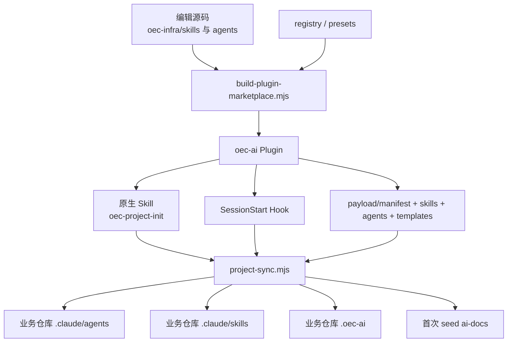
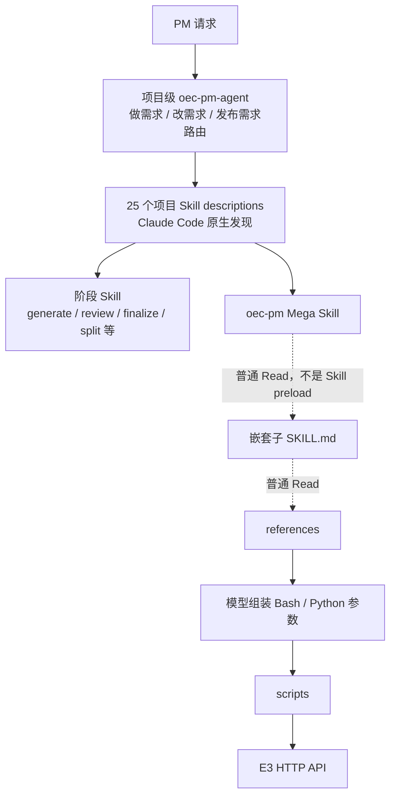
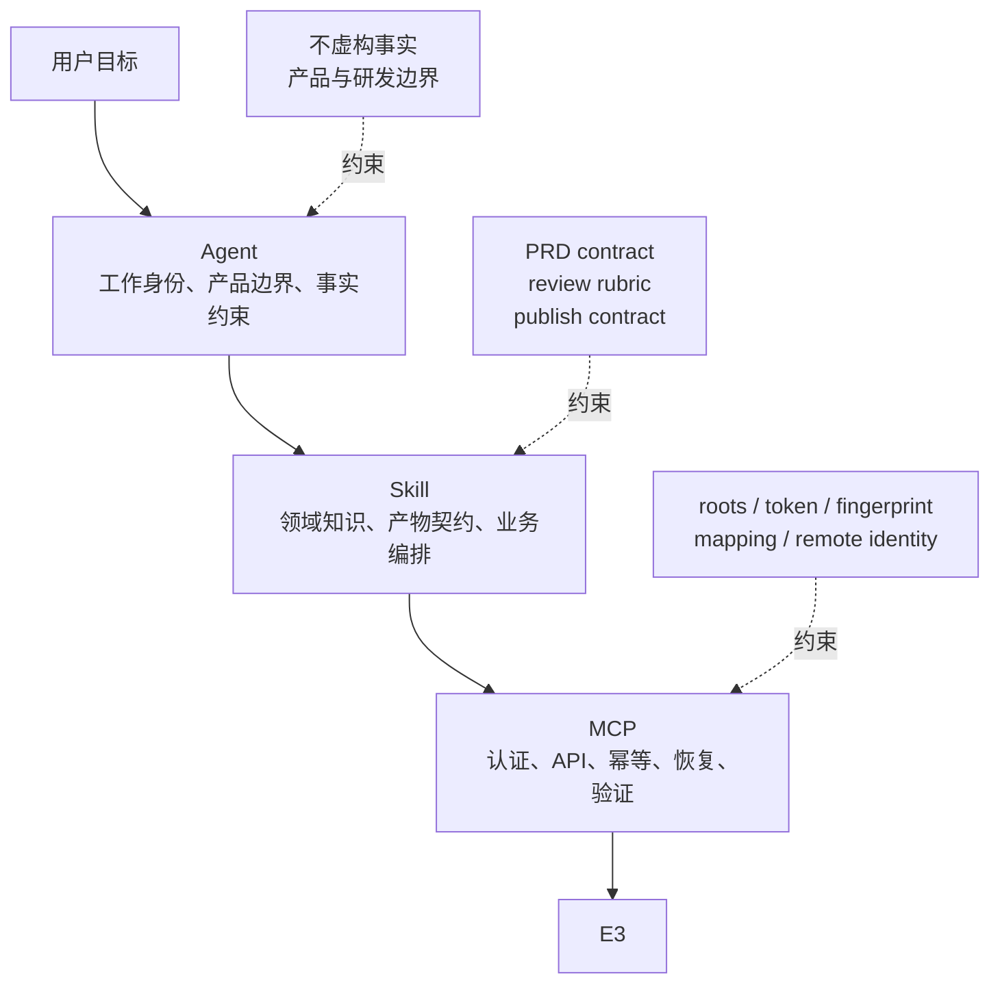
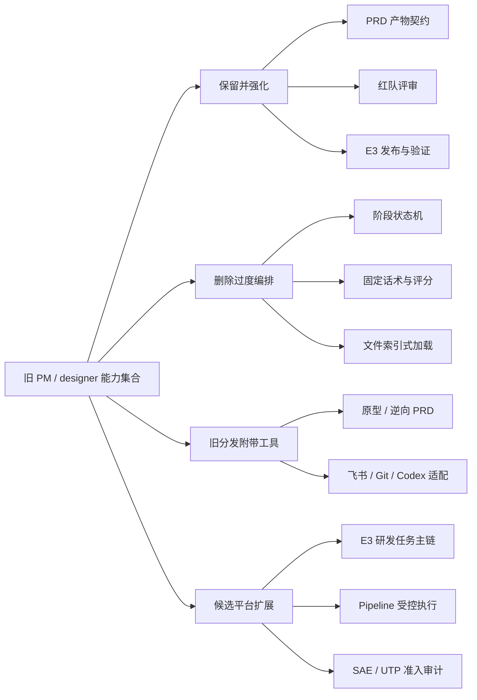

# OEC PM 能力迁移分析

> 本文基于旧仓库 `oec-ai-infra` 的 commit
> `79356008b9961c3e8a70c57e2fe5c9cf0c7ce424` 和当前 Marketplace `3.0.0`。分析对象分别是旧
> `oec-ai@0.2.2`，以及当前 `oec-product@3.0.0` 与其平台依赖 `oec-e3@1.0.0`。旧结构的数据来自
> 实际构建产物以及一次隔离临时目录中的
> `role=designer + tool=claude-code` 初始化，不把编辑源码目录误认为 PM 最终加载的配置。

## 1. 结论

旧实现并不是“PM Agent 和 Skills 直接装进 Claude Code Plugin”。它实际包含三套形态：

1. `oec-infra/` 是供维护者编辑的 Agent、Skill 源码。
2. `plugins/oec-ai/` 是 Marketplace 真正分发的 Plugin，其中 PM 资产位于 payload，Plugin 原生只暴露
   初始化 Skill 和同步 Hook。
3. 初始化器再把 payload 复制进每个业务仓库，使 PM 最终使用的是项目级 `.claude/agents` 和
   `.claude/skills`，而不是 Plugin 原生 Agent 和 namespaced Skills。

这套方案解决了当时的 Claude Code/Codex 双宿主和项目模板下发问题，也实现了事务式同步与安全路径
检查；但它把“Plugin 分发”“业务项目配置同步”“PM 工作流编排”“E3 API 执行”叠加成一个系统。
结果是安装状态有两个真相源，模型需要穿过多层路由和文件索引，项目配置容易与 payload 漂移，外部
副作用又依赖模型临场读取文档、拼命令和解释脚本结果。

当前迁移不是逐段缩写旧 803 行 Agent，而是重新划分职责：

- Agent 只定义 PM 身份、决策范围和事实边界。
- Skill 直接对应“写作、评审、发布”三个稳定用户目标。
- Supporting files 只作为所属 Skill 的渐进披露资源。
- 独立 `oec-e3` MCP-only Plugin 确定性实现 E3 认证、接口、幂等、恢复和远端校验。
- Plugin 安装、升级和卸载不再复制 `.claude` 配置到业务仓库。

当前主链路是：

```text
PRD 编写或修订 → PRD 红队评审 → 显式确认发布 → E3 状态验证
```

这条主链路已经完成迁移并强化。E3 研发任务创建、进度和状态也已作为平台原子能力实现，但通用产品
需求 CRUD、系统需求编辑/删除、缺陷、提测、任意任务字段编辑以及 Codex 分发仍在当前边界之外；
Pipeline 是独立平台 Plugin，不属于 PM 能力本身。

## 2. 旧实现的三层真实结构

### 2.1 第一层：`oec-infra/` 只是编辑源码

旧仓库维护者主要在以下目录编写 PM 能力：

```text
oec-infra/
├── agents/oec-product/
│   └── oec-pm-agent.md
└── skills/
    ├── product/
    │   ├── oec-prd-generate/
    │   ├── oec-prd-review/
    │   ├── oec-prd-finalize/
    │   ├── oec-prd-split/
    │   └── ...
    └── tools/
        ├── oec-pm/
        ├── oec-manage-task/
        └── ...
```

[旧构建脚本](../oec-ai-infra/script/build-plugin-marketplace.mjs) 读取 Skill、Agent 和 preset registry，
再执行以下转换：

- 将注册 Skill 按 frontmatter `name` 扁平复制到 `plugins/oec-ai/payload/skills/<name>`。
- 将 Agent group 复制到 `plugins/oec-ai/payload/agents/claude`。
- 将生成的 Codex TOML Agents 复制到 `payload/agents/codex`。
- 将 dev/designer 工作区模板复制到 `payload/templates`。
- 生成角色到 Skills、Agent groups 和模板的 [payload manifest](../oec-ai-infra/plugins/oec-ai/payload/manifest.json)。

因此，`oec-infra/skills/product/...` 是构建前来源，不是 PM 项目中的真实运行路径。任何写进 Agent 的
源码路径都必须经得住构建后的扁平化，否则会成为失效索引。

### 2.2 第二层：Marketplace 实际分发的是 bootstrap Plugin

旧仓库根部的 `oec-internal` Marketplace 只分发一个覆盖产品、设计、研发、测试和交付的
`oec-ai` Plugin。实际构建后的核心结构是：

```text
plugins/oec-ai/
├── .claude-plugin/plugin.json
├── skills/
│   └── oec-project-init/
├── hooks/hooks.json
├── runtime/project-sync.mjs
└── payload/
    ├── manifest.json
    ├── skills/
    ├── agents/claude/
    ├── agents/codex/
    ├── templates/
    └── runtime/
```

使用当前 Claude Code 对 [旧 Plugin manifest](../oec-ai-infra/plugins/oec-ai/.claude-plugin/plugin.json)
进行实际发现，组件清单是：

```text
Skills:      1  oec-project-init
Agents:      0
Hooks:       1  SessionStart
MCP servers: 0
```

PM Agent、25 个 designer Skills 和 E3 脚本虽然被 Plugin 携带，却都只是 payload 文件。安装 Plugin
只让 Claude 获得 `/oec-ai:oec-project-init` 和同步 Hook，不会直接出现一个 Plugin-scoped PM Agent。

[SessionStart Hook](../oec-ai-infra/plugins/oec-ai/hooks/hooks.json) 在 `startup|clear|compact` 时调用
[project-sync.mjs](../oec-ai-infra/plugins/oec-ai/runtime/project-sync.mjs)。同步器只会更新已经存在
`.oec-ai/installation.json` 的项目；没有初始化标记时直接返回。因此 Plugin 安装成功不等于业务仓库
已经具备 PM 配置，首次使用仍要运行 `oec-project-init` 并选择 role 和 host tool。

### 2.3 第三层：PM 真正获取的是项目级配置副本

在隔离临时目录实际执行下面的旧初始化入口：

```bash
node plugins/oec-ai/skills/oec-project-init/scripts/init.mjs \
  --plugin-root plugins/oec-ai \
  --target <temporary-product-repository> \
  --role designer \
  --tool claude-code
```

PM 最终获得的真实目录是：

```text
业务仓库/
├── .claude/
│   ├── agents/
│   │   └── oec-pm-agent.md
│   └── skills/                    # 25 个项目级 Skills
├── .oec-ai/
│   ├── installation.json
│   └── bin/
│       ├── plugin-discovery.mjs
│       └── project-sync-launcher.mjs
└── ai-docs/                       # 8 个首次初始化模板文件
    ├── prd/
    ├── ui/
    └── versions/v0.1.0/
```

本次物化的精确结果为：

| 内容 | 数量 | 所有权语义 |
|---|---:|---|
| `.claude/agents/oec-pm-agent.md` | 1 | 同步器管理的项目级 Agent |
| `.claude/skills/*` | 610 个文件、25 个 Skill 根目录 | 同步器管理的项目级 Skills |
| `.oec-ai/bin/*` | 2 | 同步器管理的项目运行时 |
| `ai-docs/*` | 8 | 仅文件缺失时 seed，后续视为业务内容 |
| `.oec-ai/installation.json` | 1 | 记录版本、role、tool 和 managed files |
| **总计** | **622 个文件，约 4.2 MiB** | 分布在业务仓库内 |

`installation.json` 记录了 613 个 `managedFiles`。其中体量最大的四个 Skill 包是：

| Skill 包 | 文件数 | 与 PRD 主链的关系 |
|---|---:|---|
| `iflytek-feishu-api` | 304 | 通用飞书 17 个模块、267 个 API |
| `oec-git-devops` | 114 | 仓库、流水线和 DevOps 管理 |
| `oec-manage-task` | 92 | 任务、提测和缺陷管理 |
| `oec-pm` | 67 | PM Mega Skill、嵌套规范和 E3 脚本 |

前三个相邻工具共 510 个 managed files，占全部受管文件约 83%。它们随 designer role 一次下发，
但与“写 PRD、评审、发布”并不共享稳定生命周期。这说明旧分发边界首先按组织角色聚合，而不是按
用户目标或副作用边界聚合。

25 个项目 Skills 可进一步分为：

- 15 个产品阶段 Skills：ideate、generate、review、revise、finalize、split、triage 等。
- 6 个设计相关 Skills：设计系统、原型、UI contract、视觉验证。
- 4 个通用工具 Skills：Git DevOps、任务管理、PM Mega Skill 和飞书 API。

### 2.4 从源码到项目副本的完整分发链



旧同步器并非简单粗暴复制，它具有以下保护：

- 先在 staging 组装并验证，再备份旧 managed files，失败时恢复。
- 拒绝 payload symlink、目标 symlink traversal 和项目路径逃逸。
- workspace templates 只在目标文件缺失时 seed，不覆盖已有 `ai-docs`。
- 通过 `installation.json` 识别旧版本 managed files 和 retired files。

但生命周期仍有四个结构性问题：

1. Plugin cache 和项目副本同时存在，形成两个状态源。
2. SessionStart 只有 payload 版本严格大于 installation 版本时才同步；同版本内容变化不会传播。
3. 新版本同步会覆盖 managed files 并删除 retired files；若项目提交了这些配置，会产生大规模工作区
   变更；若未提交，又成为机器上的隐式项目状态。
4. 代码中没有与初始化对称的项目资产 uninstall。卸载 Plugin 不会自动清除已复制到业务仓库的
   `.claude` 和 `.oec-ai` 文件。

## 3. 旧配置的索引和加载关系

### 3.1 项目 Skill 发现不等于 Agent Skill 预加载

物化后的 25 个目录符合项目 Skill 入口形态：

```text
.claude/skills/<skill-name>/SKILL.md
```

Claude Code 可以根据这些 Skill 的 description 发现并调用它们。但是旧
[oec-pm-agent.md](../oec-ai-infra/oec-infra/agents/oec-product/oec-pm-agent.md) frontmatter 没有
`skills:` 字段，因此 Agent 启动时没有任何 PM Skill 被原生预加载。Agent 的 803 行正文自己保存
入口判断、阶段编排、文件路径、Git 规则、失败处理和发布流程，再依靠模型从所有项目 Skills 中选择。

与此同时，顶层 [oec-pm/SKILL.md](../oec-ai-infra/plugins/oec-ai/payload/skills/oec-pm/SKILL.md)
又明确要求：

> 执行任何操作前，必须先根据路由表 Read 对应子目录的 `SKILL.md`；这些文件不作为独立顶层
> Skill 调用。

`oec-pm` 目录下实际有 1 个根 `SKILL.md` 和 6 个嵌套 `SKILL.md`，合计约 2064 行：

```text
oec-pm/
├── SKILL.md                       # 唯一项目级 Skill 入口
├── requirements-analysis/SKILL.md
├── generate-prd-document/SKILL.md
├── design-prototype/SKILL.md
├── manage-product-requirements/SKILL.md
├── decompose-prd-to-requirements/SKILL.md
└── write-file-strategy/SKILL.md
```

后六个文件是根 Skill 的 supporting files。模型能用 Read 打开它们，但这不等于 Claude Code 已把
它们注册成六个独立 Skill，也不等于 Agent frontmatter 预加载了它们。

### 3.2 实际调用链包含三重路由



三层都在判断意图：

| 判断层 | 路由内容 | 典型重叠 |
|---|---|---|
| PM Agent | 做需求、改需求、发布需求及内部状态机 | “写 PRD”“上 E3” |
| 顶层阶段 Skills | generate、review、revise、finalize、split 等 | `oec-prd-generate` 本身就能匹配 PRD 写作 |
| `oec-pm` Mega Skill | 需求分析、PRD、原型、产品需求和系统需求 | description 同时匹配写 PRD、原型和 E3 |

例如“根据需求写个 PRD”既可能命中 Agent 的 build flow，又直接符合 `oec-prd-generate`，也符合
`oec-pm` 的 `generate-prd-document` 路由。更多文字不会自动消除这种重叠，反而要求模型先判断
“应该服从哪一层路由”，再处理产品问题。

### 3.3 构建扁平化已经造成失效路径索引

旧 Agent 引用了：

```text
skills/product/oec-prd-split/sub-prd.md
skills/product/oec-prd-split/SKILL.md
```

但实际 PM 项目只有：

```text
.claude/skills/oec-prd-split/SKILL.md
.claude/skills/oec-prd-split/templates/sub-prd.md
```

这两个旧路径在实际初始化结果中均不存在。问题不只是少写了 `.claude/`：构建过程删除了
`skills/product` 分类层，而 `sub-prd.md` 本身还位于 `templates/`。因此把文件路径写进大型 Agent
相当于让 Agent 知道构建前内部布局；只要 publication layout 调整，Prompt 索引就会失效。

当前 Claude Code 对 Skill 的正式关系是：项目 Skill 位于 `.claude/skills/<name>/SKILL.md`，Plugin
Skill 位于 `<plugin>/skills/<name>/SKILL.md`；Agent 的 `skills:` 字段会注入列出的完整 Skill 内容。
普通 Read 仍然有价值，但应该用于 Skill 内的渐进披露资源，不应该冒充组件加载。

- [Claude Code Skills](https://code.claude.com/docs/en/slash-commands)
- [Claude Code Subagents](https://code.claude.com/docs/en/sub-agents)
- [Claude Code Plugins reference](https://code.claude.com/docs/en/plugins-reference)

### 3.4 E3 链路把平台执行交给了 Prompt

旧 E3 发布主链大致是：

```text
PM Agent
→ oec-prd-quality-gate
→ oec-pm Mega Skill
→ decompose-prd-to-requirements/SKILL.md
→ CRT/QRY/EDT/DEL reference
→ 模型选择 Python script 并拼参数
→ requests 调 E3 HTTP API
→ 模型解释 JSON 并写 mapping
→ post-publish gate
```

由此产生的风险包括：

- 系统需求和任务实现分散在 `oec-pm`、`oec-manage-task` 等不同包，Agent 又禁止某些跨包调用，
  所有权不完整。
- 部分字段候选把 `options[0]` 当默认值，列表顺序被误当成业务决策。
- quality gate 曾使用正则模拟 YAML parser，难以稳定验证嵌套 schema 和安全路径。
- OAuth token exchange 存在关闭 TLS 证书验证的旧实现。
- 模型负责选择脚本、构造参数、判断重试和解释多种 ID 返回结构。
- 发布后缺任务 ID 可以降级成 warning，“已发布”的语义不够严格。

这些是确定性平台问题，不应通过继续扩写 PM Agent 来弥补。

## 4. 对旧方案的辩证判断

### 4.1 应保留的设计价值

旧方案并非简单的错误实现，它解决了当时的现实问题：

- 用一个 registry 和 preset 维护 Claude Code/Codex 双宿主资产。
- 通过 role 选择 dev、designer 或 all，避免永远下发全集。
- 使用 staged copy、backup 和 rollback 防止半安装状态。
- 检查路径逃逸和 symlink traversal，保护业务仓库边界。
- 将首次工作区模板与后续 managed files 区分，避免升级覆盖 PRD 内容。
- 用 installation manifest 支持跨 Plugin 版本的项目同步。

如果目标是“把一整套组织脚手架物化进每个项目”，这种设计有合理性。迁移否定的不是这些工程保护，
而是把它们继续作为 PM Plugin 的默认运行模型。

### 4.2 需要迁移的结构性弊端

| 问题 | 对 PM 或模型的实际影响 |
|---|---|
| 二次安装 | Marketplace 安装成功后还要初始化 role/tool，开箱即用链路不完整 |
| 双状态源 | Plugin payload 和业务仓库副本可能不同步，排障要同时检查两处 |
| 项目污染 | 一次 designer 初始化写入 622 个文件，组织工具与产品资料混在同一仓库生命周期 |
| 升级耦合 | SessionStart 可能覆盖 managed files、删除 retired files，并制造项目 diff |
| 卸载不对称 | Plugin 卸载后项目副本没有自动回收路径 |
| 三重路由 | Agent、阶段 Skills、Mega Skill 对相同意图重复判断 |
| 文件索引漂移 | Agent 记住构建前路径，publication layout 改动后索引失效 |
| 能力边界过宽 | PRD、原型、飞书、Git、任务、缺陷和 E3 CRUD 同时进入 designer 配置 |
| 平台执行不确定 | OAuth、API、幂等、恢复和 mapping 依赖模型驱动 Bash/Python |

模型能力提升并不意味着业务规则可以删除。正确的区分是：

- 需要理解语义、权衡取舍的产品判断交给模型。
- 输出必须稳定一致的不变量交给确定性代码。
- 涉及外部写操作的平台能力交给类型化工具和明确确认。
- 特定组织的产物规则保留在 Skill supporting files，而不是大 Agent 状态机里。

## 5. 迁移设计原则

### 5.1 按用户目标拆能力，不按内部阶段拆能力

PM 稳定需要完成的是：

1. 把需求写清楚并维护为可交付 PRD。
2. 判断关键假设和风险是否经得住挑战。
3. 在明确确认后把最终产物发布到 E3。

ideate、generate、revise、finalize 和 split 是可能采用的内部工作动作，不需要成为要求模型逐关模拟的
固定状态机。因此当前收敛为：

| Skill | 用户目标 | 副作用边界 |
|---|---|---|
| [writing-prds](oec-product/skills/writing-prds/SKILL.md) | 创建、修订、收口和拆分 PRD | 只写本地 PRD；提交前确认 |
| [reviewing-prds](oec-product/skills/reviewing-prds/SKILL.md) | 对 PRD 做只读红队评审 | 不修改文件 |
| [publishing-prds-to-e3](oec-product/skills/publishing-prds-to-e3/SKILL.md) | 显式发布最终产物 | 展示计划并确认后写 E3 |

### 5.2 Agent、Skill、MCP 各自只有一个主要职责



当前 [oec-pm Agent](oec-product/agents/oec-pm.md) 通过 frontmatter 原生预加载 writing 和
reviewing，完整 Skill 内容在 Agent 启动时注入，不需要记住 `SKILL.md` 文件路径。带外部副作用的
publishing 不预加载，并设置为只能由用户显式调用。

### 5.3 让模型处理语义，让代码处理不变量

模型继续负责：

- 理解模糊或不完整的需求。
- 识别承重假设和需要用户决策的事项。
- 根据需求复杂度选择条件章节。
- 把技术输入转为用户可观察的产品行为。
- 在事实不足时澄清，不虚构业务规则。

确定性代码负责：

- 文件、路径、版本和命名。
- HANDOFF YAML schema 和安全路径。
- Story ID 唯一性及验收标准关联。
- HANDOFF、子 PRD、featureName 和故事集合一致性。
- MCP roots、selectionToken、planToken 和 workspace 隔离。
- artifact fingerprint、E3 ID、标题、空间和任务父子关系。
- mapping 原子写入、partial checkpoint 和幂等恢复。

### 5.4 保留业务规则，删除对模型过程的微管理

继续保留：

- 产品语言与研发设计的权限边界。
- PRD SSOT、版本、changelog 和路径契约。
- 一个模块对应一个子 PRD，单模块也生成一个子 PRD。
- 一个子 PRD 对应一个 E3 系统需求，一个 Story 对应一个任务。
- 不虚构业务规则、证据、决策和 E3 结果。
- 用户确认后才精确提交 PRD 或 mapping 文件。

主动删除：

- 固定 ideate/review/revise/finalize 状态机。
- 固定章节填充、固定完成话术和 A/B/C/D 评级。
- quick-fix 分级、固定重试次数和打断恢复对话树。
- Agent 内的 Skill 文件索引。
- Prompt 内的 OAuth、HTTP、JSON、重试和 ID 提取细节。

## 6. 当前实现

### 6.1 领域 Plugin 与平台 Plugin 分层

当前采用 Claude Code 原生层级，并进一步把产品知识与 E3 平台执行解耦：

```text
Marketplace: plainOEC-infra
├── Plugin: oec-product@3.0.0
│   ├── agents/oec-pm.md
│   ├── skills/writing-prds/
│   ├── skills/reviewing-prds/
│   ├── skills/publishing-prds-to-e3/
│   └── dependency: oec-e3@~1.0.0
└── Plugin: oec-e3@1.0.0
    ├── .mcp.json
    ├── servers/e3/
    └── dist/e3-server.mjs
```

实际组件清单是：

| Plugin | Skills | Agents | MCP servers | Commands | Hooks |
| --- | ---: | ---: | ---: | ---: | ---: |
| `oec-product@3.0.0` | 3 | 1 | 0 | 0 | 0 |
| `oec-e3@1.0.0` | 0 | 0 | 1 | 0 | 0 |

Product 通过 Marketplace 复制进 Claude Code plugin cache，Claude Code 自动解析 E3 dependency。安装
过程不会在产品仓库创建 `.claude`、`.oec-ai` 或模板；只有用户真正执行 writing Skill 时，才按业务
目标创建 PRD 产物。隔离 Git Marketplace 安装已验证 Product 与 E3 均可在无 `node_modules` 的
Plugin cache 中运行。

关键入口：

- [Marketplace](.claude-plugin/marketplace.json)
- [Product manifest](oec-product/.claude-plugin/plugin.json)
- [PM Agent](oec-product/agents/oec-pm.md)
- [E3 manifest](oec-e3/.claude-plugin/plugin.json)
- [E3 MCP 注册](oec-e3/.mcp.json)

### 6.2 Supporting files 回到所属 Skill

Writing 的 artifact contract、versioning、product language、templates 和 checker 都位于
`writing-prds/` 内；Review rubric 位于 `reviewing-prds/`；E3 publish contract 位于
`publishing-prds-to-e3/`。没有 Plugin 根公共 `references/assets/lib`，也没有另一个 Mega Skill
负责告诉模型去哪里找文件。

Skill description 直接描述能力和触发边界，不再依赖无定义的品牌词帮助模型判断。Reference 只在
执行相关能力时按需读取，避免把所有模板、平台规则和评审方法同时放进 Agent。

### 6.3 E3 发布变成四个类型化工具

E3 MCP Server 保持四个 PRD 发布工具：

| 工具 | 职责 | 是否写 E3 |
|---|---|---|
| `prepare_prd_publish` | 验证产物、查询远端、生成 15 分钟计划 | 否 |
| `select_product_space` | 保存 workspace-bound 空间和 POMP 选择 | 否 |
| `execute_prd_publish` | 校验计划后创建或复用需求与任务 | 是 |
| `get_prd_publish_status` | 只读验证 mapping 和远端对象 | 否 |

Publishing Skill 只表达业务步骤：

```text
prepare
→ 必要时选择空间或 POMP
→ 展示创建/复用计划和 warnings
→ 用户明确确认
→ execute
→ status 独立验证
```

OAuth、固定 origin、HTTP payload、成功码、ID 归一化、未知 POST 结果恢复、mapping checkpoint 和
脱敏全部由 `oec-e3` 实现。Product Skill 只保留 HANDOFF、版本不可变、用户确认和发布结果表达。

### 6.4 发布一致性边界

`prepare` 在访问 E3 前执行完整 artifact gate；`execute` 在远端写入前再次验证 workspace、planToken、
配置、fingerprint、本地产物和远端身份。

一旦 mapping 包含任一 E3 ID，该版本就与 artifact fingerprint 和产品空间绑定：

- fingerprint 或空间不一致时阻断，不覆盖旧 mapping。
- mapping ID 存在时先按 ID 验证标题和任务父子关系。
- mapping 无 ID 时才按精确标题查询；0 条创建、1 条复用、多条阻断。
- 每个远端成功结果立即原子写入 mapping，partial 下次从 checkpoint 恢复。
- 只有全部系统需求和 Story 任务均 verified 才返回 `published`。

POMP、研发负责人和测试负责人只在唯一候选或唯一默认值时自动选择。多个候选没有唯一默认值时让
用户选择或产生 warning，不把列表第一项当业务决定。

产品空间和 POMP 配置保存在
`${CLAUDE_PLUGIN_DATA}/e3/workspaces/<canonical-root-sha256>/config.json`。Selection 和 plan token 都
绑定 canonical MCP root，一个产品仓库不能使用另一个仓库的选择或计划。

### 6.5 E3 研发任务是独立原子能力

同一 E3 Server 还提供六个研发任务工具：

```text
prepare_development_tasks
select_development_requirement
execute_development_tasks
prepare_task_progress
execute_task_progress
get_development_task_status
```

这些工具不是新的 Dev 工作流，也不依赖 `oec-engineering`。它们只确定性完成需求选择、任务创建或
复用、开始、工时日志、完成和只读状态验证。任务由 `changeId + localId` 建立本地身份，mapping
绑定 workspace、空间、父需求、标题和远端 ID；每项成功立即 checkpoint，失败返回 partial。

### 6.6 Git 原生分发不要求项目安装依赖

E3 bundle 和 Product bundled artifact checker 随 Git 提交，包含所需 runtime。
Marketplace 根 package manifest 仅用于维护和重建，不位于 Plugin 根，因此干净安装后的 Plugin
cache 不需要 `node_modules`、npm registry 登录、SessionStart 安装 Hook 或用户执行 `npm install`。

确定性 PRD contract 的源码位于 [packages/prd-artifact-contract](packages/prd-artifact-contract)，只在
构建期被 Product checker 和 E3 Server 分别导入并打包。它不是 Claude 组件、公共 Skill reference
或 Plugin 之间的运行时文件依赖。

## 7. 能力迁移结果

### 7.1 已迁移并强化

- 创建、修订、收口版本 PRD。
- 根 PRD、增量 PRD、子 PRD、changelog 和 HANDOFF。
- 单模块仍生成一个子 PRD。
- 外部子 PRD 合入产品 SSOT。
- 产品语言和研发边界。
- 只读 PRD 红队评审。
- 发布前后确定性 artifact gate。
- 子 PRD 到系统需求、Story 到任务的映射。
- E3 OAuth、空间和 POMP 配置。
- E3 mapping、状态验证、幂等复用和 partial resume。
- 已发布版本不可变及远端对象漂移阻断。
- E3 研发任务需求选择、创建/复用、进度、工时和状态验证的受控工具链。

### 7.2 因模型能力提升和减少过度设计而删除

以下内容是对模型过程的过度编排，不应恢复为 Agent 提示词：

- ideate/generate/review/revise/finalize 的硬状态机。
- 独立需求分析报告作为强制前置阶段。
- A/B/C/D 质量评级。
- 固定章节填充和固定完成话术。
- 路由表套路由表。
- 文件索引式 Skill 加载。
- quick-fix 分级路由。
- 固定重试次数、流程打断和回退对话模板。

### 7.3 未随 PM 主链迁移的旧分发附带工具

旧 `oec-ai` 按 designer 角色同时下发了相邻领域工具。以下能力没有进入当前 `oec-product`：

- 原型设计和设计系统处理。
- 从存量系统逆向整理 PRD。
- 行为基线维护。
- 经验库沉淀与检索。
- 飞书、Git DevOps 等通用组织工具。
- Codex TOML Agent 生成和项目级配置同步。

这些能力与 PRD 编写、评审和受控发布没有稳定的同一生命周期。如果真实场景仍需要，应按用户目标
评估为独立 Skill、Plugin 或宿主适配层，不为复刻旧 designer 安装包而扩大 PM Plugin。

### 7.4 独立平台能力与未来扩展

已经迁移但不属于 Product Plugin 的平台能力：

- E3 研发任务创建、复用、进度、工时和状态验证，归属 `oec-e3`。
- 既有 dev/test 流水线的受控执行，归属 `oec-pipeline`，不随 Product 自动安装。

仍未准入或明确不恢复的平台能力：

- 云帆产品需求和系统需求的通用 CRUD。
- 缺陷、提测、任意任务字段编辑和依赖可视化。
- 多负责人显式选择工具和远端已发布需求更新。
- SAE、UTP、通用 Gitee 和流水线管理。

只有真实场景证明受控主链不能完成必要目标，并且 API、权限、远端身份和非生产环境契约已经验证，
才增加边界清晰的 MCP 工具或独立 Plugin。即使扩展，也不把 HTTP/API 细节写回 PM Agent。



## 8. 迁移效果与验证

### 8.1 结构与维护效果

| 指标 | 旧 `oec-ai@0.2.2` | 当前 Product + E3 | 结果 |
|---|---:|---:|---|
| 启用 PM 所需的项目物化文件 | 622 个初始化文件 | 0 | 安装与业务产物生命周期分离 |
| PM Agent 行数 | 803 | 19 | 身份与工作流解耦 |
| PM 项目级 Skills | 25 | 0 | 不再复制项目配置 |
| Plugin 原生 PM Skills | 0；仅 1 个 init Skill | 3 | 原生发现和 namespace |
| 核心 Skill 正文 | 产品阶段 2412 行 + `oec-pm` 树 2064 行 | 3 个 Skill 共 105 行 | 从阶段粒度收敛到用户目标 |
| Plugin 原生 PM Agents | 0 | 1 | Agent 与 Plugin 同生命周期 |
| Product Plugin MCP Servers | 0 | 0 | 产品知识不再持有平台运行时 |
| E3 Plugin MCP Servers | 0 | 1（10 tools） | E3 从 Prompt/Bash 迁到独立类型化平台工具 |
| SessionStart Hook | 1 | 0 | 不再隐式同步项目配置 |
| Agent Skill 关系 | 描述发现 + 文件 Read | frontmatter 原生预加载 writing/reviewing | 减少路由歧义 |
| E3 执行 | 模型驱动 Python/HTTP | 4 个发布 + 6 个研发任务 MCP 工具 | 外部副作用可验证 |

行数和文件数不能直接等同于 token 成本。旧 Skills 并非全部同时加载，当前 MCP bundle 也包含大量
确定性代码。真正的改善是模型判断面更单一：Agent 不重复 Skill 工作流，writing/reviewing 才被
预加载，publishing 只在用户显式调用时出现，API 细节不进入 Prompt。

### 8.2 自动验证

Marketplace `3.0.0` 当前自动验证结果：

```text
npm run build
npm test

tests: 99
pass:  99
fail:  0
```

测试覆盖：

- Agent frontmatter、显式调用描述和 Skill 预加载。
- 三个 Skill 的正向/负向触发和 publishing 手动调用。
- 模型判断面不依赖冗余品牌限定词。
- YAML artifact contract、安全路径和 bundled checker。
- OAuth PKCE、state、refresh、401 和脱敏。
- E3 十个工具、roots、selectionToken 和 workspace 隔离。
- planToken 过期、workspace/config/fingerprint 变化。
- mapping v1 兼容、v2 原子写入和 legacy adoption。
- 创建、复用、歧义、远端漂移和 partial resume。
- POMP 单候选、唯一默认值、多默认值、无默认值、零候选和 pending 恢复。
- 缺失任一任务 ID 时禁止返回 `published`。
- 无 `node_modules` 的 bundled checker 和 MCP stdio discovery。
- E3 研发 mapping、父需求选择、创建/复用、partial、进度顺序和只读 status。
- Pipeline workspace/remote/ref/commit 绑定、候选歧义、dev/test 限制和未知 POST 恢复。
- 无 `node_modules` 的 Product + E3 dependency 干净安装与自动发现。

Plugin 验证结果：

```text
claude plugin validate .
claude plugin validate ./oec-product
claude plugin validate ./oec-engineering
claude plugin validate ./oec-e3
claude plugin validate ./oec-pipeline

✔ Validation passed
```

### 8.3 真实 E3 验收边界

2026-08-20，`oec-product@2.2.0` 在获得授权的非生产空间“OBU-AI提效组”完成真实发布验收：

1. 完整 fixture 通过 pre-publish artifact gate。
2. prepare 计划创建一条系统需求和一条 Story 任务。
3. execute 返回 `published`。
4. status 通过真实 E3 响应验证 ID、标题、任务父子关系和详情链接。
5. 再次 prepare 的创建数为 0，需求和任务均精确复用。
6. 修改带既有 mapping 的 fixture 后，prepare 返回 `published-version-changed`，mapping 不变。
7. 从干净 Git archive 安装后，Plugin cache 没有 `node_modules`，bundled MCP 注册四个工具。

`2.2.1` 清理了模型判断面；`3.0.0` 再把 E3 Server 抽离为 dependency，并增加研发任务工具。既有
2.2.0 真实发布证据可以证明被保留的 PRD API 契约，但不能自动证明新的 Plugin Data、研发任务链或
Pipeline 已通过真实 E2E。

真实验收仍有两项明确边界：

- 真实流程没有进入 POMP 歧义分支，多候选选择由自动测试覆盖。
- 未在真实 E3 人为制造 partial 写入故障，partial resume 仍是 mocked evidence。

详见 [oec-product README](oec-product/README.md) 和 [oec-e3 README](oec-e3/README.md)。

## 9. 当前边界和后续注意事项

### 9.1 当前不是 Codex 双宿主实现

旧仓库同时生成 Claude Markdown Agents 和 Codex TOML Agents。当前仓库只有 `.claude-plugin`，没有
`.codex-plugin` 或 Codex Agent manifest。

如果目标是 Claude Code 原生产品插件，这是主动收缩；如果组织仍要求 Claude/Codex 双宿主，应另行
设计 Codex 分发适配层，不破坏当前 Claude Plugin 的职责结构。

### 9.2 当前 E3 MCP 是受控主链接口，不是通用管理 SDK

当前保证不可变 PRD 的发布、复用、恢复和验证，并提供研发任务的创建、进度和状态主链；不提供通用
update/delete API，也不恢复旧 `oec-manage-task` 的缺陷、提测、任意字段编辑和查询工具箱。

产品说明应明确：当前完成的是“PRD 发布 + 研发任务主链”，不是“所有 E3 操作能力的完整复刻”。

### 9.3 License 需要组织确认

旧 Plugin manifest 使用 `UNLICENSED`，当前 `oec-product/.claude-plugin/plugin.json` 使用 `MIT`，
而根 Node package 声明 `private: true`。组织级分发前应确认这是有意的开源授权，还是应恢复内部
`UNLICENSED`。

## 10. 最终判断

迁移前，PM 能力通过 bootstrap Plugin 携带，但最终作为 622 个文件物化进业务仓库。模型面对一个
803 行项目 Agent、25 个项目 Skills、一个再次索引 6 份内部 `SKILL.md` 的 Mega Skill，以及由
Prompt 驱动的 Bash/Python E3 链路。

迁移后，PM 是一个可直接安装和卸载的原生产品域 Plugin，并通过原生 dependency 使用平台 Plugin：

- Agent 定义工作身份。
- 三个 Skills 对应稳定用户目标。
- Supporting files 提供按需领域契约。
- `oec-e3` MCP Server 确定性执行外部副作用。
- Plugin cache 承载配置，业务仓库只承载用户确认后产生的产品文档和 mapping。

如果评价“PRD 编写、评审、发布”主链，当前实现已经完成迁移并强化旧方案；如果评价旧
`oec-pm`、`oec-manage-task`、飞书、设计和 Codex 适配的全部能力，当前只是主动收窄后的子集，不能
称为完整复刻。

后续扩展应继续遵守相同原则：只有真实平台能力缺口才扩展 MCP 或增加独立 Plugin，不把认证、API、
重试、状态机、项目同步器或通用 CRUD 重新写回 PM Agent。Pipeline、SAE、UTP 以各自平台证据和
生命周期验收，不与 PM 主链合并计算完成度。
