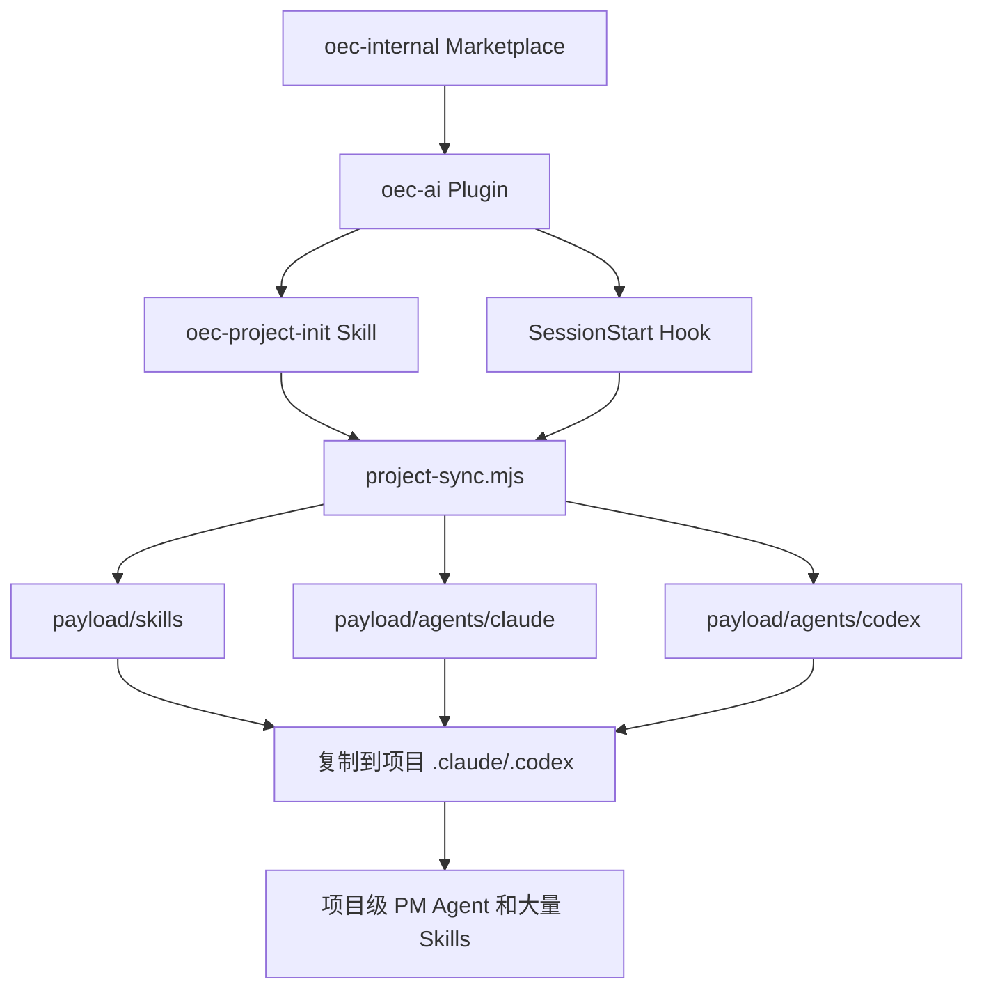
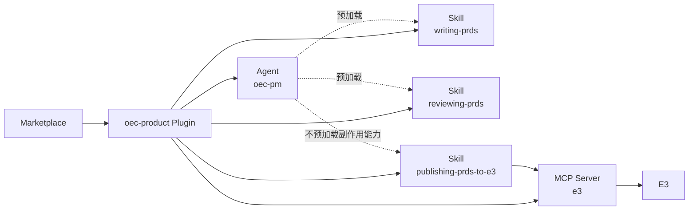
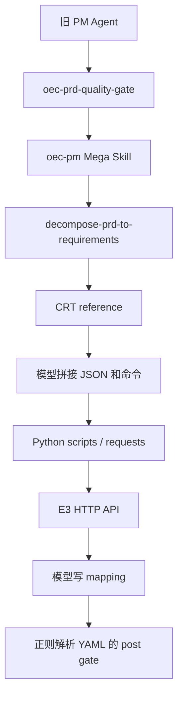
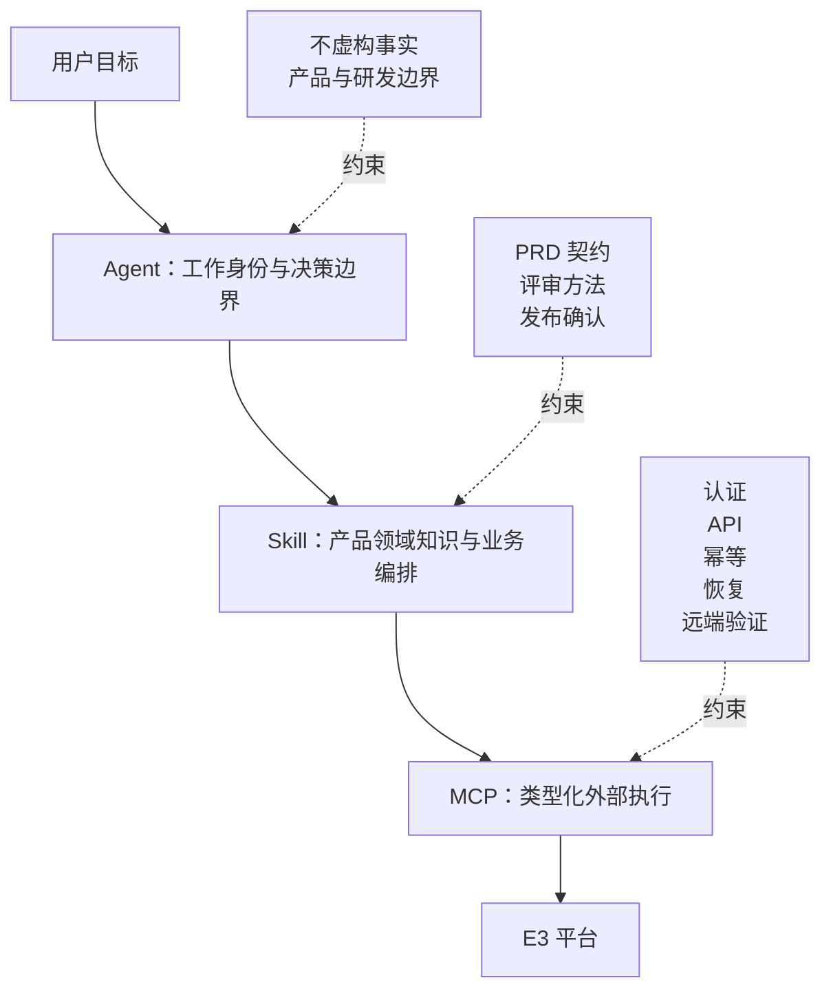
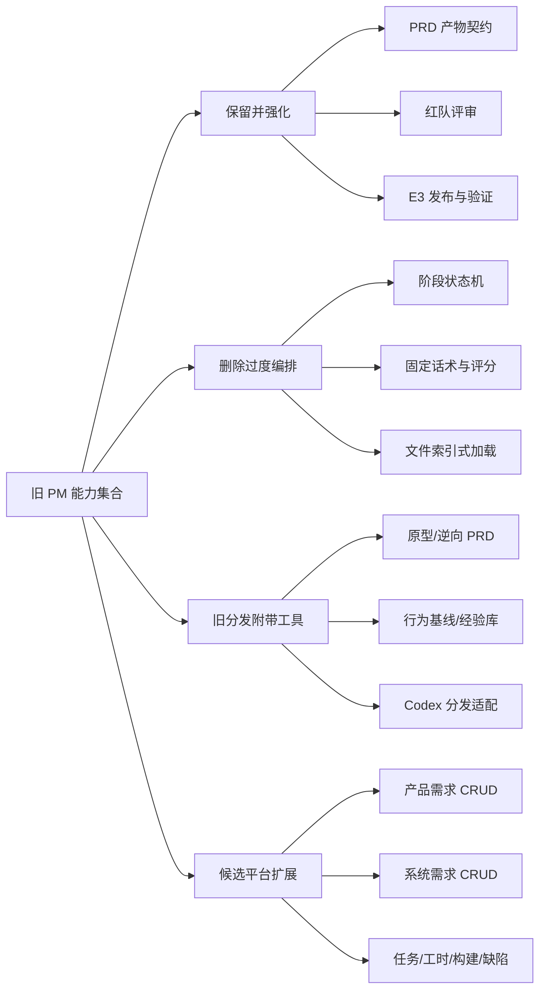

# OEC PM 能力迁移分析

> 本文对比旧实现 `/Users/qxwang6/project/oec-ai-infra/oec-infra` 中的 PM 能力，
> 与当前仓库 `/Users/qxwang6/project/plainOEC-infra` 的 `oec-product` Plugin，说明迁移原因、
> 设计思路、实际效果和仍需保留的边界。

## 1. 结论

这次迁移不是把旧 PM Agent 的提示词逐段翻译到新目录，而是重新划分三类职责：

- Agent 只定义 PM 工作身份、决策范围和事实边界。
- Skill 承载可发现、可组合的产品**领域能力**。
- **MCP Server 确定性实现 E3 认证、接口、幂等、恢复和远端校验**。

迁移后的核心链路是：

```text
PRD 编写或修订 → PRD 红队评审 → 显式确认发布 → E3 状态验证
```

这条主链路已经完成迁移，而且 E3 发布的一致性、安全性和可验证性超过旧实现。当前实现不是旧
`oec-pm` 工具箱的功能全集：通用产品需求 CRUD、系统需求编辑/删除、任务/工时/构建/缺陷管理等
平台能力没有迁移；Codex 分发能力也不在当前 Claude Code Plugin 的范围内。

## 2. 迁移前后的组织模型

### 2.1 旧实现：大插件分发项目级资产

旧仓库并非完全没有 Marketplace 或 Plugin。仓库根部存在 `oec-internal` Marketplace，分发一个覆盖
产品、设计、研发、测试和交付的大型 `oec-ai` Plugin。

但 PM Agent 和主要产品 Skills 并不是该 Plugin 直接暴露的原生组件。它们被构建进 payload，再由
`SessionStart` Hook 或 `oec-project-init` 将资产复制到业务项目的 `.claude/skills`、
`.claude/agents`，并同时生成 Codex 所需的 TOML Agents。



从 Claude Code 的 Plugin 视角实测，旧 `oec-ai@0.2.2` 的原生组件清单是：

```text
Skills:      1  oec-project-init
Agents:      0
Hooks:       1  SessionStart
MCP servers: 0
```

这说明旧 PM 能力虽然通过 Plugin 分发，但本质是“Plugin 安装器管理的项目级配置”，而不是
“Plugin 直接持有的 PM 组件”。安装、升级和卸载 PM 能力也与整个 OEC 工具包耦合。

关键证据：

- 旧 Marketplace：`../oec-ai-infra/.claude-plugin/marketplace.json`
- 旧 Plugin：`../oec-ai-infra/plugins/oec-ai/.claude-plugin/plugin.json`
- payload 角色清单：`../oec-ai-infra/plugins/oec-ai/payload/manifest.json`
- 项目同步实现：`../oec-ai-infra/plugins/oec-ai/runtime/project-sync.mjs`
- SessionStart Hook：`../oec-ai-infra/plugins/oec-ai/hooks/hooks.json`

### 2.2 当前实现：原生产品域 Plugin

当前仓库直接采用 Claude Code 原生层级：

```text
Marketplace
└── oec-product Plugin
    ├── Agent: oec-pm
    ├── Skill: writing-prds
    ├── Skill: reviewing-prds
    ├── Skill: publishing-prds-to-e3
    └── MCP Server: e3
```

当前 Plugin 不使用 Commands、Hooks、默认 Agent 设置，也不需要把插件资产复制进业务项目。
Marketplace 安装、升级或卸载的边界就是 `oec-product` 本身。



实测当前 `oec-product@2.1.0` 的组件清单是：

```text
Skills:      3
Agents:      1
Hooks:       0
MCP servers: 1
```

关键文件：

- [Marketplace](.claude-plugin/marketplace.json)
- [Plugin manifest](oec-product/.claude-plugin/plugin.json)
- [PM Agent](oec-product/agents/oec-pm.md)
- [MCP 注册](oec-product/.mcp.json)

该结构符合 Claude Code 的原生组件模型：Plugin 是自包含的分发单元，`skills/`、`agents/`、
`.mcp.json` 位于 Plugin 根目录；新插件优先使用 Skills，而不是 legacy Commands。

- [Claude Code Plugins reference](https://code.claude.com/docs/en/plugins-reference)
- [Claude Code Skills](https://code.claude.com/docs/en/slash-commands)
- [Claude Code Subagents](https://code.claude.com/docs/en/sub-agents)
- [Claude Code MCP](https://code.claude.com/docs/en/mcp)

## 3. 为什么需要迁移

### 3.1 旧 Agent 已经成为提示词控制程序

旧 `oec-pm-agent.md` 有 803 行，同时承担：

- PM 服务边界、拒答清单和固定话术。
- 文件路径白名单和 Git 命令规则。
- “做需求、改需求、发布需求”入口路由。
- ideate、generate、review、revise、finalize、split 阶段状态机。
- 存量 PRD、子 PRD、拆分粒度调整和中断恢复。
- 重试次数、失败选项和回退话术。
- E3 发布步骤、质量门禁和 mapping 规则。
- A/B/C/D 质量评级。
- quick-fix、经验沉淀及十六条编排规则。

旧 Agent 的长度不是一次设计的结果，而是随着线上问题不断追加约束形成的。每次增加固定流程都可能
解决一个局部问题，但也会带来三类新成本：

1. 多组状态规则、重试规则和拒答规则可能互相冲突。
2. 模型需要先模拟人为状态机，才能开始解决实际产品问题。
3. 新问题通常只能继续往同一个 Agent 追加文字，缺少可测试的稳定边界。

模型能力提升并不意味着所有规则都应删除。正确的判断标准是：

- 需要语义理解和产品判断的内容交给模型。
- 可确定验证的不变量交给代码。
- 涉及外部副作用的平台操作交给类型化工具。
- OEC 特有的业务规则继续保留在 Skill supporting files 中。

### 3.2 旧“Skill 加载”主要是文件索引

旧 `oec-pm/SKILL.md` 明确要求：执行前先 `Read` 对应子目录的 `SKILL.md`，且这些子目录不是独立
顶层 Skill。实际运行链路是：

```text
Agent 路由
→ oec-pm 再路由
→ Read 某个子 SKILL.md
→ 子 Skill 再按 CRT/QRY/EDT/DEL 路由 reference
```

这可以让模型找到文件，但不是 Claude Code 原生的 Skill 预加载，也形成了重复控制面。旧 Agent 和
`oec-pm` Mega Skill 都在做意图识别、流程选择和错误处理。

当前 Agent 通过 frontmatter 原生预加载：

```yaml
skills:
  - writing-prds
  - reviewing-prds
```

Claude Code 会在 Agent 启动时注入列出的完整 Skill 内容，不需要 Agent 再记住文件路径。发布 Skill
因为带外部副作用而不预加载，只能由用户显式调用。

### 3.3 旧 Skill 按内部阶段拆分，而不是按用户目标拆分

旧产品目录有 15 个 `SKILL.md`，约 2412 行；`oec-pm` 工具树还有 7 个 `SKILL.md`，约 2064 行。
其中大量能力围绕 ideate、generate、review、revise、finalize、split、triage 等内部阶段拆分。

这些阶段是实现过程，不是稳定的用户目标。PM 真正需要的是：

1. 把需求写清楚并维护为可交付产物。
2. 判断需求中的关键假设是否经得住挑战。
3. 在明确确认后把最终产物发布到 E3。

因此当前收敛为三个自包含 Skills：

| Skill | 用户目标 | 是否允许副作用 |
|---|---|---|
| [writing-prds](oec-product/skills/writing-prds/SKILL.md) | 创建、修订、收口、拆分 PRD | 只写本地 PRD；提交前确认 |
| [reviewing-prds](oec-product/skills/reviewing-prds/SKILL.md) | 对 PRD 做只读红队评审 | 否 |
| [publishing-prds-to-e3](oec-product/skills/publishing-prds-to-e3/SKILL.md) | 显式发布已完成产物 | 是；必须展示计划并确认 |

三个 `SKILL.md` 正文总计 93 行，Agent 19 行。长模板、字段契约和评审 rubric 作为所属 Skill 的
渐进披露资源存在，不再塞进 Agent，也不建立插件根公共资源层。

### 3.4 E3 外部执行不应依赖模型临场编排

旧 E3 发布链路包含多层 Prompt 和 Bash/Python 调用：



具体风险包括：

- 系统需求创建脚本属于 `oec-pm`，任务 POST 实现在另一套 `oec-manage-task` 中，但旧 Agent 又禁止
  直接调用 `oec-manage-task`，实现所有权断裂。
- 字段预填脚本对 POMP、研发负责人、测试负责人等候选直接使用 `options[0]`，会把列表顺序误当
  业务默认值。
- 旧 quality gate 用正则模拟 YAML parser，难以可靠处理 schema、嵌套结构和安全路径。
- OAuth token exchange 使用 `verify=False`，关闭 TLS 证书校验。
- 模型负责构造 JSON payload 和命令，接口约束只能依赖提示词提醒。
- 发布后缺少任务 ID 可以作为 warning 降级收口，“已发布”的语义不够严格。

这些问题属于平台能力，不能通过继续扩写提示词解决。

## 4. 迁移设计原则

### 4.1 让模型处理语义，让代码处理不变量

模型继续负责：

- 理解模糊或不完整的需求。
- 发现承重假设和需要用户决策的事项。
- 根据需求复杂度选择 PRD 条件章节。
- 把技术输入转为用户可观察的产品行为。
- 在事实不足时向用户澄清，不虚构业务规则。

确定性代码负责：

- 路径、文件和版本命名。
- HANDOFF YAML schema。
- Story ID 唯一性及验收标准关联。
- HANDOFF、子 PRD、featureName 和故事列表一致性。
- MCP roots 和 workspace 路径限制。
- planToken 过期、配置变化和 artifact fingerprint。
- E3 ID、标题、空间和任务父子关系验证。
- mapping 原子写入、partial checkpoint 和幂等恢复。

### 4.2 Agent、Skill、MCP 各自只有一个主要职责



发布 Skill 只表达用户可理解的业务步骤：

```text
prepare
→ 必要时选择空间或 POMP
→ 展示创建/复用计划和 warnings
→ 用户明确确认
→ execute
→ status 独立验证
```

OAuth、HTTP endpoint、payload、重试、ID 提取和 mapping 更新全部在 MCP Server 内实现。

### 4.3 保留业务规则，删除对模型思考过程的微管理

保留的规则：

- 产品语言与研发设计的权限边界。
- PRD SSOT、版本、changelog 和文件路径契约。
- 一个模块对应一个子 PRD，单模块也必须生成一个子 PRD。
- 一个子 PRD 对应一个 E3 系统需求。
- 一个 Story 对应一个 E3 任务。
- 不虚构业务规则、证据、决策和 E3 结果。
- PM 确认后才精确提交 PRD 文件。

删除的过度约束：

- 固定 ideate/review/revise/finalize 状态机。
- 固定十一章空模板。
- A/B/C/D 或数字化伪精确评分。
- 大量固定话术和输出模板。
- 对 TaskCreate/TaskUpdate 等过程工具的微观规定。
- 重试次数、打断处理和回退对话状态机。
- 通过文件路径冒充 Skill 加载。
- Agent 内的 OAuth、HTTP、JSON 和脚本细节。

## 5. 当前 E3 发布模型

当前 MCP Server 暴露四个工具，调用名称保持稳定：

| 工具 | 职责 | 是否写 E3 |
|---|---|---|
| `prepare_prd_publish` | 验证产物、读取远端、生成 15 分钟计划 | 否 |
| `select_product_space` | 保存用户选择的空间和 POMP | 否 |
| `execute_prd_publish` | 按计划创建或复用需求和任务 | 是 |
| `get_prd_publish_status` | 只读验证 mapping 和远端对象 | 否 |

### 5.1 发布前后双重门禁

`prepare` 在访问 E3 前运行完整 artifact gate；出现 errors 时直接返回 `blocked`，E3 client 零调用。

`execute` 在远端写入前重新检查：

- workspace 仍是客户端提供的 MCP root。
- planToken 未过期。
- PRD fingerprint 未变化。
- 产品空间和 POMP 配置未变化。
- 本地产物仍满足完整 pre-publish contract。
- prepare 后远端对象身份未发生漂移。

### 5.2 不可变版本和空间绑定

一旦 mapping 已包含任一 E3 ID，该版本就与 artifact fingerprint 和产品空间绑定：

- fingerprint 一致、空间一致：允许复用或 partial resume。
- fingerprint 变化且已有远端 ID：`published-version-changed`，要求创建新版本。
- mapping 已绑定其他空间：`mapping-space-mismatch`。
- 远端标题或任务父子关系不一致：`remote-object-drift`。

插件不自动更新或替换已发布对象，也不提供通用 E3 update API。

### 5.3 幂等和 partial 恢复

系统需求使用 `[版本] 模块标题` 精确查询，任务使用 `[US-ID] 故事标题` 并限制在对应父需求下：

- 0 条：创建。
- 1 条：复用。
- 多条：因歧义阻断。

远端成功后立即原子写入 mapping。网络结果未知时先按精确标识查询，不盲重试 POST。失败时保留
`partial` checkpoint，下次从已验证的需求或任务继续，不删除、不编辑、不回滚远端对象。

只有全部系统需求和 Story 任务都能验证 ID、标题、父子关系和空间时，status 才能返回
`published`。

### 5.4 不猜测 POMP 和负责人元数据

POMP 决策规则为：

```text
0 个候选                         → blocked
1 个候选                         → 自动选择
多个候选且恰好 1 个明确默认值    → 自动选择默认值
多个候选且没有唯一默认值          → needs_pomp_selection
显式传入 code 但已不在最新候选中  → blocked
```

系统需求 POMP、研发负责人和测试负责人同样只接受唯一候选或唯一默认值；存在歧义时省略并产生
warning，而不是取列表第一项。

产品空间和 POMP 选择使用 15 分钟有效的 selectionToken。Token 绑定 canonical MCP root、
选择阶段和候选集合；配置保存到 `${CLAUDE_PLUGIN_DATA}/e3/workspaces/<root-sha256>/config.json`，
因此一个产品仓库的选择不能覆盖另一个仓库。OAuth token 仍由插件实例复用。

Status 不把当前 workspace 配置当作历史发布归属。Schema v2 mapping 中的 `product_space.id` 是
只读验证的权威空间；配置缺失或不同只产生 warning。Legacy mapping 没有空间时，只有当前
workspace 已配置空间才能进行诊断，并且确认 adoption 前不能返回 `published`。

## 6. 能力迁移结果

### 6.1 已迁移并强化

- 创建、修订、收口版本 PRD。
- 根 PRD、增量 PRD、子 PRD、changelog 和 HANDOFF。
- 单模块仍生成一个子 PRD。
- 外部子 PRD 合入产品 SSOT。
- 产品语言和研发边界。
- 只读 PRD 红队评审。
- 发布前确定性 artifact gate。
- 子 PRD 到系统需求、Story 到需求任务的映射。
- E3 OAuth、空间和 POMP 配置。
- E3 mapping、状态验证、幂等复用和断点恢复。
- 已发布版本不可变及远端对象漂移阻断。

### 6.2 因模型能力提升和减少过度设计而删除

以下内容本质上是对模型过程的过度编排，不应恢复为 Agent 提示词：

- ideate/generate/review/revise/finalize 的硬状态机。
- 独立“需求分析报告”作为强制前置阶段。
- A/B/C/D 质量评级。
- 固定章节填充和固定完成话术。
- 路由表套路由表。
- 文件索引式 Skill 加载。
- quick-fix 分级路由。
- 固定重试次数、流程打断和回退对话模板。

### 6.3 未随 PM 主链迁移的旧分发附带工具

旧 `oec-ai` 是覆盖产品、设计、研发、测试和交付的大型分发包，因此曾把一些相邻领域工具与 PM
配置一起下发。以下能力没有进入当前 `oec-product`，但这不表示 E3 平台能力缺失：

- 原型设计。
- 从存量系统逆向整理 PRD。
- 行为基线维护。
- 经验库沉淀与检索。
- Codex TOML Agent 生成和项目级配置同步。

这些能力与 PRD 编写、评审和发布主链没有稳定的同一生命周期，也不是 E3 底层原语。如果真实 PM
场景仍需要，应按用户目标分别评估为独立 Skill、Plugin 或其他宿主的分发适配层，不应为了复刻旧
安装包而继续扩大 `oec-pm`。

### 6.4 经场景验证后再扩展的平台能力

以下能力属于 E3 或产品管理平台的候选扩展，不是当前迁移承诺中的缺口：

- 云帆产品需求创建、查询、编辑、删除。
- 通用系统需求查询、编辑和删除。
- 通用任务创建、状态流转和字段编辑。
- 工时、构建和缺陷管理。
- 多负责人显式选择工具。
- 远端已发布需求的更新能力。

只有真实 PM 场景证明当前四个发布工具无法完成必要目标时，才应增加边界清晰的类型化 MCP 工具
或独立 Plugin。即使扩展，也不应把 HTTP/API 细节放回 PM Agent。



## 7. 迁移效果与验证

### 7.1 结构与维护效果

| 指标 | 旧实现 | 当前实现 | 结果 |
|---|---:|---:|---|
| PM Agent 行数 | 803 | 19 | 身份与工作流解耦 |
| 核心 Skill 正文 | 产品 2412 行 + oec-pm 2064 行 | 3 个 Skill 共 93 行 | 从阶段粒度收敛到用户目标 |
| Plugin 原生 PM Agents | 0 | 1 | 不再依赖项目同步安装 |
| Plugin 原生 Skills | 1 个初始化 Skill；PM Skills 由项目同步安装 | 3 个 PM Skills | 原生发现和 namespace |
| Plugin MCP Servers | 0 | 1 | E3 从 Prompt/Bash 迁到类型化工具 |
| SessionStart Hook | 1 | 0 | 不再隐式修改项目配置 |

行数只能说明维护规模，不能直接等价为真实 token 节省，因为旧 Skills 并非全部同时进入上下文。
更重要的变化是：Agent 不再重复 Skill 内容，写作和评审才被预加载，E3 发布只在显式调用时加载。

### 7.2 自动验证

当前仓库验证结果：

```text
npm run build
npm test

tests: 50
pass:  50
fail:  0
```

测试覆盖：

- Agent frontmatter 和 Skill 预加载。
- Skill 正向、负向触发和发布手动调用。
- YAML artifact contract 和安全路径。
- OAuth PKCE、state、refresh、401 和脱敏。
- MCP 四个工具和 roots 限制。
- planToken 过期、workspace/config/fingerprint 变化。
- selectionToken 过期、跨 workspace 使用和配置隔离。
- mapping v1 兼容、v2 原子写入和 legacy adoption。
- 需求/任务创建、复用、歧义、远端漂移和 partial resume。
- POMP 单候选、唯一默认值、多默认值、无默认值、零候选和 pending 恢复。
- 缺失任一任务 ID 时禁止返回 `published`。
- 无 `node_modules` 的 bundled checker 和 E3 MCP stdio discovery。

Plugin 验证结果：

```text
claude plugin validate .
claude plugin validate ./oec-product

✔ Validation passed
```

旧 E3 目录的两份直接运行式 Python 测试在当前 checkout 中因缺少 `requests` 无法启动。这不能证明
旧逻辑错误，但说明旧目录不是 lockfile 驱动的自包含测试单元；当前 Node 实现通过
`package-lock.json` 固定依赖，测试环境更容易复现。

### 7.3 真实 E3 验收

2026-08-20，`oec-product@2.1.0` 已在获得授权的非生产空间“OBU-AI提效组”完成真实发布验收：

1. 完整 fixture 通过 pre-publish artifact gate。
2. prepare 计划创建一条系统需求和一条 Story 任务。
3. execute 返回 `published`。
4. status 通过真实 E3 响应验证 ID、标题、任务父子关系和详情链接，两项对象均为 `verified`。
5. 再次 prepare 的创建数为 0，系统需求和 Story 任务各复用一条。
6. 修改带既有 mapping 的 fixture 副本后，prepare 返回 `published-version-changed`，mapping 不变。
7. 临时 token、空间配置、计划文件和 fixture 已清理；远端验收对象按授权保留。

真实验收边界：

- 真实空间只有一个 POMP 候选，多候选歧义由自动测试覆盖。
- 未在真实 E3 人为制造 partial 写入故障，partial resume 仍是 mock 测试证据。
- Plugin 发现和 MCP E2E 已验证；一次真实 Agent 模型调用受 Claude 配额 403 阻断，因此不能把组件
  发现等同于完整 PM 对话质量 E2E。

详见 [oec-product README](oec-product/README.md#210-真实-e3-验收)。

## 8. 当前边界和后续注意事项

### 8.1 当前不是 Codex 双宿主实现

旧仓库同时生成 Claude Markdown Agents 和 Codex TOML Agents。当前仓库只有 `.claude-plugin`，没有
`.codex-plugin` 或 Codex Agent manifest。

如果目标是 Claude Code 原生产品插件，这是主动收缩；如果组织目标仍是 Claude/Codex 双宿主，则
需要另行设计 Codex 分发层，但不应破坏当前 Claude Plugin 的职责结构。

### 8.2 当前 E3 MCP 是发布器，不是通用管理 SDK

当前只保证不可变 PRD 的发布、复用、恢复和验证。没有通用 update/delete API，也不恢复旧
`oec-manage-task` 的所有能力。

这能降低误操作范围，但产品说明中必须明确：当前完成的是“PRD 到 E3 的受控发布链路”，不是
“所有 E3 操作能力的完整复刻”。

### 8.3 License 需要组织确认

旧 Plugin manifest 使用 `UNLICENSED`，当前 `oec-product/.claude-plugin/plugin.json` 使用 `MIT`，
而 Node package 又声明 `private: true`。在组织级分发前应确认这是有意的开源授权，还是应恢复为
内部 `UNLICENSED`。

## 9. 最终判断

迁移前，PM 是一个依赖模型模拟工作流、按路径读取文件索引、拼接 E3 请求的大型对话接管层。

迁移后，PM 成为一个原生可分发的产品域 Plugin：

- Agent 定义工作身份。
- Skills 提供产品领域能力。
- Supporting files 提供渐进披露的业务规则和模板。
- MCP Server 确定性执行外部副作用。

如果评价“PRD 编写、评审、发布”主链路，当前实现已经完成迁移并强化了旧方案；如果评价旧
`oec-pm`、`oec-manage-task` 及其他产品/设计工具的全部能力，当前只是主动收窄后的子集，不能称为
完全复现。

后续扩展应继续遵守同一原则：只有真实存在的平台能力缺口才扩展 MCP 或新增独立 Plugin，不把
认证、API、重试、状态机或通用 CRUD 重新写回 PM Agent 提示词。
